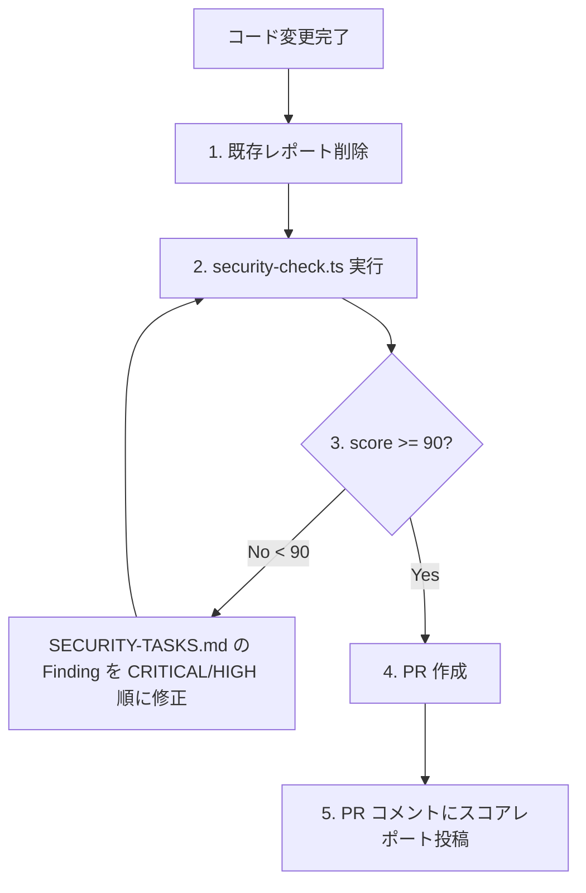

# 脅威モデリング + 静的スキャンスキル

本スキルは 2 つのモードを持ちます:

| モード | タイミング | 用途 |
|---|---|---|
| **A. STRIDE 脅威モデリング** | 実装**前** | 設計段階で脅威を洗い出し、対策を実装 TODO 化 |
| **B. 既存コード静的スキャン** | 実装**後** / 定期 | 実コードの CWE 観点スキャン + 修正タスクシート生成 |

両モードは補完関係: A で設計段階の漏れを防ぎ、B で実装後の混入・既存コードの劣化を検出する。
**新機能を実装する場合は A を必ず先行実行**、**main マージ後・PR 起票前・リリース前** には B を定期実行する。

## モード A: STRIDE 脅威モデリング (新機能実装前)

新機能・新エンドポイント・新たなデータフローを実装する **前** に、このセクションの手順を実行して脅威を洗い出し、設計に対策を組み込みます。

## 実行タイミング

以下のいずれかに該当する場合、**実装開始前に必須**:

- 新しい認証/認可フローの追加
- 新しい外部入力の受け口（API エンドポイント、ファイルアップロード、Webhook）
- 新しい外部システムとの連携
- 機密情報を扱う機能
- 権限境界を跨ぐデータフロー

## 手順

### Step 1: データフロー図の作成（テキストで可）

以下を明確にする:

```
[アクター] → [エントリポイント] → [処理] → [データストア]
                    ↓
              [信頼境界]
```

- **アクター**: 誰が使うか（匿名/認証済みユーザー/管理者/外部システム）
- **エントリポイント**: どこから入力が来るか（HTTP, ファイル, キュー等）
- **信頼境界**: 信頼できる領域とできない領域の境目
- **データストア**: どこに何を保存するか

### Step 2: STRIDE 分析

各コンポーネントに対して以下6カテゴリで脅威を洗い出す:

| カテゴリ | 脅威 | チェック例 |
|---|---|---|
| **S** poofing | なりすまし | 認証の強度、セッション管理 |
| **T** ampering | 改ざん | 入力検証、整合性チェック、HMAC |
| **R** epudiation | 否認 | 監査ログ、署名 |
| **I** nformation Disclosure | 情報漏洩 | 暗号化、アクセス制御、エラーメッセージ |
| **D** enial of Service | サービス停止 | レート制限、リソース上限 |
| **E** levation of Privilege | 権限昇格 | 認可チェック、最小権限 |

### Step 3: 対策の決定

各脅威に対して以下のいずれかを選択:

1. **Mitigate (緩和)**: 対策を実装する → 実装タスクに追加
2. **Transfer (転嫁)**: 外部サービスに委譲（例: 認証を Auth0 に）
3. **Accept (受容)**: リスクを受け入れる → 理由を文書化
4. **Eliminate (除去)**: 機能自体を設計変更

### Step 4: DESIGN.md への反映

以下のセクションを `DESIGN.md` に追加または更新:

```markdown
## セキュリティ設計（機能名）

### 信頼境界
- 境界の定義と、境界越えで発生する検証処理

### 脅威と対策（STRIDE）
| 脅威 | カテゴリ | 対策 | 実装箇所 |
|---|---|---|---|
| 例: トークン窃取 | S | HttpOnly/Secure cookie | auth/session.ts |

### 受容したリスク
- （あれば）理由と承認者
```

### Step 5: 実装タスクへの変換

洗い出された対策を実装 TODO に変換し、`/fix-issue` スキルで実装する。

## チェックリスト（STRIDE 簡易版）

新機能を追加する前に、少なくとも以下に答える:

- [ ] **誰が**この機能を使える？ 匿名/認証済み/特定ロール？
- [ ] 入力の**信頼性**は？ どこで検証する？
- [ ] 出力に**機密情報**が含まれる可能性は？
- [ ] **ログ**に機密情報が流れる可能性は？
- [ ] **レート制限**は必要？ 上限は？
- [ ] **他ユーザーのデータ**にアクセスできてしまう経路はない？
- [ ] **エラー時**に内部情報が漏洩しない？
- [ ] **依存する外部サービス**が停止したらどうなる？
- [ ] 機能を**無効化**する手段はある？（Feature Flag 等）

## 並列実行による深掘り

大規模な機能の場合、各STRIDE観点ごとに専門エージェントを並列起動して分析させる:

- Spoofing / Elevation → `auth-reviewer`
- Tampering → `injection-reviewer`
- Information Disclosure → `secret-reviewer` + `xss-reviewer`
- DoS → `performance-reviewer`
- Dependency 起因 → `dependency-reviewer`

---

## モード B: 既存コードの静的スキャン (実装後・定期)

`scripts/security-check.ts` を実行してコードを静的解析し、CWE 観点の検出結果を 2 ファイルに出力します。

| 出力ファイル | 用途 |
|---|---|
| `docs/security/security-report.html` | 人間向けビジュアルレポート (ブラウザで確認、スコア + Finding 一覧) |
| `docs/security/SECURITY-TASKS.md` | Claude Code 向け修正タスクシート (Finding ごとに修正要件 + テスト要件 + 完了条件) |

両ファイルは `.gitignore` で commit 対象外 (毎回再生成のため)。

### 実行タイミング

- **PR 起票前 (必須)**: ▼ 詳細手順は後述の「Mode B-1: PR 作成ワークフロー」を参照
- **main マージ後**: 横展開によるリグレッション検出
- **リリース直前**: 全 Finding をレビューしスコア確認
- **週次定期**: GitHub Actions で自動実行 (CI 統合は将来検討、`scripts/security-check.ts` の末尾コメント参照)

### スコア閾値: 90/100

- **score < 90**: 修正必須 (Mode B-1 ワークフローに従って Finding を解消)
- **score ≥ 90**: 修正不要 (既存 Finding は次回以降で対応、PR コメントにスコア記録のみ)
- **狙い**: 開発のたびに最新の脆弱性/攻撃手法情報を取り込み、score 90+ を **退行ない状態として維持し続ける**

### Step 1: スキャン実行

```bash
pnpm tsx scripts/security-check.ts
```

コンソールに総合スコアと件数サマリーが表示されます。例:

```
━━━━━━━━━━━━━━━━━━━━━━━━━━━━━━━━━━━━━━━━
  総合スコア: 80/100
  CRITICAL : 0
  HIGH     : 1
  MEDIUM   : 2
  LOW      : 1
━━━━━━━━━━━━━━━━━━━━━━━━━━━━━━━━━━━━━━━━
```

### Step 2: タスクシートの読み込み

`docs/security/SECURITY-TASKS.md` を読み、検出された全 Finding を把握します。`F-01` 形式の Finding ID で参照可能。

### Step 3: CRITICAL / HIGH から順に修正

各タスクの記載項目を必ず守ります:

- **修正要件**: 実装方針を忠実に実装する
- **修正後のコード例**: 参考にしつつ、実プロジェクトのコードベースに合わせて適用する
- **テスト要件**: テストなしの修正はコミットしない (CLAUDE.md コミットルール準拠)

### Step 4: 横展開チェック

修正したパターンと同じコードが他ファイルに残っていないか、`grep` で必ず確認します
(CLAUDE.md コミット前チェック §1 横展開チェックと同じ要領)。

### Step 5: 再スキャンで改善確認

```bash
pnpm tsx scripts/security-check.ts
```

を再実行し、対応した Finding が消えている / スコアが改善していることを確認します。

### チェック項目一覧

| カテゴリ | 内容 | 主な対象ファイル |
|---|---|---|
| **DEP** | beta/RC 依存ライブラリ | `package.json` |
| **DEP** | pnpm audit 既知 CVE | `pnpm-lock.yaml` |
| **AUTH** | callbackUrl 未検証 (オープンリダイレクト) | `src/app/(auth)/**/*.tsx` |
| **AUTH** | SameSite=Lax → Strict | `src/lib/auth.config.ts` |
| **RATE** | 公開エンドポイントのレート制限欠如 | `src/app/api/auth/*/route.ts` |
| **CRYPTO** | MFA 暗号化キーのゼロパディング | `src/services/mfa.service.ts` |
| **CSP** | `script-src` の `unsafe-inline` | `next.config.ts` |
| **INJECT** | `$queryRawUnsafe` / `$executeRawUnsafe` | `src/**/*.ts` |
| **LEAK** | `console.*` への機密情報出力 | `src/**/*.ts` |
| **SECRET** | ハードコードされたデフォルトシークレット | `src/lib/auth*.ts` |

### 新しいチェック項目の追加方法

`scripts/security-check.ts` の末尾のメイン処理に `checkXxx()` 関数を追加し、`addFinding({...})` を
呼び出すだけで自動的にレポート + タスクシートに反映されます。テンプレート:

```typescript
/** [CATEGORY] チェック内容の説明 */
function checkNewPattern() {
  const files = findFiles('src', f => f.endsWith('.ts'));
  for (const file of files) {
    const content = readFile(file);
    if (/危険なパターン/.test(content)) {
      addFinding({
        severity: 'HIGH',
        category: 'CATEGORY',
        title: '問題のタイトル',
        description: '問題の詳細説明',
        file: relPath(file),
        line: findLineNumber(content, /危険なパターン/),
        evidence: '問題のコード',
        recommendation: '修正方針',
        fixExample: '修正後のコード例',
        testRequired: 'テスト要件',
      });
    }
  }
}
```

### Mode A (STRIDE) との関係

- Mode A で洗い出した「対策すべき脅威」は実装され、Mode B のスキャンで自動検証される構造になるのが理想
- Mode B で新たに検出された Finding は、対応する STRIDE カテゴリ (S/T/R/I/D/E) を Mode A の表に逆流させ、次回新機能設計時のチェックリストとして活用する

---

## Mode B-1: PR 作成ワークフロー (全 PR で必須)

**狙い**: 開発のたびに最新の脆弱性 DB (pnpm audit) + パターン検出を回し、score 90+ を退行なき状態として維持し続ける。

### 5 ステップフロー



#### Step 1: 既存レポートを削除

直前のスキャン結果 (時刻・状態が古い) をリセット。古い HTML を誤って参照しないため、毎回必ず削除する:

```bash
rm -f docs/security/SECURITY-TASKS.md docs/security/security-report.html
```

PR の差分には含まれない (`.gitignore` で除外済) が、**ローカル workspace の整合性のため必須**。

#### Step 2: スキャン実行

```bash
pnpm tsx scripts/security-check.ts
```

コンソール末尾の `総合スコア: NN/100` を確認。

#### Step 3: スコア判定 + 必要なら修正ループ

- **score >= 90**: → Step 4 に進む (修正不要)
- **score < 90**: 以下のループを score >= 90 になるまで繰り返す
  1. `docs/security/SECURITY-TASKS.md` を読み、CRITICAL → HIGH → MEDIUM → LOW の優先順で Finding を確認
  2. 各 Finding の「修正要件」「修正後のコード例」「テスト要件」「完了条件」に従って実装
  3. **必ずテストを追加** (テストなし修正は CLAUDE.md コミットルール違反)
  4. 横展開: 同パターンが他ファイルに残っていないか `grep` で確認
  5. `pnpm tsx scripts/security-check.ts` を **再実行** してスコア改善を確認
  6. score >= 90 になったら次の Step へ

**スコアが上がらない場合**: パターン検出は同種の問題を 1 件としてしか減点しないが、複数ファイルでの横展開を全件修正しないと「次回の同パターン追加」で再発する。レポートの「同カテゴリ × 同重大度」の Finding は **全件修正してから** 次へ進む。

#### Step 4: PR 作成

通常通り `gh pr create` 等で PR を起票。PR description には変更内容を記述 (security 修正もここに含める)。

#### Step 5: PR コメントにスコアレポートを投稿

スコア + サマリ + 主要 Finding を Markdown でコメント。**HTML は GitHub PR コメントで一部しか描画されないため、サマリ抽出を投稿**:

```bash
# テンプレ (実際は score / counts / findings を埋める)
gh pr comment <PR_NUMBER> --body "$(cat <<'EOF'
## 🔒 セキュリティチェック結果

| 指標 | 値 |
|---|---|
| 総合スコア | **NN/100** |
| CRITICAL | N |
| HIGH | N |
| MEDIUM | N |
| LOW | N |

### 残存 Finding (簡易)

- F-NN [CATEGORY/SEVERITY]: タイトル — 対応予定 PR (or 受容理由)

### 詳細レポート

ローカルで以下を実行して \`docs/security/security-report.html\` をブラウザで確認してください:
\`\`\`bash
pnpm tsx scripts/security-check.ts
\`\`\`

> 生成: \`scripts/security-check.ts\` (本 PR 時点の score)
EOF
)"
```

**人間レビュアー**は本コメントから過去 PR と比較して退行が起きていないかを判断します (主要な狙い)。

### Mode B-1 のチェックリスト (PR 起票前に確認)

- [ ] Step 1: `rm -f docs/security/SECURITY-TASKS.md docs/security/security-report.html` 実行
- [ ] Step 2: `pnpm tsx scripts/security-check.ts` 実行、コンソールスコア確認
- [ ] Step 3: score < 90 なら全 Finding を修正済 + テスト追加済 + score >= 90 で再実行確認
- [ ] Step 4: `gh pr create` で PR 起票
- [ ] Step 5: `gh pr comment` でスコアレポート投稿 (上記テンプレ使用)

---

## Mode B-2: スクリプトのメンテナンス (新規攻撃手法の取り込み)

「最新の脆弱性 / 攻撃手法情報」を継続的に取り込むには、`scripts/security-check.ts` 自体を更新し続ける必要があります。**自動取得できる範囲は限定的**であることを認識した上で、以下の経路を運用します。

### 自動取得経路 (script 改変なしで最新化される部分)

| 経路 | 鮮度 | カバー範囲 |
|---|---|---|
| `pnpm audit` | 高 (CVE DB を都度照会) | 既知の依存ライブラリ脆弱性 (`[DEP]` カテゴリの一部) |
| `package.json` の beta/RC 検出 | 高 (現在の依存を読む) | 不安定版利用 (`[DEP]` カテゴリの一部) |

→ **依存系の最新化は自動**で回る。

### 手動メンテナンス対象 (Claude / 人間が `checkXxx()` を追加して対応)

| カテゴリ | 例 |
|---|---|
| `AUTH` | 新しい認証バイパス手法、OAuth/OIDC 攻撃 |
| `RATE` | 新しい DoS/ブルートフォースパターン |
| `CRYPTO` | 弱い暗号アルゴリズム、サイドチャネル |
| `CSP` | 新しい CSP bypass 手法 (e.g. `wasm-eval`、`unsafe-hashes`) |
| `INJECT` | NoSQL injection、LDAP injection、prototype pollution |
| `LEAK` | エラースタックの機密漏洩、レスポンス header の情報漏洩 |
| `SECRET` | 環境変数の漏洩経路、JWT 実装ミス |

### メンテナンスのトリガー (いつ追加するか)

1. **CWE Top 25 / OWASP Top 10 の更新時** (年 1 回程度): 新規項目に対応する `checkXxx()` を script に追加
2. **本プロジェクトで脆弱性インシデントが起きた時**: 同種の再発を防ぐ `checkXxx()` を追加
3. **新ライブラリ導入時**: そのライブラリ固有の罠 (e.g. NextAuth callbackUrl) に対する `checkXxx()` を追加
4. **Claude が修正対応中に「同パターンを横展開チェックすべき」と判断した時**: その場で `checkXxx()` 追加 PR を別途切る

### 追加方法 (テンプレ)

`scripts/security-check.ts` の末尾メイン処理に新しい `checkXxx()` を追加し、関数本体で `addFinding({...})` を呼ぶだけ。詳細は本 skill「### 新しいチェック項目の追加方法」セクション参照。

### スクリプトのメンテナンス PR の出し方

- 1 PR = 1 新規 `checkXxx()` 追加が原則 (レビューしやすさ)
- PR description に **対応する CWE 番号 / OWASP カテゴリ / 元ネタ URL** を必ず明記
- スクリプト追加後は本リポジトリで Mode B-1 を回し、新 check が既存コードに当たれば修正 PR を別途起票
