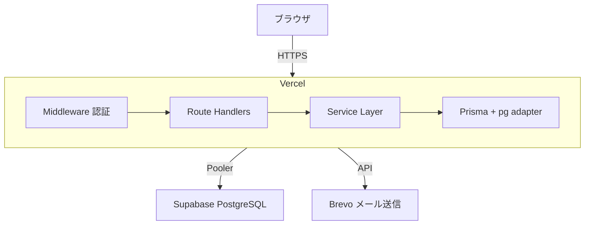

# たすきば Knowledge Relay

> 知見を残す。判断をつなぐ。プロジェクトを強くする。

## 概要

**たすきば Knowledge Relay** は、プロジェクトの知見を蓄積し、次の判断を強くする運営プラットフォームです。

### テーマ

プロジェクトの知見を蓄積し、次の判断を強くする運営プラットフォーム

### コンセプト

運営するほど、次のプロジェクトがうまくいく。

プロジェクトを繰り返すごとに、現担当者が蓄積したナレッジが次の担当者へ引き継がれ、さらに洗練された判断が可能になります。

### 主な特徴

- **一気通貫の運営基盤** - 企画・見積もり・計画・実行・監視・振り返りまで、一つのプラットフォームで完結
- **知見の循環** - プロジェクトで得た知見をナレッジとして蓄積し、次案件の見積もり・計画に再利用
- **健全なプロジェクト運営** - QCD のバランスを保ち、リスク・課題を早期に可視化

## 機能一覧

### プロジェクト運営

| 機能 | 説明 |
|---|---|
| プロジェクト管理 | 企画から振り返りまでの状態遷移管理（作成・編集・削除） |
| 見積もり管理 | 過去ナレッジ・実績を参照した見積もり作成・確定 |
| WBS / タスク管理 | 階層構造のタスク管理、担当割り当て、進捗・実績更新 |
| ガントチャート | スケジュールの時系列可視化（進捗・遅延・マイルストーン表示） |
| リスク・課題管理 | リスク/課題の起票・状態管理・CSV エクスポート |
| ナレッジ管理 | 知見の登録・全文検索・公開範囲制御 |
| 振り返り | プロジェクト完了後の総括・コメント・ナレッジ化 |
| マイタスク | 自分の担当タスク一覧・進捗更新ショートカット |

### セキュリティ・アカウント管理

| 機能 | 説明 |
|---|---|
| 認証 | メール + パスワード認証、セッション管理 |
| MFA（多要素認証） | TOTP（Google Authenticator 等）対応、管理者必須。3 回連続失敗で 30 分 MFA ロック（recovery code または admin 操作で解除） |
| パスワード管理 | パスワードポリシー、変更、リセット（リカバリーコード方式）、履歴チェック |
| アカウントロック | ログイン失敗 5 回で一時ロック、3 回目で恒久ロック（パスワード系）／ MFA 系は独立の 3 回失敗 / 30 分ロック |
| 権限管理 | RBAC（システム管理者 / PM・TL / メンバー / 閲覧者） |
| 監査ログ | 全データ変更・認証イベントの自動記録 + 管理者閲覧画面 |
| エラー集約 | 全エラーを `system_error_logs` DB に記録し、画面には固定文言のみ表示（機密情報の漏洩面最小化） |
| 未使用アカウント管理 | 30日未ログインで自動無効化、60日で物理削除 |

セキュリティ実装の多層防御の詳細・限界は [`docs/developer/SPECIFICATION.md §25`](docs/developer/SPECIFICATION.md#25-セキュリティ実装の全体像-多層防御-pr-122-で整理) を参照。運用時の監視・MFA ロック対応は [`docs/administrator/OPERATION.md §13`](docs/administrator/OPERATION.md#13-セキュリティ運用-pr-122-で追加) を参照。

## 技術スタック

| レイヤー | 技術 |
|---|---|
| フロントエンド | Next.js 16 (App Router) / React 19 / TypeScript |
| UI | shadcn/ui / Tailwind CSS |
| バックエンド | Next.js API Routes / Server Actions |
| ORM | Prisma 7（@prisma/adapter-pg 方式） |
| データベース | PostgreSQL 16 |
| 認証 | NextAuth.js (Auth.js) 5 |
| MFA | otplib（TOTP / RFC 6238） |
| 全文検索 | pg_trgm（PostgreSQL 標準拡張） |
| メール送信 | Brevo（MailProvider 抽象化で複数プロバイダ対応、console/inbox は開発・E2E 用） |
| テスト | Vitest |

## アーキテクチャ



## デプロイ

### 自社運用（Vercel + Supabase）

| コンポーネント | サービス | 月額 |
|---|---|---|
| アプリケーション | Vercel Hobby | $0 |
| データベース | Supabase Free | $0 |
| メール送信 | Brevo Free | $0（300 通/日） |

デプロイ手順・スキーマ変更時の運用・適用済みマイグレーション一覧は [docs/administrator/OPERATION.md](docs/administrator/OPERATION.md) を参照してください。

## セットアップ

### 前提条件

- Node.js 22 LTS
- pnpm
- Docker / Docker Compose（ローカル PostgreSQL 用）または Supabase アカウント

### ローカル開発（Supabase 接続）

```bash
# 1. リポジトリのクローン
git clone <repository-url>
cd BusinessManagementPlatform

# 2. 依存パッケージのインストール
pnpm install

# 3. 環境変数の設定
cp .env.example .env
# .env を編集して DATABASE_URL, NEXTAUTH_SECRET 等を設定

# 4. Prisma Client 生成 + マイグレーション
npx prisma generate
npx prisma migrate dev

# 5. 初期管理者の作成
pnpm db:seed

# 6. 開発サーバの起動
pnpm dev
```

http://localhost:3000 でアクセスできます。

## ドキュメント

開発・運用保守に関わるドキュメントは **[docs/](docs/README.md)** に役割別で整理されています。

| 対象 | 入口 |
|---|---|
| このサービスを初めて触る**開発者** | [docs/beginner/](docs/beginner/README.md) — 開発環境構築から初めての PR 作成までの一貫手順 |
| **開発者** (実装・テスト担当) | [docs/developer/](docs/README.md#developer--開発者向け) — 要件 / 仕様 / 設計 / 改修ガイド / テスト戦略 |
| **運用管理者** (デプロイ・障害対応担当) | [docs/administrator/](docs/README.md#administrator--運用管理者向け) — デプロイ / 環境変数 / migration / 障害対応 / リリース計画 |
| 全ドキュメント索引 | [docs/README.md](docs/README.md) |

コミット / PR 規約・ブランチ運用は [CONTRIBUTING.md](CONTRIBUTING.md) を参照してください。

## ライセンス

Private
