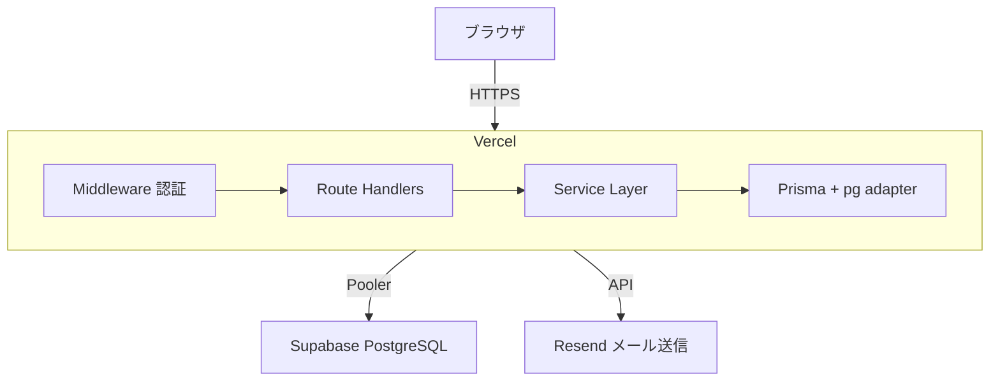

# たすきば Knowledge Relay

> 知見を残す。判断をつなぐ。プロジェクトを強くする。

## 概要

**たすきば Knowledge Relay** は、プロジェクトの知見を蓄積し、次の判断を強くする運営プラットフォームです。

### テーマ

プロジェクトの知見を蓄積し、次の判断を強くする運営プラットフォーム

### コンセプト

運営するほど、次のプロジェクトがうまくいく。

プロジェクトを繰り返すごとに、現担当者が蓄積したナレッジが次の担当者へ引き継がれ、さらに洗練された判断が可能になります。

### 主な特徴

- **一気通貫の運営基盤** - 企画・見積もり・計画・実行・監視・振り返りまで、一つのプラットフォームで完結
- **知見の循環** - プロジェクトで得た知見をナレッジとして蓄積し、次案件の見積もり・計画に再利用
- **健全なプロジェクト運営** - QCD のバランスを保ち、リスク・課題を早期に可視化

## 機能一覧

### プロジェクト運営

| 機能 | 説明 |
|---|---|
| プロジェクト管理 | 企画から振り返りまでの状態遷移管理（作成・編集・削除） |
| 見積もり管理 | 過去ナレッジ・実績を参照した見積もり作成・確定 |
| WBS / タスク管理 | 階層構造のタスク管理、担当割り当て、進捗・実績更新 |
| ガントチャート | スケジュールの時系列可視化（進捗・遅延・マイルストーン表示） |
| リスク・課題管理 | リスク/課題の起票・状態管理・CSV エクスポート |
| ナレッジ管理 | 知見の登録・全文検索・公開範囲制御 |
| 振り返り | プロジェクト完了後の総括・コメント・ナレッジ化 |
| マイタスク | 自分の担当タスク一覧・進捗更新ショートカット |

### セキュリティ・アカウント管理

| 機能 | 説明 |
|---|---|
| 認証 | メール + パスワード認証、セッション管理 |
| MFA（多要素認証） | TOTP（Google Authenticator 等）対応、管理者必須 |
| パスワード管理 | パスワードポリシー、変更、リセット（リカバリーコード方式）、履歴チェック |
| アカウントロック | ログイン失敗5回で一時ロック、3回目で恒久ロック |
| 権限管理 | RBAC（システム管理者 / PM・TL / メンバー / 閲覧者） |
| 監査ログ | 全データ変更・認証イベントの自動記録 + 管理者閲覧画面 |
| 未使用アカウント管理 | 30日未ログインで自動無効化、60日で物理削除 |

## 技術スタック

| レイヤー | 技術 |
|---|---|
| フロントエンド | Next.js 16 (App Router) / React 19 / TypeScript |
| UI | shadcn/ui / Tailwind CSS |
| バックエンド | Next.js API Routes / Server Actions |
| ORM | Prisma 7（@prisma/adapter-pg 方式） |
| データベース | PostgreSQL 16 |
| 認証 | NextAuth.js (Auth.js) 5 |
| MFA | otplib（TOTP / RFC 6238） |
| 全文検索 | pg_trgm（PostgreSQL 標準拡張） |
| メール送信 | Resend / SMTP（MailProvider 抽象化で切替可能） |
| テスト | Vitest |

## アーキテクチャ



## デプロイ

### 自社運用（Vercel + Supabase）

| コンポーネント | サービス | 月額 |
|---|---|---|
| アプリケーション | Vercel Hobby | $0 |
| データベース | Supabase Free | $0 |
| メール送信 | Resend Free | $0 |

#### スキーマ変更時の手順 (重要)

Vercel ビルドでは `prisma migrate deploy` を実行していない（Vercel ビルド環境は IPv4 のみで
Supabase の直結 URL `db.[ref].supabase.co:5432` に到達できないため）。
スキーマ変更を含むコードをマージする際は以下を手動で実施する:

1. ローカルから `prisma migrate dev` で `prisma/migrations/` に新規マイグレーションを作成
2. PR マージ後、Supabase ダッシュボードの SQL Editor で当該 `migration.sql` を実行
3. 次回デプロイ後にアプリが正常起動することを確認

自動化したい場合は DIRECT_URL を Supavisor セッションモード
(`pooler.supabase.com:5432`) に変更した上で、`vercel.json` の `buildCommand` に
`pnpm prisma migrate deploy` を追加する。

#### 既知の手動適用待ちマイグレーション

以下は本番 (Supabase) への適用時に SQL Editor で該当ファイル全文を実行すること。

| マイグレーション | 追加内容 | PR |
|---|---|---|
| `20260418_visibility_and_risk_nature` | risks_issues / retrospectives に visibility 列、risks_issues に risk_nature 列、knowledge.visibility の旧値 (project/company) を public に集約 | #60 |
| `20260419_attachments` | 汎用添付リンクテーブル attachments (URL 参照型、entity_type + entity_id のポリモーフィック関連、DESIGN.md §22) | #64 |
| `20260419_project_process_tags_and_suggestion` | projects.process_tags 追加 + pg_trgm 拡張有効化 + knowledges / risks_issues / retrospectives のトライグラム GIN インデックス + knowledges.business_domain_tags (Phase 2 で追加) (核心機能「提案型サービス」, DESIGN.md §23) | #65 |

### 外部配布

.zip パッケージとして配布。外部ユーザが自前の環境で構築・運用可能。

| デプロイ形態 | 対応状況 |
|---|---|
| PC（ローカル） | Docker Compose で一式起動 |
| オンプレミス | Nginx + Docker Compose（HTTPS 対応） |
| クラウド（コンテナ） | AWS ECS / Azure App Service |
| クラウド（サーバレス） | AWS Lambda / Azure Functions |

## セットアップ

### 前提条件

- Node.js 22 LTS
- pnpm
- Docker / Docker Compose（ローカル PostgreSQL 用）または Supabase アカウント

### ローカル開発（Supabase 接続）

```bash
# 1. リポジトリのクローン
git clone <repository-url>
cd BusinessManagementPlatform

# 2. 依存パッケージのインストール
pnpm install

# 3. 環境変数の設定
cp .env.example .env
# .env を編集して DATABASE_URL, NEXTAUTH_SECRET 等を設定

# 4. Prisma Client 生成 + マイグレーション
npx prisma generate
npx prisma migrate dev

# 5. 初期管理者の作成
pnpm db:seed

# 6. 開発サーバの起動
pnpm dev
```

http://localhost:3000 でアクセスできます。

## ドキュメント

| ドキュメント | 説明 |
|---|---|
| [要件定義書](docs/REQUIREMENTS.md) | プラットフォームの要件定義 |
| [仕様書](docs/SPECIFICATION.md) | 機能仕様・画面仕様・権限マトリクス・アカウントフロー |
| [設計書](docs/DESIGN.md) | アーキテクチャ・ER 図・テーブル定義・API・セキュリティ・インフラ |
| [開発計画書](docs/PLAN.md) | MVP-1a / 1b / 2 のスケジュール・スコープ・リリース条件 |
| [ナレッジ](docs/knowledge/) | プロジェクト運営で得た知見・教訓 |

## ライセンス

Private
