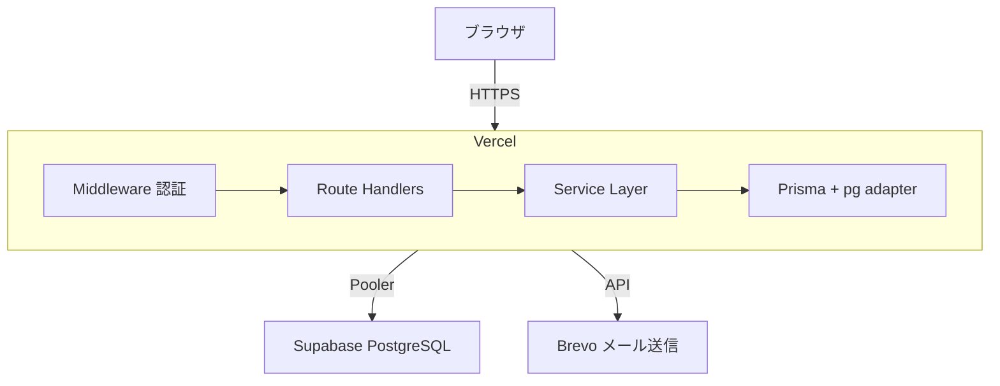

# たすきば Knowledge Relay

> 知見を残す。判断をつなぐ。プロジェクトを強くする。

---

## 🚀 はじめに / Getting Started

**初めてリポジトリを触る開発者は、まず [`ONBOARDING.md`](./ONBOARDING.md) を開いてください。**

`ONBOARDING.md` には:
- 最初の 30 分でローカル環境を立ち上げる 7 ステップ手順
- リーディングパス (初日 / 1 週目 / 1 ヶ月目) への入口
- 開発フローの要点 + 困ったときの参照先

を集約しています。本 README は「プロダクト概要 / 機能一覧 / 技術スタック」のリファレンスです。

---

## 概要

**たすきば Knowledge Relay** は、プロジェクトの知見を蓄積し、次の判断を強くする運営プラットフォームです。

### テーマ

プロジェクトの知見を蓄積し、次の判断を強くする運営プラットフォーム

### コンセプト

運営するほど、次のプロジェクトがうまくいく。

プロジェクトを繰り返すごとに、現担当者が蓄積したナレッジが次の担当者へ引き継がれ、さらに洗練された判断が可能になります。

### 主な特徴

- **一気通貫の運営基盤** - 企画・見積もり・計画・実行・監視・振り返りまで、一つのプラットフォームで完結
- **知見の循環** - プロジェクトで得た知見をナレッジとして蓄積し、次案件の見積もり・計画に再利用
- **健全なプロジェクト運営** - QCD のバランスを保ち、リスク・課題を早期に可視化

## 機能一覧

### プロジェクト運営

| 機能 | 説明 |
|---|---|
| プロジェクト管理 | 企画から振り返りまでの状態遷移管理（作成・編集・削除） |
| 見積もり管理 | 過去ナレッジ・実績を参照した見積もり作成・確定 |
| WBS / タスク管理 | 階層構造のタスク管理、担当割り当て、進捗・実績更新 |
| ガントチャート | スケジュールの時系列可視化（進捗・遅延・マイルストーン表示） |
| リスク・課題管理 | リスク/課題の起票・状態管理・CSV エクスポート |
| ナレッジ管理 | 知見の登録・全文検索・公開範囲制御 |
| 振り返り | プロジェクト完了後の総括・コメント・ナレッジ化 |
| マイタスク | 自分の担当タスク一覧・進捗更新ショートカット |

### セキュリティ・アカウント管理

| 機能 | 説明 |
|---|---|
| 認証 | メール + パスワード認証、セッション管理 |
| MFA（多要素認証） | TOTP（Google Authenticator 等）対応、管理者必須。3 回連続失敗で 30 分 MFA ロック（recovery code または admin 操作で解除） |
| パスワード管理 | パスワードポリシー、変更、リセット（リカバリーコード方式）、履歴チェック |
| アカウントロック | ログイン失敗 5 回で一時ロック、3 回目で恒久ロック（パスワード系）／ MFA 系は独立の 3 回失敗 / 30 分ロック |
| 権限管理 | RBAC（システム管理者 / PM・TL / メンバー / 閲覧者） |
| 監査ログ | 全データ変更・認証イベントの自動記録 + 管理者閲覧画面 |
| エラー集約 | 全エラーを `system_error_logs` DB に記録し、画面には固定文言のみ表示（機密情報の漏洩面最小化） |
| 未使用アカウント管理 | 30日未ログインで自動無効化、60日で物理削除 |

セキュリティ実装の多層防御の詳細は [docs/design/SECURITY.md](docs/design/SECURITY.md) を参照。運用時の監視・MFA ロック対応は [docs/operations/SECURITY_OPS.md](docs/operations/SECURITY_OPS.md) と [docs/operations/INCIDENT_RESPONSE.md §6.5](docs/operations/INCIDENT_RESPONSE.md) を参照。

## 技術スタック

| レイヤー | 技術 |
|---|---|
| フロントエンド | Next.js 16 (App Router) / React 19 / TypeScript |
| UI | shadcn/ui / Tailwind CSS |
| バックエンド | Next.js API Routes / Server Actions |
| ORM | Prisma 7（@prisma/adapter-pg 方式） |
| データベース | PostgreSQL 16 |
| 認証 | NextAuth.js (Auth.js) 5 |
| MFA | otplib（TOTP / RFC 6238） |
| 全文検索 | pg_trgm（PostgreSQL 標準拡張） |
| ベクトル検索 | pgvector（PostgreSQL 拡張、1024 次元） |
| Embedding | Voyage AI `voyage-4-lite`（提案エンジン v2 の類似検索用） |
| LLM | Anthropic Claude（`@anthropic-ai/sdk`、自動タグ抽出等） |
| メール送信 | Brevo（MailProvider 抽象化で複数プロバイダ対応、console/inbox は開発・E2E 用） |
| テスト | Vitest（単体）/ Playwright（E2E） |

## アーキテクチャ


```mermaid
graph TD
    Browser[ブラウザ] -->|HTTPS| Vercel[Vercel / Next.js]
    Vercel -->|Pooler| Supabase[Supabase PostgreSQL]
    Vercel -->|API| Brevo[Brevo メール送信]

    subgraph Vercel
        MW[Middleware 認証] --> RH[Route Handlers]
        RH --> SL[Service Layer]
        SL --> PA[Prisma + pg adapter]
    end
```

## デプロイ

### 自社運用（Vercel + Supabase）

| コンポーネント | サービス | 月額 |
|---|---|---|
| アプリケーション | Vercel Hobby | $0 |
| データベース | Supabase Free | $0 |
| メール送信 | Brevo Free | $0（300 通/日） |

> **注意 (商用利用時)**: Vercel Hobby プランは規約上**商用利用不可**のため、外部公開・有償提供フェーズでは Vercel Pro ($20/月) への移行が必要です。Supabase Free / Brevo Free も無料枠の制約があり、スケール時は有償プランへ段階移行する想定です。詳細は [docs/design/INFRASTRUCTURE.md §10.3](docs/design/INFRASTRUCTURE.md) を参照。

デプロイ手順は [docs/operations/DEPLOYMENT.md](docs/operations/DEPLOYMENT.md)、スキーマ変更時の運用は [docs/operations/DB_MIGRATION_PROCEDURE.md](docs/operations/DB_MIGRATION_PROCEDURE.md) を参照してください。

## セットアップ

### 前提条件

- Node.js 22 LTS
- pnpm
- Docker / Docker Compose(ローカル PostgreSQL 用)または Supabase アカウント

### クイックスタート

詳細な手順は **[`ONBOARDING.md`](./ONBOARDING.md)** を参照してください。最短経路の概要のみ示します:

```bash
git clone <repository-url>
cd BusinessManagementPlatform
pnpm install
cp .env.example .env             # DATABASE_URL / NEXTAUTH_SECRET 等を設定
npx prisma generate && npx prisma migrate dev
pnpm db:seed                     # 初期管理者の作成
pnpm dev                         # http://localhost:3000
```

詰まったら [docs/operations/SETUP_LOCAL.md](docs/operations/SETUP_LOCAL.md) のトラブルシューティング節へ。

## ドキュメント

開発・運用保守に関わるドキュメントは **[docs/](docs/README.md)** に役割別で整理されています。

| 対象 | 入口 |
|---|---|
| **クローン直後の開発者** | [ONBOARDING.md](./ONBOARDING.md) — 環境構築から PR 作成・CI 確認まで(自己完結) |
| 段階的な深掘り (Day 1 / Week 1 / Month 1) | [docs/README.md](docs/README.md) — リーディングパス |
| コードベースの歩き方(主要ディレクトリ) | [docs/design/ARCHITECTURE.md](docs/design/ARCHITECTURE.md) §4 |
| 業務用語・機能の対応関係 | [docs/business/GLOSSARY.md](docs/business/GLOSSARY.md) / [docs/business/FEATURE_CATALOG.md](docs/business/FEATURE_CATALOG.md) |
| 設計判断の根拠 (なぜこの設計か) | [docs/adr/](docs/adr/README.md) (ADR-0001〜0013) |
| 運用・デプロイ・障害対応 | [docs/operations/](docs/operations/README.md) |
| 全ドキュメント索引 | [docs/README.md](docs/README.md) |

コミット / PR 規約・ブランチ運用は [CONTRIBUTING.md](CONTRIBUTING.md) を参照してください。

## ライセンス

Private
