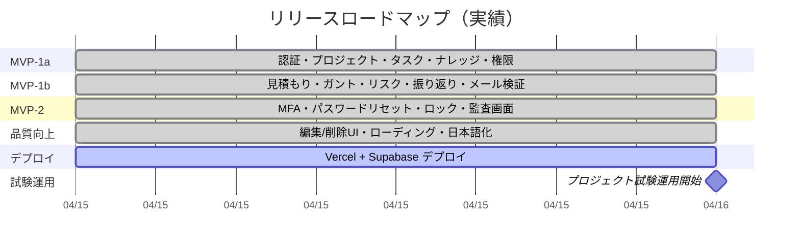

# たすきば Knowledge Relay 開発計画書

> **📌 この文書は MVP 開発完了時点 (2026-04-15, v2.0 実績反映版) の履歴記録です。**
>
> | 知りたいこと | 参照先 |
> |---|---|
> | 現行アプリの **要件** | [REQUIREMENTS.md](./REQUIREMENTS.md) |
> | 現行アプリの **機能仕様** | [SPECIFICATION.md](./SPECIFICATION.md) |
> | 現行アプリの **設計** (アーキテクチャ / データモデル等) | [DESIGN.md](./DESIGN.md) |
> | **今後の** リリース計画 (プレリリース 2026-05 / 正式リリース 2026-06〜) | [RELEASE_ROADMAP.md](../administrator/RELEASE_ROADMAP.md) |
> | 本文書 | **MVP 構築時 (2026-04-15 以前) の計画と実績の記録** |
>
> MVP 完了後の改修・機能追加では REQUIREMENTS / SPECIFICATION / DESIGN が最新の真実。
> 本文書は「何をどの順番で構築したか」の歴史資料として固定化しているため更新しない。

- 作成日: 2026-04-15
- 更新日: 2026-04-15
- 版数: v2.0（実績反映）
- 状態: **MVP 構築完了 (2026-04-15 時点) の記録として固定**

---

## 1. 文書概要

本計画書は、たすきば Knowledge Relay の MVP 開発スケジュールを定義する。
MVP を 3 フェーズに分割し、段階的にリリースする。

### 1.1 関連文書

- [要件定義書](./REQUIREMENTS.md)
- [仕様書](./SPECIFICATION.md)
- [設計書](./DESIGN.md)
- [リリースロードマップ](../administrator/RELEASE_ROADMAP.md) — MVP 完了後のロードマップ (未来側)

---

## 2. リリースロードマップ



### 2.1 フェーズ概要

| フェーズ | 計画 | 実績 | 状態 |
|---|---|---|---|
| MVP-1a | 2026-04-15 〜 2026-05-01 | **2026-04-15（1日で完了）** | 完了 |
| MVP-1b | 2026-05-01 〜 2026-06-01 | **2026-04-15（同日完了）** | 完了 |
| MVP-2 | 2026-06-01 〜 2026-07-01 | **2026-04-15（同日完了）** | 完了 |
| 品質向上 | - | 2026-04-15 | 完了 |
| Vercel デプロイ | - | 2026-04-15 | 進行中 |
| 試験運用開始 | 2026-05-01 | **2026-04-16（前倒し）** | 予定 |

---

## 3. MVP-1a: 最小動作版

### 3.1 概要

| 項目 | 内容 |
|---|---|
| 期間 | 2026-04-15 〜 2026-05-01（16日間） |
| 目的 | プロジェクトの立ち上げ・タスク管理・ナレッジ蓄積を可能にし、試験運用を開始する |
| リスク | バッファが少ない。ブロッカー発生時は一部機能を MVP-1b にスライド |

### 3.2 スコープ

| 機能 | 画面 | 含む操作 |
|---|---|---|
| 認証 | ログイン / ログアウト | メール + パスワード認証、セッション管理 |
| プロジェクト管理 | 一覧 / 詳細 | 作成・編集・状態遷移 |
| WBS / タスク管理 | 一覧 / 詳細 | 階層構造 CRUD、担当設定、進捗率・実績工数更新 |
| ナレッジ管理 | 一覧 / 詳細 / 検索 | 作成・編集・全文検索（pg_trgm）、公開範囲制御 |
| ユーザ管理 | 一覧 / 登録 | 管理者によるアカウント作成、ロール設定 |
| メンバー管理 | 一覧 / 追加 | プロジェクトメンバー追加・ロール設定 |
| 権限制御 | - | RBAC（ロール x 状態チェック）、IDOR 防止 |
| 監査ログ | - | audit_logs / auth_event_logs / role_change_logs への記録（閲覧画面なし） |
| 初期データ | - | シードスクリプトによる初期管理者作成 |

### 3.3 スコープ外（MVP-1b 以降）

- 見積もり管理、ガントチャート、リスク/課題管理、振り返り、マイタスク画面
- メール検証、CSV エクスポート
- MFA、パスワードリセット、アカウントロック、自動削除バッチ
- 監査ログ閲覧画面、権限変更履歴画面

### 3.4 詳細スケジュール

| # | タスク | 期間 | 開始日 | 終了日 | 依存 |
|---|---|---|---|---|---|
| 1 | プロジェクト初期構築 | 2日 | 04/15 | 04/16 | - |
| | - Next.js 15 (App Router) 初期化 | | | | |
| | - Prisma + PostgreSQL (Docker Compose) セットアップ | | | | |
| | - shadcn/ui + Tailwind CSS 導入 | | | | |
| | - ESLint + Prettier 設定 | | | | |
| | - ディレクトリ構造の作成 | | | | |
| 2 | 認証基盤 | 2日 | 04/17 | 04/18 | #1 |
| | - NextAuth.js (Auth.js) セットアップ | | | | |
| | - Prisma Schema: users, sessions | | | | |
| | - ログイン / ログアウト画面 | | | | |
| | - 認証 Middleware | | | | |
| | - パスワードポリシーバリデーション（Zod） | | | | |
| 3 | ユーザ / メンバー管理 | 2日 | 04/19 | 04/20 | #2 |
| | - Prisma Schema: project_members, role_change_logs | | | | |
| | - ユーザ管理画面（一覧 / 登録） | | | | |
| | - メンバー管理画面（一覧 / 追加 / ロール設定） | | | | |
| | - シードスクリプト（初期管理者作成） | | | | |
| 4 | 権限制御 + 監査ログ | 2日 | 04/21 | 04/22 | #3 |
| | - Prisma Schema: audit_logs, auth_event_logs | | | | |
| | - Permission Guard（ロール x 状態チェック） | | | | |
| | - IDOR 防止パターンの共通実装 | | | | |
| | - 監査ログ記録の共通処理 | | | | |
| 5 | プロジェクト管理 | 3日 | 04/23 | 04/25 | #4 |
| | - Prisma Schema: projects | | | | |
| | - プロジェクト一覧画面（検索・フィルタ） | | | | |
| | - プロジェクト詳細画面（タブ構成のハブ画面） | | | | |
| | - 作成 / 編集 / 状態遷移（State Machine） | | | | |
| 6 | WBS / タスク管理 | 3日 | 04/26 | 04/28 | #5 |
| | - Prisma Schema: tasks, task_progress_logs | | | | |
| | - タスク一覧画面（ツリー表示） | | | | |
| | - タスク作成 / 編集（階層構造） | | | | |
| | - 進捗率・実績工数の更新 | | | | |
| | - 担当者設定 | | | | |
| 7 | ナレッジ管理 | 3日 | 04/29 | 05/01 | #5 |
| | - Prisma Schema: knowledges, knowledge_projects | | | | |
| | - pg_trgm 拡張の有効化 + GIN インデックス | | | | |
| | - ナレッジ一覧画面（検索・フィルタ） | | | | |
| | - ナレッジ作成 / 編集 / 公開範囲制御 | | | | |
| | - 全文検索（SearchProvider 抽象化） | | | | |

### 3.5 ガントイメージ

```
タスク                 4/15  4/17  4/19  4/21  4/23  4/26  4/29  5/1
                        |     |     |     |     |     |     |     |
1. 初期構築             ====
2. 認証基盤                   ====
3. ユーザ/メンバー管理              ====
4. 権限制御+監査ログ                      ====
5. プロジェクト管理                             ======
6. タスク管理                                         ======
7. ナレッジ管理                                               ======
```

### 3.6 MVP-1a リリース条件

以下が全て満たされた場合にリリースとする。

- [ ] 初期管理者でログインできる
- [ ] プロジェクトの作成・状態遷移ができる
- [ ] タスクの作成・階層構造・進捗更新ができる
- [ ] ナレッジの作成・検索ができる
- [ ] メンバーの追加・ロール設定ができる
- [ ] 権限のないユーザの操作が拒否される
- [ ] pnpm lint / pnpm test / pnpm build が通る
- [ ] Vercel + Supabase へのデプロイが成功する

### 3.7 スライドルール

ブロッカー発生時に MVP-1b へスライド可能な機能（優先度の低い順）。

| スライド候補 | 理由 |
|---|---|
| 全文検索（pg_trgm） | ナレッジ一覧の一般的なフィルタで代用可能 |
| ナレッジの公開範囲制御 | 初期は全ユーザ閲覧可で運用可能 |
| プロジェクト状態遷移の条件チェック | 手動での状態変更で代用可能 |

---

## 4. MVP-1b: 機能拡充版

### 4.1 概要

| 項目 | 内容 |
|---|---|
| 期間 | 2026-05-01 〜 2026-06-01（31日間） |
| 見積もり | 10〜16日（バッファ: 15〜21日） |
| 目的 | 見積もり〜振り返りの全ビジネス機能を完成させ、プロジェクトライフサイクル全体をカバーする |

### 4.2 スコープ

| 機能 | 画面 | 含む操作 |
|---|---|---|
| 見積もり管理 | 一覧 / 詳細 | 作成・編集・確定、ナレッジ/実績の参照リンク |
| ガントチャート | 表示 | タスクの時系列可視化（読み取り専用）、マイルストーン表示 |
| リスク / 課題管理 | 一覧 / 詳細 | 起票・編集・状態管理・対応策記録 |
| 振り返り | 一覧 / 詳細 | 作成・編集・コメント・確定・ナレッジ化対象指定 |
| マイタスク | 一覧 | 自分の担当タスク一覧、進捗更新のショートカット |
| メール検証 | - | アカウント登録時のメール検証フロー |
| CSV エクスポート | - | リスク/課題一覧のエクスポート |
| MVP-1a からのスライド分 | - | 全文検索等、MVP-1a でスライドした機能があれば含む |

### 4.3 詳細スケジュール

| # | タスク | 見積もり | 依存 |
|---|---|---|---|
| 8 | MVP-1a のフィードバック対応・バグ修正 | 2日 | - |
| 9 | 見積もり管理 | 2日 | #8 |
| | - Prisma Schema: estimates, estimate_knowledges | | |
| | - 見積もり一覧 / 詳細画面 | | |
| | - 作成・編集・確定 | | |
| 10 | リスク / 課題管理 | 2日 | #8 |
| | - Prisma Schema: risks_issues, task_risks, risk_knowledges | | |
| | - 一覧 / 詳細画面 | | |
| | - 起票・編集・状態管理 | | |
| | - CSV エクスポート | | |
| 11 | ガントチャート | 3日 | #8 |
| | - ガントチャートコンポーネント実装 | | |
| | - ガント用 API（タスクデータ変換） | | |
| | - 表示期間切替・担当者フィルタ | | |
| 12 | マイタスク画面 | 1日 | #8 |
| | - 自分の担当タスク一覧 | | |
| | - 進捗更新ショートカット | | |
| 13 | 振り返り | 2日 | #8 |
| | - Prisma Schema: retrospectives, retrospective_comments, retrospective_knowledges | | |
| | - 作成・編集・コメント・確定 | | |
| | - ナレッジ化対象指定 | | |
| 14 | メール検証フロー | 2日 | #8 |
| | - Resend 統合（MailProvider 抽象化） | | |
| | - メール検証トークン発行・検証 | | |
| | - メールテンプレート（React Email） | | |
| 15 | 結合テスト + リリース準備 | 2日 | #9〜#14 |
| | **合計** | **16日** | |

### 4.4 MVP-1b リリース条件

- [ ] 見積もりの作成・確定ができる
- [ ] ガントチャートでタスクが時系列表示される
- [ ] リスク/課題の起票・追跡ができる
- [ ] 振り返りの記録・ナレッジ化指定ができる
- [ ] マイタスクで自分のタスクを確認・更新できる
- [ ] アカウント登録時にメール検証が動作する
- [ ] リスク/課題の CSV エクスポートができる
- [ ] pnpm lint / pnpm test / pnpm build が通る

---

## 5. MVP-2: セキュリティ強化版

### 5.1 概要

| 項目 | 内容 |
|---|---|
| 期間 | 2026-06-01 〜 2026-07-01（30日間） |
| 見積もり | 12〜18日（バッファ: 12〜18日） |
| 目的 | 外部展開に耐えうるセキュリティ品質を実現する |

### 5.2 スコープ

| 機能 | 含む操作 |
|---|---|
| MFA（TOTP） | 有効化フロー、MFA 付きログイン、リカバリーコードでの認証 |
| パスワードリセット | リカバリーコード + メールアドレスによるリセットフロー |
| アカウントロック | 一時ロック（5回失敗/10分）、恒久ロック（3回目）、管理者解除 |
| パスワード履歴 | 直近5回の再利用禁止 |
| 未使用アカウント自動削除 | 23日警告メール → 30日論理削除 → 60日物理削除 |
| アカウント自主削除 | ユーザ自身による削除申請、30日後物理削除 |
| 監査ログ閲覧画面 | システム管理者向けの監査ログ検索・閲覧 |
| 権限変更履歴画面 | 権限変更の監査証跡閲覧 |
| リカバリーコード再発行 | 管理者による再発行 |
| 管理者 MFA 必須化 | 管理者ロールは MFA 未設定だとシステム管理機能にアクセス不可 |

### 5.3 詳細スケジュール

| # | タスク | 見積もり | 依存 |
|---|---|---|---|
| 16 | MVP-1b のフィードバック対応・バグ修正 | 2日 | - |
| 17 | アカウントロック + パスワード履歴 | 2日 | #16 |
| | - failed_login_count / locked_until / permanent_lock の実装 | | |
| | - password_histories テーブル + 再利用チェック | | |
| 18 | パスワードリセットフロー | 3日 | #17 |
| | - リセット画面（メール + リカバリーコード入力） | | |
| | - password_reset_tokens の発行・検証 | | |
| | - 新パスワード設定 + 全セッション無効化 | | |
| | - パスワード変更完了メール送信 | | |
| 19 | MFA（TOTP） | 3日 | #17 |
| | - TOTP シークレット生成・暗号化保存 | | |
| | - QR コード表示 + 有効化フロー | | |
| | - MFA 付きログインフロー（一時トークン方式） | | |
| | - リカバリーコードでのフォールバック認証 | | |
| | - 管理者 MFA 必須チェック | | |
| 20 | リカバリーコード再発行 | 1日 | #19 |
| | - 管理者画面からの再発行 | | |
| | - 旧コード全無効化 + 新コード発行 | | |
| 21 | 未使用アカウント自動削除バッチ | 2日 | #16 |
| | - 警告メール送信（23日後） | | |
| | - 論理削除（30日後） | | |
| | - 物理削除（60日後）+ 個人情報匿名化 | | |
| 22 | アカウント自主削除 | 1日 | #18 |
| | - 設定画面からの削除申請 | | |
| | - 本人確認（パスワード + リカバリーコード） | | |
| 23 | 監査ログ閲覧画面 + 権限変更履歴画面 | 2日 | #16 |
| | - 監査ログ検索・一覧・詳細 | | |
| | - 権限変更履歴検索・一覧 | | |
| 24 | 結合テスト + セキュリティテスト + リリース準備 | 2日 | #17〜#23 |
| | **合計** | **18日** | |

### 5.4 MVP-2 リリース条件

- [ ] MFA の有効化・ログインが動作する
- [ ] リカバリーコードでログインできる
- [ ] パスワードリセットフローが動作する
- [ ] アカウントロックが正しく発動・解除される
- [ ] 未使用アカウントの自動削除が動作する
- [ ] 監査ログ画面でログを検索・閲覧できる
- [ ] 権限変更履歴画面で変更履歴を閲覧できる
- [ ] 全ロール x 全操作の権限テストが通る
- [ ] IDOR テスト（他プロジェクトへの不正アクセス拒否）が通る
- [ ] pnpm lint / pnpm test / pnpm build が通る

---

## 6. リスクと対策

| リスク | 影響 | 発生確率 | 対策 |
|---|---|---|---|
| MVP-1a のスケジュール超過 | 5/1 リリース遅延 | 中 | スライドルール（3.7）に基づき一部機能を MVP-1b へ移動 |
| Supabase Free の制約による技術的ブロッカー | 開発遅延 | 低 | Pooler 対応を初期構築で早期に検証 |
| ガントチャートの実装難易度 | MVP-1b 遅延 | 中 | ライブラリ選定を早期に実施。最悪の場合テーブル形式で代用 |
| 試験運用でのフィードバックによる仕様変更 | 各フェーズの作業増加 | 中 | バッファ期間で吸収。大きな変更は次フェーズに計画 |

---

## 7. 進捗管理

### 7.1 管理方法

本計画書のタスク一覧とリリース条件チェックリストをもとに進捗を管理する。

### 7.2 進捗確認タイミング

| フェーズ | 中間確認日 | 確認内容 |
|---|---|---|
| MVP-1a | 04/22（7日目） | #1〜#4 完了確認。遅延時はスライドルール適用を判断 |
| MVP-1b | 05/15（14日目） | #8〜#11 完了確認 |
| MVP-2 | 06/15（14日目） | #16〜#19 完了確認 |

### 7.3 完了基準

各フェーズのリリース条件（3.6 / 4.4 / 5.4）が全て満たされた時点でリリースとする。

---

## 8. 備考

本計画書は MVP の開発スケジュールを定義したドラフトであった。
v2.0 (2026-04-15 実績反映) 時点で MVP の全フェーズが完了し、以降は
**履歴記録として固定**している (冒頭注記参照)。MVP 完了後のロードマップは
[RELEASE_ROADMAP.md](../administrator/RELEASE_ROADMAP.md) に引き継がれている。
