# データモデルとテーブル定義 (Program Design)

本ドキュメントは、Prisma スキーマと Postgres テーブル定義を集約する (DESIGN.md §4〜§5、§13、§15)。マイグレーション戦略は [../operations/DB_MIGRATION_PROCEDURE.md](../operations/DB_MIGRATION_PROCEDURE.md) を参照。

---

## §4. データモデル

## 4. データモデル

### 4.1 ER 図

```mermaid
erDiagram
    users {
        uuid id PK
        varchar name
        varchar email UK
        varchar password_hash
        enum system_role "admin | general"
        boolean is_active
        integer failed_login_count
        timestamp locked_until
        boolean permanent_lock
        boolean mfa_enabled
        varchar mfa_secret_encrypted
        timestamp mfa_enabled_at
        timestamp last_login_at
        timestamp created_at
        timestamp updated_at
        timestamp deleted_at
    }

    recovery_codes {
        uuid id PK
        uuid user_id FK
        varchar code_hash
        timestamp used_at
        timestamp created_at
    }

    email_verification_tokens {
        uuid id PK
        uuid user_id FK
        varchar token_hash
        timestamp expires_at
        timestamp used_at
        timestamp created_at
    }

    password_reset_tokens {
        uuid id PK
        uuid user_id FK
        varchar token_hash
        timestamp expires_at
        timestamp used_at
        timestamp created_at
    }

    password_histories {
        uuid id PK
        uuid user_id FK
        varchar password_hash
        timestamp created_at
    }

    auth_event_logs {
        uuid id PK
        varchar event_type
        uuid user_id FK
        varchar email
        varchar ip_address
        text user_agent
        jsonb detail
        timestamp created_at
    }

    operation_trace_logs {
        uuid id PK
        uuid user_id FK
        varchar session_id
        uuid request_id
        varchar http_method
        varchar path
        jsonb query_params
        varchar entity_type
        uuid entity_id
        varchar action
        varchar ip_address
        text user_agent
        integer response_status
        integer duration_ms
        timestamp created_at
    }

    projects {
        uuid id PK
        varchar name
        uuid customer_id FK "PR #111-2: customers.id / ON DELETE SET NULL"
        text purpose
        text background
        text scope
        text out_of_scope
        enum dev_method "scratch | power_platform | package | other"
        varchar tech_stack_tags "JSONB array"
        varchar business_domain_tags "JSONB array"
        date planned_start_date
        date planned_end_date
        enum status "planning | estimating | scheduling | executing | completed | retrospected | closed"
        text notes
        uuid created_by FK
        uuid updated_by FK
        timestamp created_at
        timestamp updated_at
        timestamp deleted_at
    }

    project_members {
        uuid id PK
        uuid project_id FK
        uuid user_id FK
        enum project_role "pm_tl | member | viewer"
        uuid assigned_by FK
        timestamp created_at
        timestamp updated_at
    }

    estimates {
        uuid id PK
        uuid project_id FK
        varchar item_name
        enum category "requirements | design | development | testing | other"
        enum dev_method "scratch | power_platform | package | other"
        decimal estimated_effort
        enum effort_unit "person_hour | person_day"
        text rationale
        text preconditions
        boolean is_confirmed
        text notes
        uuid created_by FK
        uuid updated_by FK
        timestamp created_at
        timestamp updated_at
        timestamp deleted_at
    }

    tasks {
        uuid id PK
        uuid project_id FK
        uuid parent_task_id FK
        enum type "work_package | activity"
        varchar wbs_number
        varchar name
        text description
        enum category "requirements | design | development | testing | review | management | other"
        uuid assignee_id FK "nullable - WP は null"
        date planned_start_date "nullable - WP は子から自動計算"
        date planned_end_date "nullable - WP は子から自動計算"
        decimal planned_effort "WP は子の合計を自動計算"
        enum priority "low | medium | high"
        enum status "not_started | in_progress | completed | on_hold"
        integer progress_rate "0-100 - WP は子の加重平均"
        boolean is_milestone
        text notes
        uuid created_by FK
        uuid updated_by FK
        timestamp created_at
        timestamp updated_at
        timestamp deleted_at
    }

    task_progress_logs {
        uuid id PK
        uuid task_id FK
        uuid updated_by FK
        date update_date
        integer progress_rate "0-100"
        decimal actual_effort
        decimal remaining_effort
        enum status "not_started | in_progress | completed | on_hold"
        boolean is_delayed
        text delay_reason
        text work_memo
        boolean has_issue
        text next_action
        date completed_date
        timestamp created_at
    }

    risks_issues {
        uuid id PK
        uuid project_id FK
        enum type "risk | issue"
        varchar title
        text content
        text cause
        enum impact "low | medium | high"
        enum likelihood "low | medium | high"
        enum priority "low | medium | high"
        text response_policy
        text response_detail
        uuid reporter_id FK
        uuid assignee_id FK
        date deadline
        enum state "open | in_progress | monitoring | resolved"
        text result
        text lesson_learned
        uuid created_by FK
        uuid updated_by FK
        timestamp created_at
        timestamp updated_at
        timestamp deleted_at
    }

    knowledges {
        uuid id PK
        varchar title
        enum knowledge_type "research | verification | incident | decision | lesson | best_practice | other"
        text background
        text content
        text result
        text conclusion
        text recommendation
        enum reusability "low | medium | high"
        varchar tech_tags "JSONB array"
        enum dev_method "scratch | power_platform | package | other"
        varchar process_tags "JSONB array"
        enum visibility "draft | project | company"
        uuid created_by FK
        uuid updated_by FK
        timestamp created_at
        timestamp updated_at
        timestamp deleted_at
    }

    retrospectives {
        uuid id PK
        uuid project_id FK
        date conducted_date
        text plan_summary
        text actual_summary
        text good_points
        text problems
        text estimate_gap_factors
        text schedule_gap_factors
        text quality_issues
        text risk_response_evaluation
        text improvements
        text knowledge_to_share
        enum state "draft | confirmed"
        uuid created_by FK
        uuid updated_by FK
        timestamp created_at
        timestamp updated_at
        timestamp deleted_at
    }

    comments {
        uuid id PK
        varchar entity_type
        uuid entity_id
        uuid user_id FK
        text content
        timestamp created_at
        timestamp updated_at
        timestamp deleted_at
    }

    decisions {
        uuid id PK
        uuid project_id FK
        varchar title
        text background
        text issue
        text options
        text decision_content
        text decision_reason
        date decided_date
        uuid decided_by FK
        text impact_scope
        uuid created_by FK
        uuid updated_by FK
        timestamp created_at
        timestamp updated_at
        timestamp deleted_at
    }

    change_requests {
        uuid id PK
        uuid project_id FK
        text request_content
        text reason
        uuid requester_id FK
        text impact_target
        text impact_assessment
        boolean needs_approval
        enum approval_status "pending | approved | rejected"
        text applied_content
        enum state "open | applied | rejected | cancelled"
        uuid created_by FK
        uuid updated_by FK
        timestamp created_at
        timestamp updated_at
        timestamp deleted_at
    }

    audit_logs {
        uuid id PK
        uuid user_id FK
        varchar action
        varchar entity_type
        uuid entity_id
        jsonb before_value
        jsonb after_value
        varchar ip_address
        timestamp created_at
    }

    role_change_logs {
        uuid id PK
        uuid changed_by FK
        uuid target_user_id FK
        enum change_type "system_role | project_role"
        uuid project_id FK
        varchar before_role
        varchar after_role
        text reason
        timestamp created_at
    }

    %% Relationships
    projects ||--o{ project_members : "has"
    users ||--o{ project_members : "belongs to"
    projects ||--o{ estimates : "has"
    projects ||--o{ tasks : "has"
    tasks ||--o{ tasks : "parent-child"
    tasks ||--o{ task_progress_logs : "has"
    users ||--o{ task_progress_logs : "updates"
    projects ||--o{ risks_issues : "has"
    projects ||--o{ retrospectives : "has"
    %% PR #199: comments は polymorphic (entity_type + entity_id)。FK は持たないため
    %%   ER 図上では「持つ」リレーションを表現せず単独テーブルとして配置。
    projects ||--o{ decisions : "has"
    projects ||--o{ change_requests : "has"
    users ||--o{ audit_logs : "performs"
    users ||--o{ role_change_logs : "changes"
    users ||--o{ recovery_codes : "has"
    users ||--o{ email_verification_tokens : "has"
    users ||--o{ password_reset_tokens : "has"
    users ||--o{ password_histories : "has"
    users ||--o{ operation_trace_logs : "traced"
    users ||--o{ auth_event_logs : "logged"
```



### 4.2 多対多リレーションテーブル

```mermaid
erDiagram
    estimate_knowledges {
        uuid id PK
        uuid estimate_id FK
        uuid knowledge_id FK
    }

    task_knowledges {
        uuid id PK
        uuid task_id FK
        uuid knowledge_id FK
    }

    task_risks {
        uuid id PK
        uuid task_id FK
        uuid risk_issue_id FK
    }

    task_estimates {
        uuid id PK
        uuid task_id FK
        uuid estimate_id FK
    }

    task_dependencies {
        uuid id PK
        uuid task_id FK
        uuid depends_on_task_id FK
    }

    risk_knowledges {
        uuid id PK
        uuid risk_issue_id FK
        uuid knowledge_id FK
    }

    decision_tasks {
        uuid id PK
        uuid decision_id FK
        uuid task_id FK
    }

    decision_risks {
        uuid id PK
        uuid decision_id FK
        uuid risk_issue_id FK
    }

    decision_knowledges {
        uuid id PK
        uuid decision_id FK
        uuid knowledge_id FK
    }

    knowledge_projects {
        uuid id PK
        uuid knowledge_id FK
        uuid project_id FK
    }

    retrospective_knowledges {
        uuid id PK
        uuid retrospective_id FK
        uuid knowledge_id FK
    }

    knowledge_links {
        uuid id PK
        uuid knowledge_id FK
        varchar url
        varchar label
    }
```



---


## §5. テーブル定義書

## 5. テーブル定義書

### 5.1 users（ユーザ）

| カラム名 | 型 | NULL | デフォルト | 説明 |
|---|---|---|---|---|
| id | UUID | NO | gen_random_uuid() | 主キー |
| name | VARCHAR(100) | NO | - | ユーザ名 |
| email | VARCHAR(255) | NO | - | メールアドレス（ログインID）。UNIQUE |
| password_hash | VARCHAR(255) | NO | - | bcrypt ハッシュ済みパスワード |
| system_role | VARCHAR(20) | NO | 'general' | システムロール: admin / general |
| is_active | BOOLEAN | NO | true | 有効/無効 |
| failed_login_count | INTEGER | NO | 0 | ログイン失敗回数 |
| locked_until | TIMESTAMPTZ | YES | NULL | 一時ロック解除日時 |
| permanent_lock | BOOLEAN | NO | false | 恒久ロックフラグ |
| mfa_enabled | BOOLEAN | NO | false | MFA 有効フラグ |
| mfa_secret_encrypted | VARCHAR(255) | YES | NULL | 暗号化された TOTP シークレットキー |
| mfa_enabled_at | TIMESTAMPTZ | YES | NULL | MFA 有効化日時 |
| last_login_at | TIMESTAMPTZ | YES | NULL | 最終ログイン日時 |
| created_at | TIMESTAMPTZ | NO | now() | 作成日時 |
| updated_at | TIMESTAMPTZ | NO | now() | 更新日時 |
| deleted_at | TIMESTAMPTZ | YES | NULL | 論理削除日時 |

**インデックス**: `idx_users_email` (email, UNIQUE, WHERE deleted_at IS NULL)

### 5.2 projects（プロジェクト）

| カラム名 | 型 | NULL | デフォルト | 説明 |
|---|---|---|---|---|
| id | UUID | NO | gen_random_uuid() | 主キー |
| name | VARCHAR(100) | NO | - | プロジェクト名 |
| customer_id | UUID | NO | - | 顧客 FK (PR #111-2 以降): customers.id / ON DELETE SET NULL |
| purpose | TEXT | NO | - | 目的（2000文字以内） |
| background | TEXT | NO | - | 背景（2000文字以内） |
| scope | TEXT | NO | - | スコープ（2000文字以内） |
| out_of_scope | TEXT | YES | NULL | スコープ外（2000文字以内） |
| dev_method | VARCHAR(30) | NO | - | 開発方式 |
| business_domain_tags | JSONB | YES | '[]' | 対象業務領域（タグ配列） |
| tech_stack_tags | JSONB | YES | '[]' | 技術スタック（タグ配列） |
| planned_start_date | DATE | NO | - | 開始予定日 |
| planned_end_date | DATE | NO | - | 終了予定日 |
| status | VARCHAR(20) | NO | 'planning' | プロジェクト状態 |
| notes | TEXT | YES | NULL | 備考（2000文字以内） |
| created_by | UUID | NO | - | 作成者（FK: users.id） |
| updated_by | UUID | NO | - | 更新者（FK: users.id） |
| created_at | TIMESTAMPTZ | NO | now() | 作成日時 |
| updated_at | TIMESTAMPTZ | NO | now() | 更新日時 |
| deleted_at | TIMESTAMPTZ | YES | NULL | 論理削除日時 |

**status の値**: planning / estimating / scheduling / executing / completed / retrospected / closed

**インデックス**:
- `idx_projects_status` (status, WHERE deleted_at IS NULL)
- `idx_projects_customer_id` (customer_id) — PR #111-2 以降、`customer_name` 列は廃止

### 5.2b customers（顧客 / PR #111-1 新設、#111-2 完全移行）

プロジェクト発注元の顧客マスタ。`Project.customer_id` が本テーブルへの FK を持つ (1:N)。

| カラム名 | 型 | NULL | デフォルト | 説明 |
|---|---|---|---|---|
| id | UUID | NO | gen_random_uuid() | 主キー |
| name | VARCHAR(100) | NO | - | 顧客名 |
| department | VARCHAR(100) | YES | NULL | 部門 |
| contact_person | VARCHAR(100) | YES | NULL | 担当者氏名 |
| contact_email | VARCHAR(255) | YES | NULL | 担当者メール |
| notes | TEXT | YES | NULL | 備考（1000文字以内） |
| created_by | UUID | NO | - | 作成者（FK: users.id） |
| updated_by | UUID | NO | - | 更新者（FK: users.id） |
| created_at | TIMESTAMPTZ | NO | now() | 作成日時 |
| updated_at | TIMESTAMPTZ | NO | now() | 更新日時 |

**削除方針**: 物理削除 (`deleted_at` 列を持たない)。`Project.customer_id` FK は `ON DELETE SET NULL` のため、
論理削除済 Project の `customer_id` は Customer 物理削除時に自動 null 化される。active Project が
残存する場合は `deleteCustomerCascade` で関連資源を先にカスケード削除してから Customer を削除する。

**インデックス**: `idx_customers_name` (name)

### 5.3 project_members（プロジェクトメンバー）

ユーザとプロジェクトの多対多の紐付けを管理する中間テーブル。プロジェクトごとに異なるプロジェクトロールを付与する「プロジェクトメンバーシップ」を実現する。

```
User ──< project_members >── Project
            (project_role)
```

**設計意図**: 同一ユーザが複数プロジェクトに参加する際、プロジェクトごとに異なるロール（PM/TL・メンバー・閲覧者）を持てるようにする。例えば、Aプロジェクトではメンバーとして作業し、Bプロジェクトでは PM/TL としてプロジェクトを運営する、といった柔軟な権限運用を可能にする。

| カラム名 | 型 | NULL | デフォルト | 説明 |
|---|---|---|---|---|
| id | UUID | NO | gen_random_uuid() | 主キー |
| project_id | UUID | NO | - | FK: projects.id |
| user_id | UUID | NO | - | FK: users.id |
| project_role | VARCHAR(20) | NO | - | pm_tl / member / viewer |
| assigned_by | UUID | NO | - | 設定者（FK: users.id） |
| created_at | TIMESTAMPTZ | NO | now() | 作成日時 |
| updated_at | TIMESTAMPTZ | NO | now() | 更新日時 |

**制約**: UNIQUE(project_id, user_id) — 同一ユーザは同一プロジェクトに1つのロールのみ

**権限チェックでの利用**: Service 層の権限判定で、操作対象プロジェクトに対するユーザのプロジェクトロールをこのテーブルから取得し、操作可否を判定する（詳細はセクション 8 参照）

### 5.4 estimates（見積もり）

| カラム名 | 型 | NULL | デフォルト | 説明 |
|---|---|---|---|---|
| id | UUID | NO | gen_random_uuid() | 主キー |
| project_id | UUID | NO | - | FK: projects.id |
| item_name | VARCHAR(100) | NO | - | 見積項目名 |
| category | VARCHAR(30) | NO | - | 区分 |
| dev_method | VARCHAR(30) | NO | - | 開発方式 |
| estimated_effort | DECIMAL(10,2) | NO | - | 見積工数 |
| effort_unit | VARCHAR(20) | NO | - | 人時 / 人日 |
| rationale | TEXT | NO | - | 見積根拠（3000文字以内） |
| preconditions | TEXT | YES | NULL | 前提条件（2000文字以内） |
| is_confirmed | BOOLEAN | NO | false | 確定済みフラグ |
| notes | TEXT | YES | NULL | 備考（1000文字以内） |
| created_by | UUID | NO | - | FK: users.id |
| updated_by | UUID | NO | - | FK: users.id |
| created_at | TIMESTAMPTZ | NO | now() | 作成日時 |
| updated_at | TIMESTAMPTZ | NO | now() | 更新日時 |
| deleted_at | TIMESTAMPTZ | YES | NULL | 論理削除日時 |

### 5.5 tasks（タスク / WBS）

| カラム名 | 型 | NULL | デフォルト | 説明 |
|---|---|---|---|---|
| id | UUID | NO | gen_random_uuid() | 主キー |
| project_id | UUID | NO | - | FK: projects.id |
| parent_task_id | UUID | YES | NULL | FK: tasks.id（親タスク） |
| wbs_number | VARCHAR(50) | YES | NULL | WBS 番号（例: 1.2.3） |
| name | VARCHAR(100) | NO | - | タスク名 |
| description | TEXT | YES | NULL | タスク内容（2000文字以内） |
| category | VARCHAR(30) | NO | - | 区分 |
| assignee_id | UUID | NO | - | 担当者（FK: users.id） |
| planned_start_date | DATE | NO | - | 開始予定日 |
| planned_end_date | DATE | NO | - | 終了予定日 |
| planned_effort | DECIMAL(10,2) | NO | - | 予定工数 |
| priority | VARCHAR(10) | YES | 'medium' | 優先度: low / medium / high |
| status | VARCHAR(20) | NO | 'not_started' | ステータス |
| progress_rate | INTEGER | NO | 0 | 進捗率（0〜100） |
| is_milestone | BOOLEAN | NO | false | マイルストーンフラグ |
| notes | TEXT | YES | NULL | 備考（1000文字以内） |
| created_by | UUID | NO | - | FK: users.id |
| updated_by | UUID | NO | - | FK: users.id |
| created_at | TIMESTAMPTZ | NO | now() | 作成日時 |
| updated_at | TIMESTAMPTZ | NO | now() | 更新日時 |
| deleted_at | TIMESTAMPTZ | YES | NULL | 論理削除日時 |

**インデックス**:
- `idx_tasks_project` (project_id, WHERE deleted_at IS NULL)
- `idx_tasks_assignee` (assignee_id, WHERE deleted_at IS NULL)
- `idx_tasks_parent` (parent_task_id, WHERE deleted_at IS NULL)

### 5.6 task_progress_logs（進捗・実績ログ）

| カラム名 | 型 | NULL | デフォルト | 説明 |
|---|---|---|---|---|
| id | UUID | NO | gen_random_uuid() | 主キー |
| task_id | UUID | NO | - | FK: tasks.id |
| updated_by | UUID | NO | - | 更新者（FK: users.id） |
| update_date | DATE | NO | - | 更新日 |
| progress_rate | INTEGER | NO | - | 進捗率（0〜100） |
| actual_effort | DECIMAL(10,2) | NO | - | 実績工数 |
| remaining_effort | DECIMAL(10,2) | YES | NULL | 残工数 |
| status | VARCHAR(20) | NO | - | ステータス |
| is_delayed | BOOLEAN | NO | false | 遅延有無 |
| delay_reason | TEXT | YES | NULL | 遅延理由 |
| work_memo | TEXT | YES | NULL | 作業メモ（2000文字以内） |
| has_issue | BOOLEAN | NO | false | 課題有無 |
| next_action | TEXT | YES | NULL | 次アクション（1000文字以内） |
| completed_date | DATE | YES | NULL | 完了日 |
| created_at | TIMESTAMPTZ | NO | now() | 作成日時 |

**インデックス**: `idx_progress_task` (task_id, update_date DESC)

### 5.7 risks_issues（リスク・課題）

| カラム名 | 型 | NULL | デフォルト | 説明 |
|---|---|---|---|---|
| id | UUID | NO | gen_random_uuid() | 主キー |
| project_id | UUID | NO | - | FK: projects.id |
| type | VARCHAR(10) | NO | - | risk / issue |
| title | VARCHAR(100) | NO | - | 件名 |
| content | TEXT | NO | - | 内容（2000文字以内） |
| cause | TEXT | YES | NULL | 原因（課題時に推奨） |
| impact | VARCHAR(10) | NO | - | 影響度: low / medium / high |
| likelihood | VARCHAR(10) | YES | NULL | 発生可能性（リスク時必須） |
| priority | VARCHAR(10) | NO | - | 優先度: low / medium / high |
| response_policy | TEXT | YES | NULL | 対応方針（1000文字以内） |
| response_detail | TEXT | YES | NULL | 対応策（2000文字以内） |
| reporter_id | UUID | NO | - | 起票者（FK: users.id） |
| assignee_id | UUID | YES | NULL | 対応担当者（FK: users.id） |
| deadline | DATE | YES | NULL | 期限 |
| state | VARCHAR(20) | NO | 'open' | 状態 |
| result | TEXT | YES | NULL | 結果（2000文字以内） |
| lesson_learned | TEXT | YES | NULL | 教訓（2000文字以内） |
| created_by | UUID | NO | - | FK: users.id |
| updated_by | UUID | NO | - | FK: users.id |
| created_at | TIMESTAMPTZ | NO | now() | 作成日時 |
| updated_at | TIMESTAMPTZ | NO | now() | 更新日時 |
| deleted_at | TIMESTAMPTZ | YES | NULL | 論理削除日時 |

**インデックス**:
- `idx_risks_project` (project_id, type, WHERE deleted_at IS NULL)
- `idx_risks_priority` (priority, state, WHERE deleted_at IS NULL)

### 5.7b stakeholders（ステークホルダー / feat/stakeholder-management で新設、PMBOK 13）

| カラム名 | 型 | NULL | デフォルト | 説明 |
|---|---|---|---|---|
| id | UUID | NO | gen_random_uuid() | 主キー |
| project_id | UUID | NO | - | FK: projects.id |
| user_id | UUID | YES | NULL | FK: users.id (ON DELETE SET NULL)。内部メンバー紐付け、null=外部関係者 |
| name | VARCHAR(100) | NO | - | 表示用氏名 (敬称付き表記許容、User.name とは別系列) |
| organization | VARCHAR(100) | YES | NULL | 所属組織 (例: 顧客企画部、規制機関名) |
| role | VARCHAR(100) | YES | NULL | 役職 (例: 部長、CTO) |
| contact_info | TEXT | YES | NULL | 連絡先メモ (1000文字以内) |
| influence | SMALLINT | NO | - | 影響度 1-5 (DB CHECK 制約あり) |
| interest | SMALLINT | NO | - | 関心度 1-5 (DB CHECK 制約あり) |
| attitude | VARCHAR(20) | NO | - | 姿勢: supportive / neutral / opposing |
| current_engagement | VARCHAR(20) | NO | - | 現在のエンゲージメント (PMBOK 13.1.2 5 段階) |
| desired_engagement | VARCHAR(20) | NO | - | 望ましいエンゲージメント (5 段階) |
| personality | TEXT | YES | NULL | 人となり / 考え方 (自由記述、2000文字以内) |
| tags | JSONB | NO | '[]' | 検索/分類タグ (string[]) |
| strategy | TEXT | YES | NULL | 対応戦略 / 具体的アクション (2000文字以内) |
| created_by | UUID | NO | - | FK: users.id |
| updated_by | UUID | NO | - | FK: users.id |
| created_at | TIMESTAMPTZ | NO | now() | 作成日時 |
| updated_at | TIMESTAMPTZ | NO | now() | 更新日時 |
| deleted_at | TIMESTAMPTZ | YES | NULL | 論理削除日時 |

**インデックス**:
- `idx_stakeholders_project` (project_id)
- `idx_stakeholders_user` (user_id)

**設計判断**:
- 内部 (内部メンバー) と外部 (顧客役員、規制機関等) を 1 テーブルで管理。
  user_id を nullable FK にし、内部の場合のみ User 紐付け。
- ON DELETE SET NULL: User 物理削除時もステークホルダー記録は残す (人物評の保全)。
- influence / interest は 1-5 段階で生値保持。UI は閾値 >= 4 で 4 象限分類するが、
  生値を保持することで将来 5x5 ヒートマップにも丸められる。
- 可視性は service 層認可で PM/TL + admin に限定。member 以下にはタブ自体を非表示。
  個人情報・人物評を含むため、認可境界を厳格に保つ (DB レベルでは制約しない、§8 参照)。

### 5.8 knowledges（ナレッジ）

| カラム名 | 型 | NULL | デフォルト | 説明 |
|---|---|---|---|---|
| id | UUID | NO | gen_random_uuid() | 主キー |
| title | VARCHAR(150) | NO | - | タイトル |
| knowledge_type | VARCHAR(30) | NO | - | 種別 |
| background | TEXT | NO | - | 背景（2000文字以内） |
| content | TEXT | NO | - | 内容（5000文字以内） |
| result | TEXT | NO | - | 結果（3000文字以内） |
| conclusion | TEXT | YES | NULL | 結論（2000文字以内） |
| recommendation | TEXT | YES | NULL | 推奨事項（2000文字以内） |
| reusability | VARCHAR(10) | YES | NULL | 再利用性: low / medium / high |
| tech_tags | JSONB | YES | '[]' | 対象技術（タグ配列） |
| dev_method | VARCHAR(30) | YES | NULL | 開発方式 |
| process_tags | JSONB | YES | '[]' | 対象工程（タグ配列） |
| visibility | VARCHAR(20) | NO | 'draft' | 公開範囲: draft / project / company |
| created_by | UUID | NO | - | FK: users.id |
| updated_by | UUID | NO | - | FK: users.id |
| created_at | TIMESTAMPTZ | NO | now() | 作成日時 |
| updated_at | TIMESTAMPTZ | NO | now() | 更新日時 |
| deleted_at | TIMESTAMPTZ | YES | NULL | 論理削除日時 |

**インデックス**:
- `idx_knowledges_type` (knowledge_type, WHERE deleted_at IS NULL)
- `idx_knowledges_visibility` (visibility, WHERE deleted_at IS NULL)
- `idx_knowledges_fulltext` (GIN index on title, content for 全文検索)

### 5.9 retrospectives（振り返り）

| カラム名 | 型 | NULL | デフォルト | 説明 |
|---|---|---|---|---|
| id | UUID | NO | gen_random_uuid() | 主キー |
| project_id | UUID | NO | - | FK: projects.id |
| conducted_date | DATE | NO | - | 実施日 |
| plan_summary | TEXT | NO | - | 計画総括（2000文字以内） |
| actual_summary | TEXT | NO | - | 実績総括（2000文字以内） |
| good_points | TEXT | NO | - | 良かった点（3000文字以内） |
| problems | TEXT | NO | - | 問題点（3000文字以内） |
| estimate_gap_factors | TEXT | YES | NULL | 見積差分要因（3000文字以内） |
| schedule_gap_factors | TEXT | YES | NULL | スケジュール差分要因（3000文字以内） |
| quality_issues | TEXT | YES | NULL | 品質面課題（3000文字以内） |
| risk_response_evaluation | TEXT | YES | NULL | リスク対応評価（3000文字以内） |
| improvements | TEXT | NO | - | 次回改善事項（3000文字以内） |
| knowledge_to_share | TEXT | YES | NULL | 横展開したい知見（3000文字以内） |
| state | VARCHAR(20) | NO | 'draft' | 状態: draft / confirmed |
| created_by | UUID | NO | - | FK: users.id |
| updated_by | UUID | NO | - | FK: users.id |
| created_at | TIMESTAMPTZ | NO | now() | 作成日時 |
| updated_at | TIMESTAMPTZ | NO | now() | 更新日時 |
| deleted_at | TIMESTAMPTZ | YES | NULL | 論理削除日時 |

### 5.10 comments（コメント / PR #199 で polymorphic 統合）

PR #199 で旧 `retrospective_comments` を統合し、attachments と同じ polymorphic 設計
(entity_type + entity_id) に変更。7 エンティティ (issue / task / risk / retrospective /
knowledge / customer / stakeholder) で 1 テーブル共通。

| カラム名 | 型 | NULL | デフォルト | 説明 |
|---|---|---|---|---|
| id | UUID | NO | gen_random_uuid() | 主キー |
| entity_type | VARCHAR(30) | NO | - | 親エンティティ種別 (`issue` / `task` / `risk` / `retrospective` / `knowledge` / `customer` / `stakeholder`) |
| entity_id | UUID | NO | - | 親エンティティの id (FK は持たない: 削除時整合はアプリ層で担保) |
| user_id | UUID | NO | - | FK: users.id (投稿者) |
| content | TEXT | NO | - | コメント内容 (1〜2000 文字、サーバ側 trim 後検証) |
| created_at | TIMESTAMPTZ | NO | now() | 作成日時 |
| updated_at | TIMESTAMPTZ | NO | now() | 更新日時 (`@updatedAt` で自動。createdAt と異なれば「編集済」判定) |
| deleted_at | TIMESTAMPTZ | YES | NULL | 論理削除時刻 (admin / 投稿者本人で削除可) |

**インデックス**: `idx_comments_entity (entity_type, entity_id, deleted_at)` — 表示クエリの主索引。

**認可ポリシー**:
- 投稿 / 閲覧:
  - issue / risk / retrospective / knowledge: 認証済ユーザは誰でも (project member 非メンバーも可)
  - task / stakeholder: project member or admin
  - customer: admin only
- 編集 / 削除: 投稿者本人 OR システム管理者

**Migration ノート**: `prisma/migrations/20260430_unified_comments/migration.sql` で
旧 `retrospective_comments` の全行を `entity_type='retrospective'` で `comments` に
INSERT 後、旧テーブルを DROP する。

### 5.11 decisions（意思決定）

| カラム名 | 型 | NULL | デフォルト | 説明 |
|---|---|---|---|---|
| id | UUID | NO | gen_random_uuid() | 主キー |
| project_id | UUID | NO | - | FK: projects.id |
| title | VARCHAR(100) | NO | - | 件名 |
| background | TEXT | YES | NULL | 背景 |
| issue | TEXT | YES | NULL | 論点 |
| options | TEXT | YES | NULL | 選択肢 |
| decision_content | TEXT | NO | - | 決定内容 |
| decision_reason | TEXT | YES | NULL | 決定理由 |
| decided_date | DATE | YES | NULL | 決定日 |
| decided_by | UUID | YES | NULL | 決定者（FK: users.id） |
| impact_scope | TEXT | YES | NULL | 影響範囲 |
| created_by | UUID | NO | - | FK: users.id |
| updated_by | UUID | NO | - | FK: users.id |
| created_at | TIMESTAMPTZ | NO | now() | 作成日時 |
| updated_at | TIMESTAMPTZ | NO | now() | 更新日時 |
| deleted_at | TIMESTAMPTZ | YES | NULL | 論理削除日時 |

### 5.12 change_requests（変更要求）

| カラム名 | 型 | NULL | デフォルト | 説明 |
|---|---|---|---|---|
| id | UUID | NO | gen_random_uuid() | 主キー |
| project_id | UUID | NO | - | FK: projects.id |
| request_content | TEXT | NO | - | 変更要求内容 |
| reason | TEXT | NO | - | 変更理由 |
| requester_id | UUID | NO | - | 起票者（FK: users.id） |
| impact_target | TEXT | YES | NULL | 影響対象 |
| impact_assessment | TEXT | YES | NULL | 影響評価 |
| needs_approval | BOOLEAN | NO | false | 承認要否 |
| approval_status | VARCHAR(20) | YES | NULL | 承認結果: pending / approved / rejected |
| applied_content | TEXT | YES | NULL | 変更反映内容 |
| state | VARCHAR(20) | NO | 'open' | 状態: open / applied / rejected / cancelled |
| created_by | UUID | NO | - | FK: users.id |
| updated_by | UUID | NO | - | FK: users.id |
| created_at | TIMESTAMPTZ | NO | now() | 作成日時 |
| updated_at | TIMESTAMPTZ | NO | now() | 更新日時 |
| deleted_at | TIMESTAMPTZ | YES | NULL | 論理削除日時 |

### 5.13 audit_logs（監査ログ）

| カラム名 | 型 | NULL | デフォルト | 説明 |
|---|---|---|---|---|
| id | UUID | NO | gen_random_uuid() | 主キー |
| user_id | UUID | NO | - | 操作者（FK: users.id） |
| action | VARCHAR(50) | NO | - | 操作内容（CREATE / UPDATE / DELETE 等） |
| entity_type | VARCHAR(50) | NO | - | 対象エンティティ種別 |
| entity_id | UUID | NO | - | 対象エンティティ ID |
| before_value | JSONB | YES | NULL | 変更前の値 |
| after_value | JSONB | YES | NULL | 変更後の値 |
| ip_address | VARCHAR(45) | YES | NULL | 操作元 IP |
| created_at | TIMESTAMPTZ | NO | now() | 操作日時 |

**インデックス**:
- `idx_audit_entity` (entity_type, entity_id)
- `idx_audit_user` (user_id, created_at DESC)

### 5.14 role_change_logs（権限変更履歴）

| カラム名 | 型 | NULL | デフォルト | 説明 |
|---|---|---|---|---|
| id | UUID | NO | gen_random_uuid() | 主キー |
| changed_by | UUID | NO | - | 変更者（FK: users.id） |
| target_user_id | UUID | NO | - | 対象ユーザ（FK: users.id） |
| change_type | VARCHAR(20) | NO | - | system_role / project_role |
| project_id | UUID | YES | NULL | プロジェクトロール時のみ（FK: projects.id） |
| before_role | VARCHAR(30) | YES | NULL | 変更前ロール |
| after_role | VARCHAR(30) | NO | - | 変更後ロール |
| reason | TEXT | YES | NULL | 変更理由（1000文字以内） |
| created_at | TIMESTAMPTZ | NO | now() | 変更日時 |

---


## §13. 初期データ・シード設計

## 13. 初期データ・シード設計

### 13.1 初期管理者アカウント

システム起動後に最初のログインを可能にするため、シードスクリプトで初期管理者アカウントを作成する。

#### 作成方法

```
pnpm db:seed
```

#### 処理フロー

```
[1] 環境変数から初期管理者情報を取得
    - INITIAL_ADMIN_EMAIL（必須）
    - INITIAL_ADMIN_PASSWORD（必須、パスワードポリシー準拠）
    |
    v
[2] 管理者アカウント作成
    - system_role = admin
    - is_active = true（シード時はメール検証をスキップ）
    - パスワードを bcrypt ハッシュ化
    - force_password_change = true（初回ログイン時にパスワード変更を強制）
    |
    v
[3] リカバリーコード10個を生成
    - 各コードを bcrypt ハッシュ化して DB 保存
    |
    v
[4] コンソールに出力（1回限り）
    === 初期管理者アカウント作成 ===
    メール:           (環境変数の値)
    初回ログイン後にパスワード変更が強制されます
    リカバリーコード:
      1. XXXX-XXXX
      2. XXXX-XXXX
      ... (10個)
    このリカバリーコードを安全な場所に保管してください。
    再表示はできません。
    ================================
```

#### 冪等性

- 同一メールアドレスのユーザが既に存在する場合はスキップする
- 複数回実行しても安全

#### 環境変数

| 変数名 | 説明 | 例 |
|---|---|---|
| INITIAL_ADMIN_EMAIL | 初期管理者のメールアドレス | admin@example.com |
| INITIAL_ADMIN_PASSWORD | 初期管理者のパスワード | （ポリシー準拠の強力なパスワード） |

### 13.2 マスタデータ

MVP ではマスタデータをコード内定数（enum / 定数オブジェクト）として管理する。DB マスタテーブルは MVP 後に必要に応じて導入する。

#### 定数定義一覧

| 定数名 | 値 | 利用箇所 |
|---|---|---|
| DevMethod | scratch / power_platform / package / other | プロジェクト、見積もり |
| TaskCategory | requirements / design / development / testing / review / management / other | タスク |
| KnowledgeType | research / verification / incident / decision / lesson / best_practice / other | ナレッジ |
| ProjectStatus | planning / estimating / scheduling / executing / completed / retrospected / closed | プロジェクト |
| TaskStatus | not_started / in_progress / completed / on_hold | タスク |
| Priority | low / medium / high | タスク、リスク/課題 |
| Impact | low / medium / high | リスク/課題 |
| RiskIssueState | open / in_progress / monitoring / resolved | リスク/課題 |
| Visibility | draft / project / company | ナレッジ |
| SystemRole | admin / general | ユーザ |
| ProjectRole | pm_tl / member / viewer | プロジェクトメンバー |
| EffortUnit | person_hour / person_day | 見積もり |

#### 実装方針

```typescript
// lib/constants/master.ts
export const DEV_METHODS = {
  scratch: 'スクラッチ開発',
  power_platform: 'PowerPlatform',
  package: 'パッケージ導入',
  other: 'その他',
} as const;

export type DevMethod = keyof typeof DEV_METHODS;
```

---


## §15. インデックス戦略

## 15. インデックス戦略

### 15.1 設計原則

| 原則 | 説明 |
|---|---|
| WHERE 句頻出カラム | 一覧のフィルタ条件になるカラムにインデックスを付与 |
| 全 FK カラム | JOIN の高速化 |
| 複合インデックス | WHERE 句で複数カラムを同時に使うパターンに対応 |
| 部分インデックス | `WHERE deleted_at IS NULL` で論理削除レコードを除外 |
| 過剰インデックス回避 | 書き込み性能低下を防ぐため必要最小限に |

### 15.2 テーブル別インデックス定義

#### users

| インデックス名 | カラム | 種別 | 用途 |
|---|---|---|---|
| idx_users_email | email | UNIQUE, 部分 | ログイン時のメール検索 |
| idx_users_active | is_active, last_login_at | 部分 | 未使用アカウントバッチ |

#### projects

| インデックス名 | カラム | 種別 | 用途 |
|---|---|---|---|
| idx_projects_status | status | 部分 | 一覧のステータスフィルタ |
| idx_projects_customer_id | customer_id | 通常 | 顧客経由の絞込 (PR #111-2 以降、customer_name 索引は廃止) |
| idx_projects_dates | planned_start_date, planned_end_date | 部分 | 一覧の日付範囲フィルタ |

#### project_members

| インデックス名 | カラム | 種別 | 用途 |
|---|---|---|---|
| idx_pm_project | project_id | - | プロジェクトのメンバー一覧 |
| idx_pm_user | user_id | - | ユーザの参加プロジェクト一覧 |
| uq_pm_project_user | project_id, user_id | UNIQUE | 重複追加防止 |

#### estimates

| インデックス名 | カラム | 種別 | 用途 |
|---|---|---|---|
| idx_estimates_project | project_id | 部分 | プロジェクト内の見積一覧 |

#### tasks

| インデックス名 | カラム | 種別 | 用途 |
|---|---|---|---|
| idx_tasks_project | project_id | 部分 | プロジェクト内タスク一覧 |
| idx_tasks_assignee | assignee_id, status | 部分 | マイタスク画面 |
| idx_tasks_parent | parent_task_id | 部分 | WBS ツリー構築 |
| idx_tasks_gantt | project_id, planned_start_date, planned_end_date | 部分 | ガントチャートデータ取得 |

#### task_progress_logs

| インデックス名 | カラム | 種別 | 用途 |
|---|---|---|---|
| idx_progress_task | task_id, update_date DESC | - | 進捗履歴取得 |

#### risks_issues

| インデックス名 | カラム | 種別 | 用途 |
|---|---|---|---|
| idx_risks_project | project_id, type | 部分 | 一覧表示（リスク/課題別） |
| idx_risks_state | state, priority | 部分 | 未対応の高優先度フィルタ |
| idx_risks_assignee | assignee_id | 部分 | 担当者別フィルタ |

#### knowledges

| インデックス名 | カラム | 種別 | 用途 |
|---|---|---|---|
| idx_knowledges_type | knowledge_type | 部分 | 種別フィルタ |
| idx_knowledges_visibility | visibility | 部分 | 公開範囲フィルタ |
| idx_knowledges_search | (title, content 連結) | GIN (pg_trgm) | 全文検索（セクション16） |

#### retrospectives

| インデックス名 | カラム | 種別 | 用途 |
|---|---|---|---|
| idx_retro_project | project_id | 部分 | プロジェクト内の振り返り一覧 |

#### audit_logs

| インデックス名 | カラム | 種別 | 用途 |
|---|---|---|---|
| idx_audit_entity | entity_type, entity_id | - | エンティティ別の変更履歴 |
| idx_audit_user | user_id, created_at DESC | - | ユーザ別の操作履歴 |
| idx_audit_date | created_at DESC | - | 日時範囲での検索 |

#### operation_trace_logs

| インデックス名 | カラム | 種別 | 用途 |
|---|---|---|---|
| idx_trace_user | user_id, created_at DESC | - | ユーザ別のアクセスログ |
| idx_trace_entity | entity_type, entity_id, created_at DESC | - | エンティティ別の操作履歴 |
| idx_trace_request | request_id | - | リクエスト追跡 |
| idx_trace_date | created_at DESC | - | 日時範囲での検索 |

#### auth_event_logs

| インデックス名 | カラム | 種別 | 用途 |
|---|---|---|---|
| idx_auth_events_user | user_id, created_at DESC | - | ユーザ別の認証履歴 |
| idx_auth_events_type | event_type, created_at DESC | - | イベント種別別の検索 |

### 15.3 パーティショニング

初期フェーズでは不要。500MB の無料枠内で数年間運用可能なため、パーティショニングは実装しない。
本格運用でデータ量が増大した場合（100万レコード超過目安）に、audit_logs / operation_trace_logs を月次パーティションに分割することを検討する。

---

