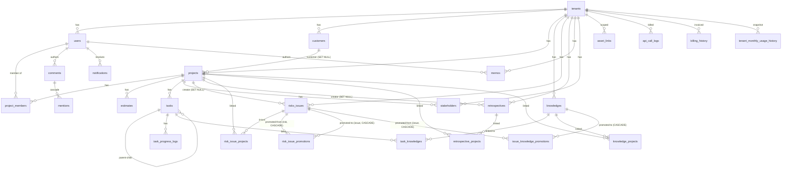

# データモデルとテーブル定義 (Program Design)

本ドキュメントは **`prisma/schema.prisma` (57 model) と実 Postgres (Supabase) の完全ミラー** を目的とした基盤文書です。1 ファイルで全テーブルの構造・インデックス・FK ポリシー・PostgreSQL 拡張・RLS・ベクトル検索の実装まで把握できることをゴールとします。

> ⚠️ **最終的な真値は [prisma/schema.prisma](../../prisma/schema.prisma) と実 DB**。本ドキュメントは schema を 1:1 に転記し設計判断を補足したものです。schema に存在しないカラム・テーブルは記載しません (推測でカラムを足さない方針)。マイグレーション戦略は [../operations/DB_MIGRATION_PROCEDURE.md](../operations/develop/DB_MIGRATION_PROCEDURE.md) を参照。

最終再生成: 2026-06-27 (v1.5.0 アイデア出し機能で idea_voting_sessions 系 4 table / idea_whiteboard_sessions 系 2 table / idea_qa_threads 系 3 table / idea_asset_links を追加; 同日 tenant_banners を追加、schema.prisma 57 model + Supabase introspection 照合)。

---

## 目次

- [§1. テーブル一覧 (57 + Prisma 管理表)](#1-テーブル一覧-57--prisma-管理表)
- [§2. PostgreSQL 拡張機能](#2-postgresql-拡張機能)
- [§3. ベクトル検索の実装 (pgvector)](#3-ベクトル検索の実装-pgvector)
- [§4. 全文検索インデックス (pg_trgm)](#4-全文検索インデックス-pg_trgm)
- [§5. RLS とテナント分離](#5-rls-とテナント分離)
- [§6. FK onDelete ポリシー](#6-fk-ondelete-ポリシー)
- [§7. ER 図](#7-er-図)
- [§8. テーブル定義 (§8.1〜§8.57)](#8-テーブル定義)
- [§14. 初期データ・シード設計](#14-初期データシード設計)
- [§15. インデックス戦略](#15-インデックス戦略)

---

## §1. テーブル一覧 (57 + Prisma 管理表)

| # | 物理名 | 日本語名 | 区分 |
|---|---|---|---|
| 8.1 | `tenants` | テナント | 中核 |
| 8.2 | `users` | ユーザ | 中核 / 認証 |
| 8.3 | `sessions` | セッション | 認証 |
| 8.4 | `email_verification_tokens` | メール検証トークン | 認証 |
| 8.5 | `password_reset_tokens` | パスワードリセットトークン | 認証 |
| 8.6 | `recovery_codes` | リカバリコード | 認証 |
| 8.7 | `password_histories` | パスワード履歴 | 認証 |
| 8.8 | `customers` | 顧客 | 業務 |
| 8.9 | `projects` | プロジェクト | 業務 |
| 8.10 | `estimates` | 見積もり | 業務 |
| 8.11 | `project_members` | プロジェクトメンバー | 業務 / M2M |
| 8.12 | `tasks` | タスク (WBS) | 業務 |
| 8.13 | `task_progress_logs` | 進捗・実績ログ | 業務 |
| 8.14 | `risks_issues` | リスク・課題 | 業務 |
| 8.15 | `risk_issue_projects` | リスク課題-PJ 中間 | M2M |
| 8.16 | `stakeholders` | ステークホルダー | 業務 |
| 8.17 | `knowledges` | ナレッジ | 業務 |
| 8.18 | `knowledge_projects` | ナレッジ-PJ 中間 | M2M |
| 8.19 | `task_knowledges` | タスク-ナレッジ中間 | M2M |
| 8.20 | `retrospectives` | 振り返り | 業務 |
| 8.21 | `retrospective_projects` | 振り返り-PJ 中間 | M2M |
| 8.22 | `audit_logs` | 監査ログ | ログ |
| 8.23 | `auth_event_logs` | 認証イベントログ | ログ |
| 8.24 | `system_error_logs` | システムエラーログ | ログ |
| 8.25 | `cron_execution_logs` | cron 実行履歴 | ログ |
| 8.26 | `role_change_logs` | 権限変更履歴 | ログ |
| 8.27 | `attachments` | 添付ファイル | 業務 / embedding |
| 8.28 | `comments` | コメント | 業務 |
| 8.29 | `mentions` | メンション | 業務 |
| 8.30 | `notifications` | 通知 | 業務 |
| 8.31 | `memos` | 個人メモ | 業務 / embedding |
| 8.32 | `api_call_logs` | API 呼び出しログ | 課金 / ログ |
| 8.33 | `suggestion_explanations` | 提案説明文キャッシュ | 業務 / 課金 |
| 8.34 | `tenant_monthly_usage_history` | 月次使用量履歴 | 課金 |
| 8.35 | `tenant_import_preview` | 外部インポートプレビュー | 業務 |
| 8.36 | `email_send_logs` | メール送信ログ | ログ |
| 8.37 | `stripe_webhook_events` | Stripe Webhook イベント | 課金 |
| 8.38 | `billing_history` | 請求履歴 | 課金 |
| 8.39 | `stripe_usage_record_queue` | Stripe Usage Record キュー | 課金 |
| 8.40 | `tenant_consent_logs` | 規約同意ログ | 課金 / 法務 |
| 8.41 | `faq_embeddings` | FAQ embedding | embedding / RAG |
| 8.42 | `guide_embeddings` | ガイド embedding | embedding / RAG |
| 8.43 | `system_banners` | システム周知バナー (グローバル) | 運用 |
| 8.44 | `risk_issue_promotions` | リスク→課題 昇華リンク | 業務 / M2M |
| 8.45 | `issue_knowledge_promotions` | 課題→ナレッジ 昇華リンク | 業務 / M2M |
| 8.46 | `asset_links` | 資産間 汎用手動リンク (5 資産) | 業務 / M2M |
| 8.47 | `idea_voting_sessions` | アイデア投票セッション | 業務 / アイデア |
| 8.48 | `idea_voting_options` | 投票選択肢 | 業務 / アイデア |
| 8.49 | `idea_voting_submissions` | 投票提出 (1 人 1 セッション) | 業務 / アイデア |
| 8.50 | `idea_voting_allocations` | 投票票配分 (dot 投票) | 業務 / アイデア |
| 8.51 | `idea_whiteboard_sessions` | ホワイトボードセッション | 業務 / アイデア |
| 8.52 | `idea_whiteboard_notes` | ホワイトボード付箋 | 業務 / アイデア |
| 8.53 | `idea_qa_threads` | 匿名 Q&A スレッド | 業務 / アイデア |
| 8.54 | `idea_qa_answers` | Q&A 回答 | 業務 / アイデア |
| 8.55 | `idea_qa_upvotes` | Q&A いいね | 業務 / アイデア |
| 8.56 | `idea_asset_links` | アイデア-資産間 逆引きリンク | 業務 / アイデア |
| 8.57 | `tenant_banners` | テナント向けバナー (テナント管理者が自テナントに設定) | 運用 |
| — | `_prisma_migrations` | Prisma マイグレーション管理表 (65 行) | システム |

> `_prisma_migrations` は Prisma Migrate が管理するシステム表で `public` スキーマに存在する (適用済みマイグレーションのチェックサム・適用時刻を記録)。アプリは直接参照せず、本ドキュメントでは存在のみ注記。

> **過去 doc からの是正**: 旧 DATA_MODEL.md にあった `decisions` / `change_requests` / `operation_trace_logs` および §4.2 の `estimate_knowledges` / `task_risks` / `task_estimates` / `task_dependencies` / `risk_knowledges` / `decision_*` / `retrospective_knowledges` / `knowledge_links` は **schema/実 DB に存在しない陳腐化テーブル** のため全削除した (grep 0 件で確認済)。

---

## §2. PostgreSQL 拡張機能

実 Supabase インスタンスで有効な拡張 (introspection 確定値):

| 拡張 | バージョン | 用途 |
|---|---|---|
| `vector` (pgvector) | 0.8.0 | 1024 次元 embedding 列の格納と Cosine 類似度検索 |
| `pg_trgm` | 1.6 | トライグラム全文検索 (GIN index)。`knowledges` / `risks_issues` / `retrospectives` のテキスト検索 |
| `pgcrypto` | (有効) | `gen_random_uuid()` (全 PK の既定値) |
| `uuid-ossp` | 1.1 | UUID 生成補助 |
| `pg_stat_statements` | 1.11 | クエリ統計 (運用観測) |
| `supabase_vault` | 0.3.1 | Supabase Vault (秘密情報管理、Supabase 標準) |
| `plpgsql` | (標準) | PL/pgSQL (PostgreSQL 標準同梱) |

- `id` 列の既定値は `gen_random_uuid()` (pgcrypto)。timestamp 列は `now()` / `CURRENT_TIMESTAMP`。
- **トリガ 0 件 / カスタム関数なし** (pg_trgm 由来の関数を除く)。`updated_at` は DB トリガではなく Prisma の `@updatedAt` (アプリ側) で更新される。

---

## §3. ベクトル検索の実装 (pgvector)

embedding 列はすべて `vector(1024)` 型 (Voyage AI `voyage-4-lite`)。Prisma は vector 型を認識できないため schema 上は `Unsupported("vector(1024)")` 宣言で、read/write は `$queryRaw` 経由。

| テーブル | 列 | NULL | 備考 |
|---|---|---|---|
| `projects` | `content_embedding` | YES | purpose+background+scope 結合の embedding |
| `risks_issues` | `content_embedding` | YES | title+content+cause+lessonLearned 等 |
| `retrospectives` | `content_embedding` | YES | planSummary+actualSummary+goodPoints+improvements 等 |
| `knowledges` | `content_embedding` | YES | title+background+content+result+conclusion |
| `memos` | `content_embedding` | YES | title+content |
| `attachments` | `content_embedding` | YES | 抽出テキストの embedding (テキスト抽出成功時のみ) |
| `faq_embeddings` | `content_embedding` | **NO** | NOT NULL = 生成完了の証跡 (row が存在 = embedding 済) |
| `guide_embeddings` | `content_embedding` | **NO** | 同上 |

- **業務エンティティ (projects/risks_issues/retrospectives/knowledges/memos/attachments) は nullable**: ADR-0026 で embedding 生成を非同期化したため、本体 INSERT/UPDATE は embedding なしでも成功する (生成失敗時 NULL の fail-safe)。`attachments` は `embedding_status` 状態機械 (pending → generating → completed / failed / unsupported) で追跡。
- **`faq_embeddings` / `guide_embeddings` は NOT NULL**: source-of-truth は `src/config/faq-content.ts` / `guide-content.ts`。embedding 生成失敗時は row 自体を作らない設計 (chat/help RAG, ADR-0028)。
- **★pgvector の専用インデックス (ivfflat / hnsw) は存在しない (introspection で 0 件)★**: 現状すべての vector 類似検索は **ブルートフォース全走査** (`ORDER BY content_embedding <=> $query`)。現データ規模では許容範囲。データ量が増えた時点で ivfflat / hnsw index 追加を検討する。
- 検索サービス: チャット意味検索 `src/services/chat-search.service.ts` (pgvector + pg_trgm fallback)、ヘルプ RAG `src/services/help-search` (FaqEmbedding / GuideEmbedding)。

---

## §4. 全文検索インデックス (pg_trgm)

pg_trgm の GIN index が以下に存在する (introspection 確定、`gin_trgm_ops`):

| テーブル | 対象列 |
|---|---|
| `knowledges` | `title`, `content` |
| `risks_issues` | `title`, `content` |
| `retrospectives` | `problems`, `improvements` |

embedding 検索が利用できない場合 (embedding 未生成等) のテキストフォールバックや、部分一致検索に使用される。

---

## §5. RLS とテナント分離

実 DB introspection 確定事実 (★設計上極めて重要★):

- **大半のテーブルで RLS は `enabled` だが、ポリシーは 0 件 (`forced=false`)** → 実効的に無効。
- アプリは **Prisma 特権 (service) ロールで接続するため RLS をバイパス** する。
- **テナント分離の唯一の防御線は service 層の `where.tenantId` フィルタ** (`viewerTenantId` を必須引数で受ける設計、memory `feedback_tenant_isolation`)。DB 層 RLS には依存しない。
- 一覧系サービスは `viewerTenantId` を必須引数で受け取り、`where: { tenantId: viewerTenantId, ... }` を強制する。これが越境防止 (severity-1 個人情報漏洩リスク予防) の根本。

RLS が **OFF** のテーブル (introspection 確定):

`billing_history` / `cron_execution_logs` / `faq_embeddings` / `guide_embeddings` / `stripe_usage_record_queue` / `stripe_webhook_events` / `tenant_consent_logs`

(いずれもテナント横断のシステム/課金/RAG 系で、テナント越境 read のリスクが構造的に低いか、そもそも tenant_id を持たない `faq_embeddings`/`guide_embeddings`/`cron_execution_logs`。)

---

## §6. FK onDelete ポリシー

ADR-0015 (アプリ層 cascade) に基づき、FK の onDelete は以下の方針 (introspection + schema 確定):

| FK の種別 | onDelete | 理由 |
|---|---|---|
| `tenant_id` → `tenants.id` | **NO ACTION** | テナント削除はアプリ層で明示的に全関連を cascade 削除する (ADR-0015)。DB FK での自動 cascade は使わない |
| 作成者 (`created_by`) / reporter (`reporter_id`) | **RESTRICT** | 作成者 User を物理削除しようとすると拒否 (監査整合性を保つ) |
| 担当者 (`assignee_id`) / `stakeholders.user_id` / `memos.assignee_id` / `knowledges.assignee_id` / `retrospectives.assignee_id` | **SET NULL** | 担当者 User 物理削除時は担当解除し本体は残す |
| `projects.customer_id` → `customers.id` | **SET NULL** | Customer 物理削除時、論理削除済 Project の customer_id を dangling にしない |
| `risks_issues.project_id` / `retrospectives.project_id` (作成元 PJ) | **SET NULL** | M2M 化に伴い「作成元 PJ」の audit 用途。作成元 PJ 物理削除で NULL 化 (orphan 許容) |
| M2M 中間 (`knowledge_projects` / `retrospective_projects` / `risk_issue_projects` / `risk_issue_promotions` / `issue_knowledge_promotions`) | **CASCADE** | リンク両端の物理削除でリンク行を自動削除 |
| `asset_links.tenant_id` | **NO ACTION** | ポリモーフィック (entity ID 列に FK 無し) だが tenant_id は他テーブルと同じ NO ACTION で統一。entity 削除時の孤立リンクは各エンティティの delete service から `deleteAssetLinksForEntity` を呼んでアプリ層で除去 (v1.3.0 資産導線機能) |
| `mentions.comment_id` → `comments.id` | **CASCADE** | コメント削除でメンションも物理削除 |
| `sessions.user_id` → `users.id` | **CASCADE** | User 削除でセッション破棄 |
| その他の参照 (token 系の user_id/tenant_id 等) | NO ACTION / RESTRICT | Prisma 既定。アプリ層で整合性を担保 |

> 各列の正確な onDelete は §8 の各テーブル定義に明記。

---

## §7. ER 図

主要な業務エンティティの関連 (M2M 中間・課金・ログ系は省略、全リレーションは §8 各テーブルの FK 欄を参照):


```mermaid
erDiagram
    tenants ||--o{ users : "has"
    tenants ||--o{ customers : "has"
    tenants ||--o{ projects : "has"
    tenants ||--o{ knowledges : "has"
    tenants ||--o{ risks_issues : "has"
    tenants ||--o{ retrospectives : "has"
    tenants ||--o{ memos : "has"
    tenants ||--o{ stakeholders : "has"

    customers ||--o{ projects : "customer (SET NULL)"
    projects ||--o{ project_members : "has"
    users ||--o{ project_members : "member of"
    projects ||--o{ estimates : "has"
    projects ||--o{ tasks : "has"
    tasks ||--o{ tasks : "parent-child"
    tasks ||--o{ task_progress_logs : "has"
    tasks ||--o{ task_knowledges : "links"
    knowledges ||--o{ task_knowledges : "linked-to"
    projects ||--o{ stakeholders : "has"

    %% リスク/課題・振り返り・ナレッジは M:N (中間テーブル経由)。
    %% project_id 列は「作成元プロジェクト」(audit) で ON DELETE SET NULL。
    projects ||--o{ risks_issues : "creator (SET NULL)"
    projects ||--o{ retrospectives : "creator (SET NULL)"
    projects ||--o{ risk_issue_projects : "linked"
    risks_issues ||--o{ risk_issue_projects : "linked"
    projects ||--o{ retrospective_projects : "linked"
    retrospectives ||--o{ retrospective_projects : "linked"
    projects ||--o{ knowledge_projects : "linked"
    knowledges ||--o{ knowledge_projects : "linked"

    %% v1.3.0 資産導線機能: 昇華リンク (M:N, 再昇華ブロックなし) + 汎用手動リンク。
    risks_issues ||--o{ risk_issue_promotions : "promoted-from (risk, CASCADE)"
    risks_issues ||--o{ risk_issue_promotions : "promoted-to (issue, CASCADE)"
    risks_issues ||--o{ issue_knowledge_promotions : "promoted-from (issue, CASCADE)"
    knowledges ||--o{ issue_knowledge_promotions : "promoted-to (CASCADE)"
    %% asset_links は entity 列がポリモーフィック (FK 無し) のため tenant のみ線を引く。
    tenants ||--o{ asset_links : "scoped"

    %% comments / attachments / notifications は polymorphic (entity_type + entity_id)。
    %% FK を持たないため線は引かない。comments ||--o{ mentions は FK あり。
    comments ||--o{ mentions : "cascade"
    users ||--o{ comments : "authors"
    users ||--o{ notifications : "receives"
    users ||--o{ memos : "authors"

    tenants ||--o{ api_call_logs : "billed"
    tenants ||--o{ billing_history : "invoiced"
    tenants ||--o{ tenant_monthly_usage_history : "snapshot"
```

---

## §8. テーブル定義

各テーブルは schema.prisma と 1:1。型表記は Prisma `@db.*` の物理型。

### 8.1 tenants（テナント）

マルチテナント基盤。全業務エンティティの所属を一元管理する。v1 (2026-06-01) は `default-tenant` 単一テナント運用、v1.x で UI 経由のテナント追加に対応。

| 論理名 | 物理名 | 型 | NULL | デフォルト | 説明 |
|---|---|---|---|---|---|
| ID | id | UUID | NO | gen_random_uuid() | 主キー |
| slug | slug | VARCHAR(60) | NO | - | 組織 ID (ログイン時の識別子)。UNIQUE。公開サインアップはサーバが数字連番を自動採番 (BASE=100000、feat/signup-friction-reduction 2026-06-12)。super_admin 手動払い出しは slug 手入力。Default テナントは 'default' 固定 |
| テナント名 | name | VARCHAR(100) | NO | - | 表示名 |
| 顧客連番 | tenant_seq | INT | YES | (SEQUENCE) | 人間可読連番。UNIQUE。default=1、管理テナントは null |
| プラン | plan | VARCHAR(20) | NO | 'beginner' | 'beginner' / 'expert' / 'pro' |
| 当月 LLM 呼出数 | current_month_api_call_count | INT | NO | 0 | LLM_BILLABLE のみ。Beginner 50 件上限判定対象 |
| 当月 LLM 課金額 | current_month_api_cost_jpy | INT | NO | 0 | 円整数。予算上限予測判定対象 |
| 当月 Embedding 呼出数 | current_month_embedding_call_count | INT | NO | 0 | 全プランで件数記録 (ADR-0022) |
| 当月 Embedding 課金額 | current_month_embedding_cost_jpy | INT | NO | 0 | Beginner=0 / Expert/Pro=件数×¥5 (ADR-0029) |
| 当月ヘルプチャット数 | current_month_help_chat_count | INT | NO | 0 | 全プラン無料、月 100 回上限 (ADR-0027) |
| 月次予算上限 | monthly_budget_cap_jpy | INT | YES | NULL | LLM_BILLABLE 用。NULL=無制限 |
| Embedding 予算上限 | monthly_embedding_budget_cap_jpy | INT | YES | NULL | EMBEDDING_BILLABLE 用 (ADR-0030)。NULL=無制限 |
| Beginner 月間上限 | beginner_monthly_call_limit | INT | NO | 50 | 課金対象 featureUnit のみカウント (ADR-0019) |
| Beginner 最大席数 | beginner_max_seats | INT | NO | 5 | |
| Haiku 単価 | price_per_call_haiku | INT | NO | 10 | Expert ¥10/call (ADR-0019) |
| Sonnet 単価 | price_per_call_sonnet | INT | NO | 15 | Pro ¥15/call |
| 請求先種別 | billing_type | VARCHAR(20) | NO | 'corporate' | 'corporate' / 'individual' |
| 請求先会社名 | billing_company_name | VARCHAR(200) | YES | NULL | 請求書発行先正式名 |
| 請求先担当者 | billing_contact_name | VARCHAR(100) | YES | NULL | |
| 請求先メール | billing_contact_email | VARCHAR(255) | YES | NULL | |
| 請求先住所(legacy) | billing_address | TEXT | YES | NULL | 旧単一住所、フォールバック表示用 |
| 郵便番号 | billing_postal_code | VARCHAR(10) | YES | NULL | |
| 都道府県 | billing_prefecture | VARCHAR(20) | YES | NULL | |
| 市区町村 | billing_city | VARCHAR(100) | YES | NULL | |
| 番地 | billing_street_address | VARCHAR(200) | YES | NULL | |
| 建物名 | billing_building_name | VARCHAR(200) | YES | NULL | |
| 電話番号 | billing_phone_number | VARCHAR(20) | YES | NULL | |
| 支払い方法 | payment_method | VARCHAR(30) | NO | 'invoice' | 'invoice'(銀行振込) / 'credit_card'。旧 'bank_transfer' は 'invoice' に統合 |
| プラン変更予約日時 | scheduled_plan_change_at | TIMESTAMPTZ | YES | NULL | ダウングレード翌月適用 |
| 予約後プラン | scheduled_next_plan | VARCHAR(20) | YES | NULL | |
| 最終リセット日時 | last_reset_at | TIMESTAMPTZ | YES | NULL | 月初リセット cron が処理した最後の月初 |
| Beginner 昇格履歴 | beginner_ever_upgraded | BOOLEAN | NO | false | 一度でも Expert/Pro になった (Beginner 永続防止) |
| 60日警告送信日時 | beginner_notice_day60_sent_at | TIMESTAMPTZ | YES | NULL | |
| 75日警告送信日時 | beginner_notice_day75_sent_at | TIMESTAMPTZ | YES | NULL | |
| 90日失効通知日時 | beginner_expired_notice_sent_at | TIMESTAMPTZ | YES | NULL | |
| 150日削除予告日時 | beginner_auto_delete_notice_day150_sent_at | TIMESTAMPTZ | YES | NULL | |
| 170日削除予告日時 | beginner_auto_delete_notice_day170_sent_at | TIMESTAMPTZ | YES | NULL | |
| ~~シード参照有効~~ | ~~seed_data_enabled~~ | — | — | — | **2026-06-05 撤去** (migration 20260613)。提案/チャットを単一テナント化 (管理テナント越境参照を廃止)。見本データは「スターターデータ取込」(各テーブルの is_seed_sample マーカー) に置換 |
| インポート中ロック | import_in_progress_at | TIMESTAMPTZ | YES | NULL | 30 分で自動失効 |
| Storage 使用量 | storage_bytes_used | BIGINT | NO | 0 | DB 容量キャッシュ (日次 cron) |
| Storage 更新日時 | storage_bytes_used_at | TIMESTAMPTZ | YES | NULL | |
| 容量超過通知日時 | storage_over_limit_notice_sent_at | TIMESTAMPTZ | YES | NULL | |
| DB 容量月中 peak | storage_bytes_peak_this_month | BIGINT | NO | 0 | 課金根拠 (ADR-0020) |
| DB 容量 peak 時刻 | storage_bytes_peak_at | TIMESTAMPTZ | YES | NULL | |
| DB インスタンス peak | db_instance_bytes_peak_this_month | BIGINT | YES | NULL | drift 監視用 |
| DB 容量警告 Level | db_capacity_warning_level | VARCHAR(8) | NO | 'none' | none/l1/l2/l3 |
| circuit 失敗カウンタ | storage_guard_circuit_fail_count | INT | NO | 0 | 3 回で write 拒否 (R3 fail-close) |
| circuit open 時刻 | storage_guard_circuit_opened_at | TIMESTAMPTZ | YES | NULL | |
| ファイル容量使用量 | storage_file_bytes_used | BIGINT | NO | 0 | Supabase Storage キャッシュ (ADR-0021) |
| ファイル容量更新日時 | storage_file_bytes_used_at | TIMESTAMPTZ | YES | NULL | |
| ファイル容量月中 peak | storage_file_bytes_peak_this_month | BIGINT | NO | 0 | 課金根拠 (storage_file_overage) |
| ファイル容量 peak 時刻 | storage_file_bytes_peak_at | TIMESTAMPTZ | YES | NULL | |
| bucket 容量 peak | storage_bucket_bytes_peak_this_month | BIGINT | YES | NULL | drift 検知用 |
| ファイル容量警告 Level | file_storage_warning_level | VARCHAR(8) | NO | 'none' | none/l1/l2/l3 |
| ファイル容量前日値 | storage_file_bytes_yesterday | BIGINT | YES | NULL | anomaly baseline (+5GB/24h で alert) |
| タイムゾーン | timezone | VARCHAR(60) | NO | 'Asia/Tokyo' | IANA TZ 名 |
| ロケール | locale | VARCHAR(10) | NO | 'ja-JP' | BCP 47 |
| 作成日時 | created_at | TIMESTAMPTZ | NO | now() | |
| 更新日時 | updated_at | TIMESTAMPTZ | NO | @updatedAt | |
| 削除日時 | deleted_at | TIMESTAMPTZ | YES | NULL | 論理削除 |
| 停止日時 | suspended_at | TIMESTAMPTZ | YES | NULL | not null=read-only 強制 (滞納等) |
| 停止理由 | suspend_reason | VARCHAR(50) | YES | NULL | 'payment_delinquent' 等 |
| 停止実行者 | suspended_by | UUID | YES | NULL | super_admin の User.id (FK ではない) |
| 解除日時 | resumed_at | TIMESTAMPTZ | YES | NULL | |
| 作成者 User ID | created_by_user_id | UUID | YES | NULL | 初期 admin User.id (FK ではない、ADR-0016) |
| Stripe Customer ID | stripe_customer_id | VARCHAR(50) | YES | NULL | UNIQUE |
| Stripe Subscription ID | stripe_subscription_id | VARCHAR(50) | YES | NULL | UNIQUE |
| Subscription 状態 | stripe_subscription_status | VARCHAR(30) | YES | NULL | active/past_due/canceled 等 |
| Haiku Item ID | stripe_subscription_item_haiku_id | VARCHAR(50) | YES | NULL | |
| Sonnet Item ID | stripe_subscription_item_sonnet_id | VARCHAR(50) | YES | NULL | |
| Embedding Item ID | stripe_subscription_item_embedding_id | VARCHAR(50) | YES | NULL | ADR-0022 (env 設定時のみ) |
| DB 容量 Item ID | stripe_subscription_item_db_capacity_id | VARCHAR(50) | YES | NULL | ADR-0020/0021 |
| ファイル容量 Item ID | stripe_subscription_item_storage_file_id | VARCHAR(50) | YES | NULL | |
| 既定支払方法 ID | stripe_default_payment_method_id | VARCHAR(50) | YES | NULL | |
| カード最終検証日時 | card_last_verified_at | TIMESTAMPTZ | YES | NULL | |
| カード検証状態 | card_verification_status | VARCHAR(20) | YES | NULL | valid/expired/declined/never_verified |
| 自動停止予定日時 | auto_suspend_scheduled_at | TIMESTAMPTZ | YES | NULL | past_due 受信時 now+3日 |

**インデックス**: `idx_tenants_plan` (plan) / `idx_tenants_stripe_subscription_status` (stripe_subscription_status) / UNIQUE(slug) / UNIQUE(tenant_seq) / UNIQUE(stripe_customer_id) / UNIQUE(stripe_subscription_id)

### 8.2 users（ユーザ）

| 論理名 | 物理名 | 型 | NULL | デフォルト | 説明 |
|---|---|---|---|---|---|
| ID | id | UUID | NO | gen_random_uuid() | 主キー |
| テナント | tenant_id | UUID | NO | - | FK→tenants.id (NO ACTION)。ADR-0024 で DB DEFAULT 撤去 |
| ユーザ名 | name | VARCHAR(100) | NO | - | |
| メール | email | VARCHAR(255) | NO | - | (tenant_id, email) で UNIQUE |
| パスワードハッシュ | password_hash | VARCHAR(255) | NO | - | bcrypt |
| システムロール | system_role | VARCHAR(20) | NO | 'general' | super_admin / admin / general (3 階層) |
| 有効フラグ | is_active | BOOLEAN | NO | true | |
| ログイン失敗回数 | failed_login_count | INT | NO | 0 | |
| 一時ロック解除日時 | locked_until | TIMESTAMPTZ | YES | NULL | |
| 一時ロック累計 | temporary_lock_count | INT | NO | 0 | 3 で permanent_lock 発火 |
| 恒久ロック | permanent_lock | BOOLEAN | NO | false | |
| MFA 有効 | mfa_enabled | BOOLEAN | NO | false | |
| MFA シークレット | mfa_secret_encrypted | VARCHAR(255) | YES | NULL | 暗号化済 TOTP |
| MFA 有効化日時 | mfa_enabled_at | TIMESTAMPTZ | YES | NULL | |
| MFA 失敗回数 | mfa_failed_count | INT | NO | 0 | 3 回で 30 分ロック |
| MFA ロック解除日時 | mfa_locked_until | TIMESTAMPTZ | YES | NULL | |
| 最終ログイン日時 | last_login_at | TIMESTAMPTZ | YES | NULL | |
| 招待受諾日時 | invitation_accepted_at | TIMESTAMPTZ | YES | NULL | **NULL = 招待中**（パスワード未設定）、値あり = 受諾済。アカウント状態(招待中/有効/無効)を `is_active` と合わせて導出。2026-06-03 追加 (migration `20260610`)。ZIP インポート作成ユーザ・テナント初期 admin は `now()` を設定し「有効（要 PW 再設定）」として登録（v1.5.0）|
| パスワード変更強制 | force_password_change | BOOLEAN | NO | false | |
| トークンバージョン | token_version | INT | NO | 0 | JWT 失効カウンタ (increment で全 JWT 失効) |
| テーマ設定 | theme_preference | VARCHAR(30) | NO | 'light' | |
| 作成者 | created_by | UUID | YES | NULL | 招待した管理者の User.id。**自己参照 FK は張らない**（リレーション無し、氏名は一覧で解決）。NULL = 記録なし。2026-06-03 追加 (migration `20260611`) |
| 更新者 | updated_by | UUID | YES | NULL | 最後に編集した管理者の User.id（同上、FK なし）。2026-06-03 追加 |
| 作成日時 | created_at | TIMESTAMPTZ | NO | now() | |
| 更新日時 | updated_at | TIMESTAMPTZ | NO | @updatedAt | |
| 削除日時 | deleted_at | TIMESTAMPTZ | YES | NULL | **論理削除専用**（2026-06-03 以前は「招待中」もここで代用していたが廃止。招待中は invitation_accepted_at=null で表す） |

> timezone / locale は User からは撤去され Tenant に集約 (PR-1)。
> アカウント状態（招待中/有効/無効）の導出・ライフサイクル・席数(案A)は [USER_MANAGEMENT.md](./USER_MANAGEMENT.md) を参照。

**インデックス**: UNIQUE(tenant_id, email)=`idx_users_tenant_email` / `idx_users_active` (is_active, last_login_at) / `idx_users_tenant` (tenant_id)

### 8.3 sessions（セッション）

| 論理名 | 物理名 | 型 | NULL | デフォルト | 説明 |
|---|---|---|---|---|---|
| ID | id | UUID | NO | gen_random_uuid() | 主キー |
| セッショントークン | session_token | VARCHAR(255) | NO | - | UNIQUE |
| ユーザ | user_id | UUID | NO | - | FK→users.id (**CASCADE**) |
| 有効期限 | expires | TIMESTAMPTZ | NO | - | |
| 作成日時 | created_at | TIMESTAMPTZ | NO | now() | |

**インデックス**: UNIQUE(session_token) / `idx_sessions_user` (user_id)

### 8.4 email_verification_tokens（メール検証トークン）

| 論理名 | 物理名 | 型 | NULL | デフォルト | 説明 |
|---|---|---|---|---|---|
| ID | id | UUID | NO | gen_random_uuid() | 主キー |
| テナント | tenant_id | UUID | NO | - | FK→tenants.id。越境再利用遮断 |
| ユーザ | user_id | UUID | NO | - | FK→users.id |
| トークンハッシュ | token_hash | VARCHAR(255) | NO | - | |
| 有効期限 | expires_at | TIMESTAMPTZ | NO | - | |
| 使用日時 | used_at | TIMESTAMPTZ | YES | NULL | |
| 作成日時 | created_at | TIMESTAMPTZ | NO | now() | |

**インデックス**: `idx_email_verification_tokens_tenant` (tenant_id)

### 8.5 password_reset_tokens（パスワードリセットトークン）

| 論理名 | 物理名 | 型 | NULL | デフォルト | 説明 |
|---|---|---|---|---|---|
| ID | id | UUID | NO | gen_random_uuid() | 主キー |
| テナント | tenant_id | UUID | NO | - | FK→tenants.id |
| ユーザ | user_id | UUID | NO | - | FK→users.id |
| トークンハッシュ | token_hash | VARCHAR(255) | NO | - | |
| 有効期限 | expires_at | TIMESTAMPTZ | NO | - | |
| 使用日時 | used_at | TIMESTAMPTZ | YES | NULL | |
| 作成日時 | created_at | TIMESTAMPTZ | NO | now() | |

**インデックス**: `idx_password_reset_tokens_tenant` (tenant_id)

### 8.6 recovery_codes（リカバリコード）

| 論理名 | 物理名 | 型 | NULL | デフォルト | 説明 |
|---|---|---|---|---|---|
| ID | id | UUID | NO | gen_random_uuid() | 主キー |
| テナント | tenant_id | UUID | NO | - | FK→tenants.id |
| ユーザ | user_id | UUID | NO | - | FK→users.id |
| コードハッシュ | code_hash | VARCHAR(255) | NO | - | bcrypt |
| 使用日時 | used_at | TIMESTAMPTZ | YES | NULL | |
| 作成日時 | created_at | TIMESTAMPTZ | NO | now() | |

**インデックス**: `idx_recovery_codes_tenant` (tenant_id)

### 8.7 password_histories（パスワード履歴）

| 論理名 | 物理名 | 型 | NULL | デフォルト | 説明 |
|---|---|---|---|---|---|
| ID | id | UUID | NO | gen_random_uuid() | 主キー |
| テナント | tenant_id | UUID | NO | - | FK→tenants.id |
| ユーザ | user_id | UUID | NO | - | FK→users.id |
| パスワードハッシュ | password_hash | VARCHAR(255) | NO | - | 再利用防止用 |
| 作成日時 | created_at | TIMESTAMPTZ | NO | now() | |

**インデックス**: `idx_password_histories_tenant` (tenant_id)

### 8.8 customers（顧客）

プロジェクト発注元の顧客マスタ。物理削除方針 (deleted_at を持たない)。

| 論理名 | 物理名 | 型 | NULL | デフォルト | 説明 |
|---|---|---|---|---|---|
| ID | id | UUID | NO | gen_random_uuid() | 主キー |
| テナント | tenant_id | UUID | NO | - | FK→tenants.id (NO ACTION) |
| 顧客名 | name | VARCHAR(100) | NO | - | |
| 部門 | department | VARCHAR(100) | YES | NULL | |
| 担当者 | contact_person | VARCHAR(100) | YES | NULL | |
| 担当者メール | contact_email | VARCHAR(255) | YES | NULL | |
| 備考 | notes | TEXT | YES | NULL | |
| 作成者 | created_by | UUID | NO | - | FK→users.id (RESTRICT) |
| 更新者 | updated_by | UUID | NO | - | FK→users.id |
| 作成日時 | created_at | TIMESTAMPTZ | NO | now() | |
| 更新日時 | updated_at | TIMESTAMPTZ | NO | @updatedAt | |

**インデックス**: `idx_customers_name` (name) / `idx_customers_tenant` (tenant_id)

### 8.9 projects（プロジェクト）

| 論理名 | 物理名 | 型 | NULL | デフォルト | 説明 |
|---|---|---|---|---|---|
| ID | id | UUID | NO | gen_random_uuid() | 主キー |
| テナント | tenant_id | UUID | NO | - | FK→tenants.id (NO ACTION) |
| プロジェクト名 | name | VARCHAR(100) | NO | - | |
| 顧客 | customer_id | UUID | NO | - | FK→customers.id (**SET NULL**)。運用上 NOT NULL |
| 目的 | purpose | TEXT | NO | - | |
| 背景 | background | TEXT | NO | - | |
| スコープ | scope | TEXT | NO | - | |
| スコープ外 | out_of_scope | TEXT | YES | NULL | |
| 開発方式 | dev_method | VARCHAR(30) | NO | - | |
| 契約形態 | contract_type | VARCHAR(30) | YES | NULL | 準委任/請負/SES/その他 |
| 業務領域タグ | business_domain_tags | JSONB | NO | '[]' | |
| 技術スタックタグ | tech_stack_tags | JSONB | NO | '[]' | |
| 工程タグ | process_tags | JSONB | NO | '[]' | |
| 開始予定日 | planned_start_date | DATE | NO | - | |
| 終了予定日 | planned_end_date | DATE | NO | - | |
| ステータス | status | VARCHAR(20) | NO | 'planning' | planning/estimating/scheduling/executing/closed (5 ステータス、2026-06-03: 旧 completed/retrospected 廃止)。closed=完全読取専用(削除のみ可) |
| 備考 | notes | TEXT | YES | NULL | |
| サンプルデータ | is_sample_data | BOOLEAN | NO | false | true は一覧非表示・提案では可視 |
| embedding | content_embedding | vector(1024) | YES | NULL | purpose+background+scope |
| 作成者 | created_by | UUID | NO | - | FK→users.id (RESTRICT) |
| 更新者 | updated_by | UUID | NO | - | FK→users.id |
| 作成日時 | created_at | TIMESTAMPTZ | NO | now() | |
| 更新日時 | updated_at | TIMESTAMPTZ | NO | @updatedAt | |
| 削除日時 | deleted_at | TIMESTAMPTZ | YES | NULL | 論理削除 |

**インデックス**: `idx_projects_status` (status) / `idx_projects_customer_id` (customer_id) / `idx_projects_dates` (planned_start_date, planned_end_date) / `idx_projects_tenant` (tenant_id) / `idx_projects_tenant_status` (tenant_id, status) / `idx_projects_is_sample_data` (is_sample_data, partial)

### 8.10 estimates（見積もり）

v1.2.0 で「手動登録」と「係数ベース登録」の 2 モードを追加。係数列は `input_mode='coefficient'` 時のみ非 NULL となる。

| 論理名 | 物理名 | 型 | NULL | デフォルト | 説明 |
|---|---|---|---|---|---|
| ID | id | UUID | NO | gen_random_uuid() | 主キー |
| プロジェクト | project_id | UUID | NO | - | FK→projects.id |
| 見積項目名 | item_name | VARCHAR(100) | NO | - | |
| 区分 | category | VARCHAR(30) | NO | - | requirements / design / development / testing / review / management / other |
| 開発方式 | dev_method | VARCHAR(30) | NO | - | scratch / low_code_no_code / package / winactor / uipath / power_automate_desktop / power_apps / kintone / pleasanter / outsystems / salesforce_lightning / servicenow / mendix / appsheet / zoho_creator / other |
| 見積工数 | estimated_effort | DECIMAL(10,2) | NO | - | 係数モード時は自動計算値を保存 |
| 工数単位 | effort_unit | VARCHAR(20) | NO | - | person_hour / person_day |
| 根拠 | rationale | TEXT | NO | - | (旧フィールド。UI では非表示。notes を使用推奨) |
| 前提条件 | preconditions | TEXT | YES | NULL | |
| 確定済 | is_confirmed | BOOLEAN | NO | false | |
| 備考 | notes | TEXT | YES | NULL | |
| 入力モード | input_mode | VARCHAR(20) | NO | 'direct' | direct (手動) / coefficient (係数ベース) |
| 基準時間 | base_hours | DECIMAL(10,2) | YES | NULL | 係数モード: ツール×区分プリセット値 (h) |
| 規模係数 | scale_coeff | DECIMAL(5,2) | YES | NULL | 係数モード: 極小(0.3)〜特大(2.5) |
| 難易度係数 | difficulty_coeff | DECIMAL(5,2) | YES | NULL | 係数モード: 低(0.8)〜非常に高(1.8) |
| 手法係数 | method_coeff | DECIMAL(5,2) | YES | NULL | 係数モード: デフォルト 1.0 (ツール速度優位は base_hours に吸収) |
| 作成者 | created_by | UUID | NO | - | FK→users.id |
| 更新者 | updated_by | UUID | NO | - | FK→users.id |
| 作成日時 | created_at | TIMESTAMPTZ | NO | now() | |
| 更新日時 | updated_at | TIMESTAMPTZ | NO | @updatedAt | |
| 削除日時 | deleted_at | TIMESTAMPTZ | YES | NULL | 論理削除 |

**係数計算式**: `estimated_effort = base_hours × scale_coeff × difficulty_coeff × method_coeff`

**インデックス**: `idx_estimates_project` (project_id)

> **案Y (将来機能)**: テナントレベルでのカスタムプリセット値設定は `tenant_estimate_presets` テーブルを新設して対応予定。現状 (案X) ではシステム標準値をコードで管理する (`src/config/estimate-master.ts`)。

### 8.11 project_members（プロジェクトメンバー / M2M）

User × Project の中間テーブル。プロジェクトごとに異なる project_role を付与。

| 論理名 | 物理名 | 型 | NULL | デフォルト | 説明 |
|---|---|---|---|---|---|
| ID | id | UUID | NO | gen_random_uuid() | 主キー |
| プロジェクト | project_id | UUID | NO | - | FK→projects.id |
| ユーザ | user_id | UUID | NO | - | FK→users.id |
| プロジェクトロール | project_role | VARCHAR(20) | NO | - | pm_tl / member / viewer |
| 設定者 | assigned_by | UUID | NO | - | FK→users.id |
| 作成日時 | created_at | TIMESTAMPTZ | NO | now() | |
| 更新日時 | updated_at | TIMESTAMPTZ | NO | @updatedAt | |

**インデックス**: UNIQUE(project_id, user_id)=`uq_pm_project_user` / `idx_pm_project` / `idx_pm_user`

### 8.12 tasks（タスク / WBS）

| 論理名 | 物理名 | 型 | NULL | デフォルト | 説明 |
|---|---|---|---|---|---|
| ID | id | UUID | NO | gen_random_uuid() | 主キー |
| プロジェクト | project_id | UUID | NO | - | FK→projects.id |
| 親タスク | parent_task_id | UUID | YES | NULL | FK→tasks.id (自己参照) |
| 種別 | type | VARCHAR(20) | NO | 'activity' | work_package / activity |
| WBS 番号 | wbs_number | VARCHAR(50) | YES | NULL | |
| タスク名 | name | VARCHAR(100) | NO | - | |
| 説明 | description | TEXT | YES | NULL | |
| 区分 | category | VARCHAR(30) | NO | - | |
| 担当者 | assignee_id | UUID | YES | NULL | FK→users.id (SET NULL)。WP は null、ACT は必須 |
| 担当者集約表示 | assignee_display_text | VARCHAR(200) | YES | NULL | WP 専用。配下 ACT の担当者が 2 名以上いる場合のみ設定される表示テキスト (例: "田中 +2")。担当者が 0 人または全員同一の場合は null (migration `20260619_add_task_assignee_display_text`) |
| 開始予定日 | planned_start_date | DATE | YES | NULL | WP は子から自動計算 |
| 終了予定日 | planned_end_date | DATE | YES | NULL | WP は子から自動計算 |
| 開始実績日 | actual_start_date | DATE | YES | NULL | |
| 終了実績日 | actual_end_date | DATE | YES | NULL | |
| 予定工数 | planned_effort | DECIMAL(10,2) | NO | 0 | WP は子の合計 |
| 実績工数 | actual_effort | DECIMAL(10,2) | YES | NULL | ACT の実績工数 (人時)。担当者が実績入力。分析タブの消化工数/工数効率に使用 (migration `20260615_add_task_actual_effort`) |
| 優先度 | priority | VARCHAR(10) | YES | 'medium' | low/medium/high |
| 状態 | status | VARCHAR(20) | NO | 'not_started' | not_started/in_progress/completed/on_hold |
| 進捗率 | progress_rate | INT | NO | 0 | 0-100、WP は子の加重平均 |
| マイルストーン | is_milestone | BOOLEAN | NO | false | |
| 備考 | notes | TEXT | YES | NULL | |
| 作成者 | created_by | UUID | NO | - | FK→users.id |
| 更新者 | updated_by | UUID | NO | - | FK→users.id |
| 作成日時 | created_at | TIMESTAMPTZ | NO | now() | |
| 更新日時 | updated_at | TIMESTAMPTZ | NO | @updatedAt | |
| 削除日時 | deleted_at | TIMESTAMPTZ | YES | NULL | 論理削除 |

**インデックス**: `idx_tasks_project` (project_id) / `idx_tasks_assignee` (assignee_id, status) / `idx_tasks_parent` (parent_task_id) / `idx_tasks_gantt` (project_id, planned_start_date, planned_end_date)

> **ADR-0032 (2026-06-04)**: 部分 UNIQUE `idx_tasks_project_parent_name_unique` (同一親配下の同名重複ブロック、migration `20260525_tasks_unique_parent_name`) は **撤廃** (migration `20260610_drop_tasks_unique_parent_name`)。タスク突合は ID (UUID) のみで行い、週内に繰り返す学習タスク等の同名は業務上正当なため許容する。app 層の `assertTaskNameUniqueInParent` ガードも撤去済。

### 8.13 task_progress_logs（進捗・実績ログ）

| 論理名 | 物理名 | 型 | NULL | デフォルト | 説明 |
|---|---|---|---|---|---|
| ID | id | UUID | NO | gen_random_uuid() | 主キー |
| タスク | task_id | UUID | NO | - | FK→tasks.id |
| 更新者 | updated_by | UUID | NO | - | FK→users.id |
| 更新日 | update_date | DATE | NO | - | |
| 進捗率 | progress_rate | INT | NO | - | 0-100 |
| 実績工数 | actual_effort | DECIMAL(10,2) | NO | - | |
| 残工数 | remaining_effort | DECIMAL(10,2) | YES | NULL | |
| 状態 | status | VARCHAR(20) | NO | - | |
| 遅延有無 | is_delayed | BOOLEAN | NO | false | |
| 遅延理由 | delay_reason | TEXT | YES | NULL | |
| 作業メモ | work_memo | TEXT | YES | NULL | |
| 課題有無 | has_issue | BOOLEAN | NO | false | |
| 次アクション | next_action | TEXT | YES | NULL | |
| 完了日 | completed_date | DATE | YES | NULL | |
| 作成日時 | created_at | TIMESTAMPTZ | NO | now() | |

**インデックス**: `idx_progress_task` (task_id, update_date DESC)

### 8.14 risks_issues（リスク・課題）

| 論理名 | 物理名 | 型 | NULL | デフォルト | 説明 |
|---|---|---|---|---|---|
| ID | id | UUID | NO | gen_random_uuid() | 主キー |
| テナント | tenant_id | UUID | NO | - | FK→tenants.id (NO ACTION) |
| 作成元 PJ | project_id | UUID | YES | NULL | FK→projects.id (**SET NULL**)。M2N は risk_issue_projects 経由 |
| 種別 | type | VARCHAR(10) | NO | - | risk / issue |
| 件名 | title | VARCHAR(100) | NO | - | |
| 発生事象 | occurrence | TEXT | YES | NULL | 4 セクション化で追加 |
| メモ | content | TEXT | NO | - | UI ラベルは「メモ」、DB 列名は content |
| 原因 | cause | TEXT | YES | NULL | |
| 影響度 | impact | VARCHAR(10) | NO | - | low/medium/high |
| 発生可能性 | likelihood | VARCHAR(10) | YES | NULL | |
| 優先度 | priority | VARCHAR(10) | NO | - | low/medium/high |
| 対応方針 | response_policy | TEXT | YES | NULL | |
| 対応策 | response_detail | TEXT | YES | NULL | |
| 起票者 | reporter_id | UUID | NO | - | FK→users.id (RESTRICT) |
| 担当者 | assignee_id | UUID | YES | NULL | FK→users.id (SET NULL) |
| 期限 | deadline | DATE | YES | NULL | |
| 状態 | state | VARCHAR(20) | NO | 'open' | |
| 結果 | result | TEXT | YES | NULL | |
| 教訓 | lesson_learned | TEXT | YES | NULL | |
| 公開範囲 | visibility | VARCHAR(20) | NO | 'draft' | draft / public |
| リスク性質 | risk_nature | VARCHAR(20) | YES | NULL | threat / opportunity (type=risk のみ) |
| embedding | content_embedding | vector(1024) | YES | NULL | |
| 作成者 | created_by | UUID | NO | - | FK→users.id |
| 更新者 | updated_by | UUID | NO | - | FK→users.id |
| 作成日時 | created_at | TIMESTAMPTZ | NO | now() | |
| 更新日時 | updated_at | TIMESTAMPTZ | NO | @updatedAt | |
| 削除日時 | deleted_at | TIMESTAMPTZ | YES | NULL | 論理削除 |

**インデックス**: `idx_risks_project` (project_id, type) / `idx_risks_state` (state, priority) / `idx_risks_assignee` (assignee_id) / `idx_risks_tenant` (tenant_id) / pg_trgm GIN (title, content)

### 8.15 risk_issue_projects（リスク課題-PJ 中間 / M2M）

| 論理名 | 物理名 | 型 | NULL | デフォルト | 説明 |
|---|---|---|---|---|---|
| ID | id | UUID | NO | gen_random_uuid() | 主キー |
| リスク課題 | risk_issue_id | UUID | NO | - | FK→risks_issues.id (**CASCADE**) |
| プロジェクト | project_id | UUID | NO | - | FK→projects.id (**CASCADE**) |

**インデックス**: UNIQUE(risk_issue_id, project_id) / `idx_risk_issue_projects_project` (project_id)

### 8.16 stakeholders（ステークホルダー / PMBOK 13）

| 論理名 | 物理名 | 型 | NULL | デフォルト | 説明 |
|---|---|---|---|---|---|
| ID | id | UUID | NO | gen_random_uuid() | 主キー |
| テナント | tenant_id | UUID | NO | - | FK→tenants.id (NO ACTION) |
| プロジェクト | project_id | UUID | NO | - | FK→projects.id |
| ユーザ | user_id | UUID | YES | NULL | FK→users.id (**SET NULL**)。null=外部関係者 |
| 表示氏名 | name | VARCHAR(100) | NO | - | |
| 所属組織 | organization | VARCHAR(100) | YES | NULL | |
| 役職 | role | VARCHAR(100) | YES | NULL | |
| 連絡先メモ | contact_info | TEXT | YES | NULL | |
| 影響度 | influence | SMALLINT | NO | - | 1-5 |
| 関心度 | interest | SMALLINT | NO | - | 1-5 |
| 姿勢 | attitude | VARCHAR(20) | NO | - | supportive/neutral/opposing |
| 現エンゲージメント | current_engagement | VARCHAR(20) | NO | - | PMBOK 5 段階 |
| 望ましいエンゲージメント | desired_engagement | VARCHAR(20) | NO | - | 5 段階 |
| 優先度 | priority | VARCHAR(10) | NO | 'medium' | influence×interest から導出 |
| 人となり | personality | TEXT | YES | NULL | |
| タグ | tags | JSONB | NO | '[]' | |
| 戦略 | strategy | TEXT | YES | NULL | |
| 作成者 | created_by | UUID | NO | - | FK→users.id |
| 更新者 | updated_by | UUID | NO | - | FK→users.id |
| 作成日時 | created_at | TIMESTAMPTZ | NO | now() | |
| 更新日時 | updated_at | TIMESTAMPTZ | NO | @updatedAt | |
| 削除日時 | deleted_at | TIMESTAMPTZ | YES | NULL | 論理削除 |

**インデックス**: `idx_stakeholders_project` / `idx_stakeholders_user` / `idx_stakeholders_priority` / `idx_stakeholders_tenant`

> 可視性は service 層認可で PM/TL + admin に限定 (人物評を含むため、DB レベルでは制約しない)。

### 8.17 knowledges（ナレッジ）

| 論理名 | 物理名 | 型 | NULL | デフォルト | 説明 |
|---|---|---|---|---|---|
| ID | id | UUID | NO | gen_random_uuid() | 主キー |
| テナント | tenant_id | UUID | NO | - | FK→tenants.id (NO ACTION)。テナント間で複製 |
| タイトル | title | VARCHAR(150) | NO | - | |
| 種別 | knowledge_type | VARCHAR(30) | NO | - | |
| 背景 | background | TEXT | NO | - | |
| 内容 | content | TEXT | NO | - | |
| 結果 | result | TEXT | NO | - | |
| 結論 | conclusion | TEXT | YES | NULL | |
| 推奨事項 | recommendation | TEXT | YES | NULL | |
| 再利用性 | reusability | VARCHAR(10) | YES | NULL | low/medium/high |
| 技術タグ | tech_tags | JSONB | NO | '[]' | |
| 開発方式 | dev_method | VARCHAR(30) | YES | NULL | |
| 工程タグ | process_tags | JSONB | NO | '[]' | |
| 業務領域タグ | business_domain_tags | JSONB | NO | '[]' | |
| 公開範囲 | visibility | VARCHAR(20) | NO | 'draft' | draft / project / company |
| サンプルデータ | is_sample_data | BOOLEAN | NO | false | |
| embedding | content_embedding | vector(1024) | YES | NULL | |
| 作成者 | created_by | UUID | NO | - | FK→users.id (RESTRICT) |
| 更新者 | updated_by | UUID | NO | - | FK→users.id |
| 担当者 | assignee_id | UUID | YES | NULL | FK→users.id (**SET NULL**) |
| 作成日時 | created_at | TIMESTAMPTZ | NO | now() | |
| 更新日時 | updated_at | TIMESTAMPTZ | NO | @updatedAt | |
| 削除日時 | deleted_at | TIMESTAMPTZ | YES | NULL | 論理削除 |

**インデックス**: `idx_knowledges_type` / `idx_knowledges_visibility` / `idx_knowledges_tenant` / `idx_knowledges_tenant_visibility_created` (tenant_id, visibility, created_at) / `idx_knowledges_is_sample_data` (partial) / `idx_knowledges_assignee` / pg_trgm GIN (title, content)

### 8.18 knowledge_projects（ナレッジ-PJ 中間 / M2M）

| 論理名 | 物理名 | 型 | NULL | デフォルト | 説明 |
|---|---|---|---|---|---|
| ID | id | UUID | NO | gen_random_uuid() | 主キー |
| ナレッジ | knowledge_id | UUID | NO | - | FK→knowledges.id |
| プロジェクト | project_id | UUID | NO | - | FK→projects.id |

**インデックス**: UNIQUE(knowledge_id, project_id)

### 8.19 task_knowledges（タスク-ナレッジ中間 / M2M）

| 論理名 | 物理名 | 型 | NULL | デフォルト | 説明 |
|---|---|---|---|---|---|
| ID | id | UUID | NO | gen_random_uuid() | 主キー |
| タスク | task_id | UUID | NO | - | FK→tasks.id |
| ナレッジ | knowledge_id | UUID | NO | - | FK→knowledges.id |

**インデックス**: UNIQUE(task_id, knowledge_id)

### 8.20 retrospectives（振り返り）

| 論理名 | 物理名 | 型 | NULL | デフォルト | 説明 |
|---|---|---|---|---|---|
| ID | id | UUID | NO | gen_random_uuid() | 主キー |
| テナント | tenant_id | UUID | NO | - | FK→tenants.id (NO ACTION) |
| 作成元 PJ | project_id | UUID | YES | NULL | FK→projects.id (**SET NULL**)。M2N は retrospective_projects 経由 |
| 実施日 | conducted_date | DATE | NO | - | |
| 計画総括 | plan_summary | TEXT | NO | - | |
| 実績総括 | actual_summary | TEXT | NO | - | |
| 良かった点 | good_points | TEXT | NO | - | |
| 問題点 | problems | TEXT | NO | - | |
| 見積差分要因 | estimate_gap_factors | TEXT | YES | NULL | |
| スケジュール差分要因 | schedule_gap_factors | TEXT | YES | NULL | |
| 品質面課題 | quality_issues | TEXT | YES | NULL | |
| リスク対応評価 | risk_response_evaluation | TEXT | YES | NULL | |
| 改善事項 | improvements | TEXT | NO | - | |
| 横展開知見 | knowledge_to_share | TEXT | YES | NULL | |
| 状態 | state | VARCHAR(20) | NO | 'draft' | |
| 公開範囲 | visibility | VARCHAR(20) | NO | 'draft' | draft / public |
| embedding | content_embedding | vector(1024) | YES | NULL | |
| 作成者 | created_by | UUID | NO | - | FK→users.id |
| 更新者 | updated_by | UUID | NO | - | FK→users.id |
| 担当者 | assignee_id | UUID | YES | NULL | FK→users.id (**SET NULL**) |
| 作成日時 | created_at | TIMESTAMPTZ | NO | now() | |
| 更新日時 | updated_at | TIMESTAMPTZ | NO | @updatedAt | |
| 削除日時 | deleted_at | TIMESTAMPTZ | YES | NULL | 論理削除 |

**インデックス**: `idx_retro_project` / `idx_retro_tenant` / `idx_retro_assignee` / pg_trgm GIN (problems, improvements)

### 8.21 retrospective_projects（振り返り-PJ 中間 / M2M）

| 論理名 | 物理名 | 型 | NULL | デフォルト | 説明 |
|---|---|---|---|---|---|
| ID | id | UUID | NO | gen_random_uuid() | 主キー |
| 振り返り | retrospective_id | UUID | NO | - | FK→retrospectives.id (**CASCADE**) |
| プロジェクト | project_id | UUID | NO | - | FK→projects.id (**CASCADE**) |

**インデックス**: UNIQUE(retrospective_id, project_id) / `idx_retro_projects_project` (project_id)

### 8.22 audit_logs（監査ログ）

| 論理名 | 物理名 | 型 | NULL | デフォルト | 説明 |
|---|---|---|---|---|---|
| ID | id | UUID | NO | gen_random_uuid() | 主キー |
| テナント | tenant_id | UUID | NO | - | FK→tenants.id |
| ユーザ | user_id | UUID | NO | - | FK→users.id |
| 操作 | action | VARCHAR(50) | NO | - | CREATE/UPDATE/DELETE/SYNC_IMPORT/EXPORT/BULK_* |
| エンティティ種別 | entity_type | VARCHAR(50) | NO | - | |
| エンティティ ID | entity_id | UUID | NO | - | @db.Uuid (文字列識別子 INSERT は不可) |
| 変更前 | before_value | JSONB | YES | NULL | |
| 変更後 | after_value | JSONB | YES | NULL | 2026-06-03: 添付 (entity_type='attachment') は `{ parentEntityType, parentEntityId, storageProvider }` を格納し、画面で「どの親 (リスク/ナレッジ等) で リンク/ファイル を追加・削除したか」を導出 (内容自体は非記録)。`risk_issue` は `type` で リスク/課題 を区別 |
| IP アドレス | ip_address | VARCHAR(45) | YES | NULL | |
| 作成日時 | created_at | TIMESTAMPTZ | NO | now() | |

**インデックス**: `idx_audit_entity` (entity_type, entity_id) / `idx_audit_user` (user_id, created_at DESC) / `idx_audit_date` (created_at DESC) / `idx_audit_tenant` (tenant_id, created_at DESC)

### 8.23 auth_event_logs（認証イベントログ）

| 論理名 | 物理名 | 型 | NULL | デフォルト | 説明 |
|---|---|---|---|---|---|
| ID | id | UUID | NO | gen_random_uuid() | 主キー |
| テナント | tenant_id | UUID | YES | NULL | FK→tenants.id。pre-auth 失敗は null |
| イベント種別 | event_type | VARCHAR(30) | NO | - | |
| ユーザ | user_id | UUID | YES | NULL | FK→users.id |
| メール | email | VARCHAR(255) | YES | NULL | |
| IP アドレス | ip_address | VARCHAR(45) | YES | NULL | |
| User-Agent | user_agent | TEXT | YES | NULL | |
| 詳細 | detail | JSONB | YES | NULL | |
| 作成日時 | created_at | TIMESTAMPTZ | NO | now() | |

**インデックス**: `idx_auth_events_user` (user_id, created_at DESC) / `idx_auth_events_type` (event_type, created_at DESC) / `idx_auth_events_tenant` (tenant_id, created_at DESC)

### 8.24 system_error_logs（システムエラーログ）

| 論理名 | 物理名 | 型 | NULL | デフォルト | 説明 |
|---|---|---|---|---|---|
| ID | id | UUID | NO | gen_random_uuid() | 主キー |
| テナント | tenant_id | UUID | NO | - | FK→tenants.id。pre-auth は default-tenant |
| 重要度 | severity | VARCHAR(10) | NO | - | info/warn/error/fatal |
| 発生箇所 | source | VARCHAR(30) | NO | - | server/client/cron/mail 等 |
| メッセージ | message | TEXT | NO | - | |
| スタック | stack | TEXT | YES | NULL | |
| ユーザ | user_id | UUID | YES | NULL | FK→users.id |
| リクエスト ID | request_id | VARCHAR(64) | YES | NULL | |
| コンテキスト | context | JSONB | YES | NULL | IP / path / メタ |
| 作成日時 | created_at | TIMESTAMPTZ | NO | now() | |

**インデックス**: `idx_system_errors_severity` / `idx_system_errors_source` / `idx_system_errors_user` / `idx_system_errors_date` / `idx_system_errors_tenant`

### 8.25 cron_execution_logs（cron 実行履歴）

tenant_id / user_id を持たない (cron は全テナント横断のシステム実行)。

| 論理名 | 物理名 | 型 | NULL | デフォルト | 説明 |
|---|---|---|---|---|---|
| ID | id | UUID | NO | gen_random_uuid() | 主キー |
| cron 名 | cron_name | VARCHAR(64) | NO | - | |
| 開始時刻 | started_at | TIMESTAMPTZ | NO | now() | |
| 完了時刻 | completed_at | TIMESTAMPTZ | YES | NULL | null=実行中 or timeout |
| 所要 ms | duration_ms | INT | YES | NULL | 完了時のみ |
| 状態 | status | VARCHAR(20) | NO | - | running/success/failure |
| エラーメッセージ | error_message | TEXT | YES | NULL | |
| エラースタック | error_stack | TEXT | YES | NULL | |
| 結果サマリ | payload_json | JSONB | YES | NULL | cron route の返却値 |
| 呼出元 IP | invoker_ip | VARCHAR(45) | YES | NULL | cron-job.org IP |

**インデックス**: `idx_cron_exec_name_date` / `idx_cron_exec_status_date` / `idx_cron_exec_date`

### 8.26 role_change_logs（権限変更履歴）

| 論理名 | 物理名 | 型 | NULL | デフォルト | 説明 |
|---|---|---|---|---|---|
| ID | id | UUID | NO | gen_random_uuid() | 主キー |
| テナント | tenant_id | UUID | NO | - | FK→tenants.id (target user の tenant) |
| 変更者 | changed_by | UUID | NO | - | FK→users.id |
| 対象ユーザ | target_user_id | UUID | NO | - | FK→users.id |
| 変更種別 | change_type | VARCHAR(20) | NO | - | system_role / project_role |
| プロジェクト | project_id | UUID | YES | NULL | project_role 時のみ |
| 変更前ロール | before_role | VARCHAR(30) | YES | NULL | ロール値 (admin/general/super_admin/pm_tl/member) または状態値 (`active`/`inactive`)。初回付与は NULL |
| 変更後ロール | after_role | VARCHAR(30) | NO | - | ロール値 または `active`/`inactive` (有効/無効切替) / `deleted` (ユーザ削除) / `removed` (メンバー解除) |
| 理由 | reason | TEXT | YES | NULL | 「ユーザ新規登録」「システムロール変更」「アカウント有効化/無効化」「ユーザ削除」「新規テナント作成」等 |
| 作成日時 | created_at | TIMESTAMPTZ | NO | now() | |

**インデックス**: `idx_role_change_logs_tenant` (tenant_id, created_at DESC)

**記録されるイベント** (真値: `roleChangeLog.create` 呼出元):
- `system_role`: ユーザ新規登録 (初期ロール付与) / システムロール変更 (admin⇄general 等) / **有効化・無効化** (before/after = active/inactive) / ユーザ削除 (after=deleted) / 新規テナント作成時の初期 admin。
- `project_role`: メンバー追加 (after=ロール) / メンバーのロール変更 / メンバー解除・ユーザ削除時のメンバー除去 (after=removed)。
- 画面 (`/admin/role-changes`) は種別・ロール・状態値をロケール/ラベル表示 (システムロール / プロジェクトロール / テナント管理者 / PM/TL / 有効 / 無効 / 削除 / 解除)。

### 8.27 attachments（添付ファイル）

polymorphic (entity_type + entity_id) で 6 種 (project/task/estimate/risk/retrospective/knowledge) と連携。ADR-0021 で Supabase Storage 本体 + embedding 対応。

| 論理名 | 物理名 | 型 | NULL | デフォルト | 説明 |
|---|---|---|---|---|---|
| ID | id | UUID | NO | gen_random_uuid() | 主キー |
| テナント | tenant_id | UUID | NO | - | FK→tenants.id |
| エンティティ種別 | entity_type | VARCHAR(30) | NO | - | |
| エンティティ ID | entity_id | UUID | NO | - | FK は持たない (polymorphic) |
| スロット | slot | VARCHAR(30) | NO | 'general' | primary/source/general 等 |
| 表示名 | display_name | VARCHAR(200) | NO | - | |
| URL | url | VARCHAR(2000) | NO | - | |
| MIME ヒント | mime_hint | VARCHAR(50) | YES | NULL | |
| 追加者 | added_by | UUID | NO | - | FK→users.id |
| 作成日時 | created_at | TIMESTAMPTZ | NO | now() | |
| 更新日時 | updated_at | TIMESTAMPTZ | NO | @updatedAt | |
| 削除日時 | deleted_at | TIMESTAMPTZ | YES | NULL | 論理削除 |
| 保存先 | storage_provider | VARCHAR(20) | NO | 'url' | 'url' / 'supabase' |
| オブジェクトキー | storage_object_key | VARCHAR(500) | YES | NULL | Supabase Storage key |
| サイズ | size_bytes | BIGINT | YES | NULL | |
| embedding | content_embedding | vector(1024) | YES | NULL | 抽出テキストの embedding |
| embedding 状態 | embedding_status | VARCHAR(20) | NO | 'pending' | pending/generating/completed/failed/unsupported |
| 抽出テキストハッシュ | extracted_text_hash | VARCHAR(64) | YES | NULL | SHA-256 |
| embedding 生成日時 | embedding_generated_at | TIMESTAMPTZ | YES | NULL | |
| embedding リトライ数 | embedding_retry_count | INT | NO | 0 | 3 で failed |
| 最終リトライ時刻 | embedding_last_retry_at | TIMESTAMPTZ | YES | NULL | |

**インデックス**: `idx_attachments_entity` (entity_type, entity_id) / `idx_attachments_slot` (entity_type, entity_id, slot) / `idx_attachments_tenant` / `idx_attachments_embedding_status` (embedding_status, embedding_last_retry_at) / `idx_attachments_tenant_provider` (tenant_id, storage_provider, deleted_at) / **UNIQUE active** (storage_object_key WHERE deleted_at IS NULL、introspection 確定の部分 unique)

### 8.28 comments（コメント）

polymorphic (entity_type + entity_id) で 7 種 (issue/task/risk/retrospective/knowledge/customer/stakeholder) と連携。

| 論理名 | 物理名 | 型 | NULL | デフォルト | 説明 |
|---|---|---|---|---|---|
| ID | id | UUID | NO | gen_random_uuid() | 主キー |
| テナント | tenant_id | UUID | NO | - | FK→tenants.id |
| エンティティ種別 | entity_type | VARCHAR(30) | NO | - | |
| エンティティ ID | entity_id | UUID | NO | - | FK は持たない |
| ユーザ | user_id | UUID | NO | - | FK→users.id (投稿者) |
| 内容 | content | TEXT | NO | - | |
| 作成日時 | created_at | TIMESTAMPTZ | NO | now() | |
| 更新日時 | updated_at | TIMESTAMPTZ | NO | @updatedAt | |
| 削除日時 | deleted_at | TIMESTAMPTZ | YES | NULL | 論理削除 |

**インデックス**: `idx_comments_entity` (entity_type, entity_id, deleted_at) / `idx_comments_tenant`

### 8.29 mentions（メンション）

| 論理名 | 物理名 | 型 | NULL | デフォルト | 説明 |
|---|---|---|---|---|---|
| ID | id | UUID | NO | gen_random_uuid() | 主キー |
| テナント | tenant_id | UUID | NO | - | FK→tenants.id |
| コメント | comment_id | UUID | NO | - | FK→comments.id (**CASCADE**) |
| 種別 | kind | VARCHAR(40) | NO | - | user/all/project_member/role_*/assignee |
| 対象ユーザ | target_user_id | UUID | YES | NULL | FK→users.id。kind='user' のみ |
| 作成日時 | created_at | TIMESTAMPTZ | NO | now() | |

**インデックス**: `idx_mentions_comment` / `idx_mentions_tenant`

### 8.30 notifications（通知）

アプリ内通知 (ベル UI)。polymorphic (entity_type + entity_id)。

| 論理名 | 物理名 | 型 | NULL | デフォルト | 説明 |
|---|---|---|---|---|---|
| ID | id | UUID | NO | gen_random_uuid() | 主キー |
| テナント | tenant_id | UUID | NO | - | FK→tenants.id |
| ユーザ | user_id | UUID | NO | - | FK→users.id (受信者) |
| 種別 | type | VARCHAR(40) | NO | - | task_end_due / comment_mention / asset_share 等。`src/lib/validators/notification.ts` の `NOTIFICATION_TYPES` で列挙 |
| エンティティ種別 | entity_type | VARCHAR(30) | NO | - | knowledge / risk / issue / retrospective / memo 等。`NOTIFICATION_ENTITY_TYPES` で列挙 |
| エンティティ ID | entity_id | UUID | NO | - | |
| タイトル | title | VARCHAR(200) | NO | - | |
| リンク | link | VARCHAR(500) | NO | - | |
| 重複抑止キー | dedupe_key | VARCHAR(200) | NO | - | UNIQUE |
| 既読日時 | read_at | TIMESTAMPTZ | YES | NULL | |
| 作成日時 | created_at | TIMESTAMPTZ | NO | now() | |

**インデックス**: UNIQUE(dedupe_key)=`idx_notifications_dedupe` / `idx_notifications_user_unread` (user_id, read_at, created_at DESC) / `idx_notifications_tenant`

**v1.5.0 拡張**: `type = 'asset_share'` を追加 (公開資産共有通知、`POST /api/assets/share`)。`entity_type` に `memo` を追加 (それまでは knowledge/risk/issue/retrospective のみ対応)。DB マイグレーションは不要 (VARCHAR 列の許容値はアプリ層 Zod バリデーションで管理)。

### 8.31 memos（個人メモ）

| 論理名 | 物理名 | 型 | NULL | デフォルト | 説明 |
|---|---|---|---|---|---|
| ID | id | UUID | NO | gen_random_uuid() | 主キー |
| テナント | tenant_id | UUID | NO | - | FK→tenants.id |
| ユーザ | user_id | UUID | NO | - | FK→users.id (作成者) |
| タイトル | title | VARCHAR(150) | NO | - | |
| 内容 | content | TEXT | NO | - | |
| 公開範囲 | visibility | VARCHAR(20) | NO | 'private' | private / public |
| embedding | content_embedding | vector(1024) | YES | NULL | title+content |
| 担当者 | assignee_id | UUID | YES | NULL | FK→users.id (**SET NULL**) |
| 作成日時 | created_at | TIMESTAMPTZ | NO | now() | |
| 更新日時 | updated_at | TIMESTAMPTZ | NO | @updatedAt | |
| 削除日時 | deleted_at | TIMESTAMPTZ | YES | NULL | 論理削除 |

**インデックス**: `idx_memos_user_recent` (user_id, created_at DESC) / `idx_memos_visibility_recent` (visibility, created_at DESC) / `idx_memos_tenant` / `idx_memos_assignee`

### 8.32 api_call_logs（API 呼び出しログ）

各 LLM / Embedding API 呼び出しの記録。**課金根拠データ (feedback_billing_invariant: ApiCallLog SUM=画面表示=請求金額)**。

| 論理名 | 物理名 | 型 | NULL | デフォルト | 説明 |
|---|---|---|---|---|---|
| ID | id | UUID | NO | gen_random_uuid() | 主キー |
| テナント | tenant_id | UUID | NO | - | FK→tenants.id |
| ユーザ | user_id | UUID | YES | NULL | FK→users.id。cron/システムは null |
| featureUnit | feature_unit | VARCHAR(40) | NO | - | project-upsert / knowledge-embedding 等 |
| モデル名 | model_name | VARCHAR(60) | NO | - | |
| LLM 入力トークン | llm_input_tokens | INT | YES | NULL | embedding のみは null |
| LLM 出力トークン | llm_output_tokens | INT | YES | NULL | |
| embedding トークン | embedding_tokens | INT | YES | NULL | LLM のみは null |
| 課金額 | cost_jpy | INT | NO | - | テナント側課金額 (円整数) |
| レイテンシ ms | latency_ms | INT | NO | - | |
| リクエスト ID | request_id | VARCHAR(64) | NO | - | |
| 作成日時 | created_at | TIMESTAMPTZ | NO | now() | |

**インデックス**: `idx_api_call_logs_tenant` (tenant_id, created_at DESC) / `idx_api_call_logs_request` (request_id) / `idx_api_call_logs_feature` (feature_unit, created_at DESC)

### 8.33 suggestion_explanations（提案説明文キャッシュ）

提案候補の「なぜ関連するか」を LLM 生成しキャッシュ (再課金防止)。

| 論理名 | 物理名 | 型 | NULL | デフォルト | 説明 |
|---|---|---|---|---|---|
| ID | id | UUID | NO | gen_random_uuid() | 主キー |
| テナント | tenant_id | UUID | NO | - | FK→tenants.id (denormalized 認可境界) |
| プロジェクト | project_id | UUID | NO | - | FK→projects.id |
| 候補種別 | candidate_kind | VARCHAR(20) | NO | - | knowledge/issue/retrospective |
| 候補 ID | candidate_id | UUID | NO | - | |
| 説明文 | explanation | TEXT | NO | - | |
| モデル名 | model_name | VARCHAR(60) | NO | - | |
| 課金額 | cost_jpy | INT | NO | - | |
| 生成者 | generated_by | UUID | NO | - | FK→users.id |
| 生成日時 | generated_at | TIMESTAMPTZ | NO | now() | |

**インデックス**: UNIQUE(project_id, candidate_kind, candidate_id)=`uq_suggestion_explanation_target` / `idx_suggestion_explanations_tenant` (tenant_id, generated_at DESC)

### 8.34 tenant_monthly_usage_history（月次使用量履歴）

月初リセット直前の値を yearMonth で永続化 (請求書根拠の正本)。

| 論理名 | 物理名 | 型 | NULL | デフォルト | 説明 |
|---|---|---|---|---|---|
| ID | id | UUID | NO | gen_random_uuid() | 主キー |
| テナント | tenant_id | UUID | NO | - | FK→tenants.id |
| 対象月 | year_month | VARCHAR(7) | NO | - | "YYYY-MM" |
| 総コール数 | api_call_count | INT | NO | - | BILLABLE_FEATURE_UNITS SUM |
| 総課金額 | api_cost_jpy | INT | NO | - | 円整数 |
| Embedding 呼出数 | embedding_call_count | INT | YES | NULL | 内訳 subset。NULL=ADR-0022 前の過去月 |
| Embedding 課金額 | embedding_cost_jpy | INT | YES | NULL | 内訳 subset |
| プラン | plan | VARCHAR(20) | NO | - | 当月末時点 |
| アクティブユーザ数 | active_user_count | INT | NO | - | |
| DB 容量 | storage_bytes_used | BIGINT | NO | 0 | 過去月の容量推移用 |
| ファイル容量 peak | file_storage_bytes_peak | BIGINT | YES | NULL | ADR-0021 |
| ファイル容量超過額 | file_storage_overage_jpy | INT | YES | NULL | |
| 総課金額(合算) | total_jpy | INT | NO | 0 | LLM+Storage 合算 |
| 作成日時 | created_at | TIMESTAMPTZ | NO | now() | |

**インデックス**: UNIQUE(tenant_id, year_month)=`uq_tenant_monthly_usage_history` / `idx_monthly_usage_year_month` (year_month)

### 8.35 tenant_import_preview（外部インポートプレビュー）

preview 結果を 24h TTL 保存し apply で確定する 2 段階フロー。

| 論理名 | 物理名 | 型 | NULL | デフォルト | 説明 |
|---|---|---|---|---|---|
| ID | id | UUID | NO | gen_random_uuid() | 主キー |
| テナント | tenant_id | UUID | NO | - | FK→tenants.id |
| 作成者 | created_by_user_id | UUID | NO | - | FK→users.id (同一ユーザのみ apply 可) |
| パース済データ | parsed_json | JSONB | NO | - | knowledge[]/risksIssues[] |
| 課金見積 | cost_estimate | JSONB | NO | - | |
| サマリ | summary | JSONB | NO | - | |
| 作成日時 | created_at | TIMESTAMPTZ | NO | now() | |
| 有効期限 | expires_at | TIMESTAMPTZ | NO | - | createdAt+24h |

**インデックス**: `idx_tenant_import_preview_tenant` (tenant_id, created_at DESC) / `idx_tenant_import_preview_expires` (expires_at)

### 8.36 email_send_logs（メール送信ログ）

本文・件名は保存しない (PII 防止)。recipient は SHA-256 ハッシュ。

| 論理名 | 物理名 | 型 | NULL | デフォルト | 説明 |
|---|---|---|---|---|---|
| ID | id | UUID | NO | gen_random_uuid() | 主キー |
| テナント | tenant_id | UUID | YES | NULL | cron 経由のシステム通知は null |
| 種別 | type | VARCHAR(40) | NO | - | invitation/usage_alert/beginner_* |
| 宛先ハッシュ | recipient_hash | VARCHAR(64) | NO | - | SHA-256 |
| 宛先ドメイン | recipient_domain | VARCHAR(255) | NO | - | |
| 成功 | success | BOOLEAN | NO | - | |
| エラーメッセージ | error_message | TEXT | YES | NULL | |
| プロバイダ名 | provider_name | VARCHAR(20) | NO | - | brevo/resend/console/inbox/smtp |
| 送信日時 | sent_at | TIMESTAMPTZ | NO | now() | |

**インデックス**: `idx_email_send_logs_sent_at` (sent_at DESC) / `idx_email_send_logs_type` (type, sent_at DESC)

### 8.37 stripe_webhook_events（Stripe Webhook イベント）

冪等性保証 + 再送/リプレイ用。`id` = Stripe event.id。

| 論理名 | 物理名 | 型 | NULL | デフォルト | 説明 |
|---|---|---|---|---|---|
| ID | id | VARCHAR(50) | NO | - | = Stripe event.id (冪等性キー、PK) |
| 種別 | type | VARCHAR(60) | NO | - | customer.subscription.updated 等 |
| ペイロード | payload_json | JSONB | NO | - | |
| 受信時刻 | received_at | TIMESTAMPTZ | NO | now() | |
| 処理完了時刻 | processed_at | TIMESTAMPTZ | YES | NULL | null=未処理 |
| エラーメッセージ | error_message | TEXT | YES | NULL | |
| 失敗回数 | retry_count | INT | NO | 0 | 3 で DLQ |
| 次回再試行時刻 | next_retry_at | TIMESTAMPTZ | YES | NULL | null=DLQ |

**インデックス**: `idx_stripe_webhook_events_type` (type) / `idx_stripe_webhook_events_retry_candidates` (processed_at, next_retry_at)

### 8.38 billing_history（請求履歴）

全支払い方法 (invoice/credit_card) を統一管理。

| 論理名 | 物理名 | 型 | NULL | デフォルト | 説明 |
|---|---|---|---|---|---|
| ID | id | UUID | NO | gen_random_uuid() | 主キー |
| テナント | tenant_id | UUID | NO | - | FK→tenants.id |
| 対象月 | year_month | VARCHAR(7) | NO | - | "YYYY-MM" |
| 支払い方法 | payment_method | VARCHAR(20) | NO | - | invoice / credit_card |
| 課金額(税抜) | amount_jpy | INT | NO | - | |
| 消費税額 | tax_amount_jpy | INT | NO | - | |
| 税込合計 | total_amount_jpy | INT | NO | - | |
| 状態 | status | VARCHAR(20) | NO | - | pending/paid/failed/refunded/canceled/replaced_by_stripe |
| Stripe Invoice ID | stripe_invoice_id | VARCHAR(50) | YES | NULL | credit_card のみ |
| 入金確認日時 | paid_at | TIMESTAMPTZ | YES | NULL | |
| 失敗理由 | failure_reason | VARCHAR(50) | YES | NULL | |
| リトライ回数 | retry_count | INT | NO | 0 | credit_card のみ |
| 支払期日 | payment_due_date | TIMESTAMPTZ | YES | NULL | 銀行振込は翌月25日 |
| 期日超過 alert 日時 | overdue_alert_sent_at | TIMESTAMPTZ | YES | NULL | |
| 次回引落予定 | next_payment_attempt | TIMESTAMPTZ | YES | NULL | |
| 消込実行者 | confirmed_by | UUID | YES | NULL | 銀行振込手動消込者 |
| 消込実行時刻 | confirmed_at | TIMESTAMPTZ | YES | NULL | |
| 作成日時 | created_at | TIMESTAMPTZ | NO | now() | |
| 更新日時 | updated_at | TIMESTAMPTZ | NO | @updatedAt | |

**インデックス**: UNIQUE(tenant_id, year_month)=`uq_billing_history_tenant_month` / `idx_billing_history_status` / `idx_billing_history_stripe_invoice` / `idx_billing_history_due_date` (payment_due_date, status)

### 8.39 stripe_usage_record_queue（Stripe Usage Record キュー）

withMeteredLLM が INSERT、5 分 cron で Stripe へ送信。apiCallLogId を idempotency_key に使用。

| 論理名 | 物理名 | 型 | NULL | デフォルト | 説明 |
|---|---|---|---|---|---|
| ID | id | UUID | NO | gen_random_uuid() | 主キー |
| テナント | tenant_id | UUID | NO | - | FK→tenants.id |
| 呼出種別 | call_type | VARCHAR(20) | NO | - | haiku/sonnet/embedding (ADR-0022) |
| ApiCallLog ID | api_call_log_id | UUID | NO | - | idempotency_key |
| 数量 | quantity | INT | NO | 1 | |
| 発生時刻 | occurred_at | TIMESTAMPTZ | NO | - | |
| 送信試行回数 | retry_count | INT | NO | 0 | 0〜5 |
| 次回送信予定 | next_send_at | TIMESTAMPTZ | YES | NULL | null=DLQ |
| 送信成功時刻 | sent_at | TIMESTAMPTZ | YES | NULL | |
| 直近エラー | last_error | TEXT | YES | NULL | |
| 作成日時 | created_at | TIMESTAMPTZ | NO | now() | |

**インデックス**: `idx_stripe_usage_queue_pending` (sent_at, next_send_at) / `idx_stripe_usage_queue_tenant` (tenant_id)

### 8.40 tenant_consent_logs（規約同意ログ）

利用規約・プラポリ同意の不可変ログ (法的証跡)。

| 論理名 | 物理名 | 型 | NULL | デフォルト | 説明 |
|---|---|---|---|---|---|
| ID | id | UUID | NO | gen_random_uuid() | 主キー |
| テナント | tenant_id | UUID | NO | - | FK→tenants.id |
| ユーザ | user_id | UUID | NO | - | 初期 admin (FK は張らず String 保持) |
| 同意種別 | consent_type | VARCHAR(20) | NO | - | terms / privacy |
| バージョン | version | VARCHAR(20) | NO | - | LP 側 version と一致 |
| IP アドレス | ip_address | VARCHAR(45) | YES | NULL | |
| User-Agent | user_agent | TEXT | YES | NULL | |
| 同意日時 | accepted_at | TIMESTAMPTZ | NO | now() | immutable |

**インデックス**: UNIQUE(tenant_id, consent_type, version) / `idx_tenant_consent_logs_tenant` (tenant_id)

### 8.41 faq_embeddings（FAQ embedding / RAG）

`src/config/faq-content.ts` の embedding。テナント横断 (tenant_id を持たない)。

| 論理名 | 物理名 | 型 | NULL | デフォルト | 説明 |
|---|---|---|---|---|---|
| ID | id | UUID | NO | gen_random_uuid() | 主キー |
| エントリ ID | entry_id | VARCHAR(150) | NO | - | FaqEntry.id と一致。UNIQUE |
| コンテンツハッシュ | content_hash | VARCHAR(64) | NO | - | SHA-256、drift 検知 |
| 本文 snapshot | content_snapshot | TEXT | NO | - | RAG 入力用 |
| embedding | content_embedding | vector(1024) | **NO** | - | NOT NULL = 生成完了の証跡 |
| admin 限定 | requires_admin | BOOLEAN | NO | false | 権限フィルタ |
| PM 限定 | requires_project_pm | BOOLEAN | NO | false | |
| カテゴリ | category | VARCHAR(50) | NO | - | plan/csv/mfa/role 等 |
| 生成日時 | generated_at | TIMESTAMPTZ | NO | now() | |
| 作成日時 | created_at | TIMESTAMPTZ | NO | now() | |
| 更新日時 | updated_at | TIMESTAMPTZ | NO | @updatedAt | |

**インデックス**: UNIQUE(entry_id) / `idx_faq_embeddings_category` / `idx_faq_embeddings_permission` (requires_admin, requires_project_pm)

### 8.42 guide_embeddings（ガイド embedding / RAG）

`src/config/guide-content.ts` の embedding。FaqEmbedding と同型 + step_order。

| 論理名 | 物理名 | 型 | NULL | デフォルト | 説明 |
|---|---|---|---|---|---|
| ID | id | UUID | NO | gen_random_uuid() | 主キー |
| エントリ ID | entry_id | VARCHAR(150) | NO | - | GuideStep.id と一致。UNIQUE |
| コンテンツハッシュ | content_hash | VARCHAR(64) | NO | - | SHA-256 |
| 本文 snapshot | content_snapshot | TEXT | NO | - | |
| embedding | content_embedding | vector(1024) | **NO** | - | NOT NULL |
| admin 限定 | requires_admin | BOOLEAN | NO | false | |
| PM 限定 | requires_project_pm | BOOLEAN | NO | false | |
| 表示順 | step_order | INT | NO | - | ステップ順 |
| 生成日時 | generated_at | TIMESTAMPTZ | NO | now() | |
| 作成日時 | created_at | TIMESTAMPTZ | NO | now() | |
| 更新日時 | updated_at | TIMESTAMPTZ | NO | @updatedAt | |

**インデックス**: UNIQUE(entry_id) / `idx_guide_embeddings_step_order` (step_order) / `idx_guide_embeddings_permission` (requires_admin, requires_project_pm)

---

### 8.43 system_banners（システム周知バナー / ADR-0036）

画面上部に出す全ユーザ共通の帯メッセージ。**グローバル**（`tenant_id` を持たない）= 運営者 (super_admin) の運用周知で、全テナントの全ログインユーザに同一表示する。お知らせ画面 (markdown) / 通知ベル (`notifications`, 個人宛) とは別概念。

| 論理名 | 物理名 | 型 | NULL | デフォルト | 説明 |
|---|---|---|---|---|---|
| ID | id | UUID | NO | gen_random_uuid() | 主キー |
| メッセージ | message | VARCHAR(500) | NO | - | 帯に表示する本文 |
| 緊急度 | severity | VARCHAR(10) | NO | - | 'high'(赤) / 'medium'(黄) / 'low'(青)。正本は `src/lib/validators/system-banner.ts` |
| 表示開始 | start_at | TIMESTAMPTZ | NO | - | この日時から表示 |
| 表示終了 | end_at | TIMESTAMPTZ | NO | - | この日時で表示終了 (start < now < end で表示) |
| 有効 | enabled | BOOLEAN | NO | true | false=取り下げ (期間内でも非表示・履歴は残る) |
| 作成者 | created_by | UUID | NO | - | 払い出した super_admin の User.id。FK にしない (tenants.created_by_user_id と同設計) |
| 作成日時 | created_at | TIMESTAMPTZ | NO | now() | |
| 更新日時 | updated_at | TIMESTAMPTZ | NO | @updatedAt | |

**インデックス**: `idx_system_banners_active` (enabled, start_at, end_at) — 表示判定 (getActiveBanner) と重複判定 (1 本制約 / assertNoOverlap) の hot path 用。

> **1 本制約**: enabled なバナー同士の表示期間は重複不可 (service 層で担保)。ある時点で表示される帯は最大 1 本。

---

### 8.44 risk_issue_promotions（リスク→課題 昇華リンク / v1.3.0 資産導線機能）

リスクが顕在化した際に「課題として昇華」操作で 1 行追加される M:N リンク。新規課題は既存の `createRisk` (type='issue') を再利用して作成し、本テーブルは昇華元/昇華先の関連だけを記録する。M:N かつ再昇華の system 側ブロックはない (UI でバッジ表示し人間の判断に委ねる)。

| 論理名 | 物理名 | 型 | NULL | デフォルト | 説明 |
|---|---|---|---|---|---|
| リスク | risk_id | UUID | NO | - | FK→risks_issues.id (**CASCADE**)。複合 PK の一部 |
| 課題 | issue_id | UUID | NO | - | FK→risks_issues.id (**CASCADE**)。複合 PK の一部 |
| 作成日時 | created_at | TIMESTAMPTZ | NO | now() | |
| 作成者 | created_by | UUID | NO | - | FK→users.id。昇華操作を行った User |

**PK**: (risk_id, issue_id) — 同じ組の重複昇華は許可しない (DB 制約)。**インデックス**: `idx_risk_issue_promotions_risk` (risk_id) / `idx_risk_issue_promotions_issue` (issue_id)

### 8.45 issue_knowledge_promotions（課題→ナレッジ 昇華リンク / v1.3.0 資産導線機能）

課題が解消した際に「ナレッジとして昇華」操作で 1 行追加される M:N リンク。新規ナレッジは既存の `createKnowledge` を再利用して作成する。8.44 と同設計 (M:N、再昇華ブロックなし)。

| 論理名 | 物理名 | 型 | NULL | デフォルト | 説明 |
|---|---|---|---|---|---|
| 課題 | issue_id | UUID | NO | - | FK→risks_issues.id (**CASCADE**)。複合 PK の一部 |
| ナレッジ | knowledge_id | UUID | NO | - | FK→knowledges.id (**CASCADE**)。複合 PK の一部 |
| 作成日時 | created_at | TIMESTAMPTZ | NO | now() | |
| 作成者 | created_by | UUID | NO | - | FK→users.id。昇華操作を行った User |

**PK**: (issue_id, knowledge_id)。**インデックス**: `idx_issue_knowledge_promotions_issue` (issue_id) / `idx_issue_knowledge_promotions_knowledge` (knowledge_id)

### 8.46 asset_links（資産間 汎用手動リンク / v1.3.0 資産導線機能）

Risk / Issue / Knowledge / Retrospective / Memo の 5 資産間で「既存 ↔ 既存」を結ぶ汎用手動リンク。昇華リンク (8.44/8.45) とは別経路で、新規レコードは作成しない。リンク対象は公開可視 (visibility='public') の資産のみに service 層で限定する。

| 論理名 | 物理名 | 型 | NULL | デフォルト | 説明 |
|---|---|---|---|---|---|
| ID | id | UUID | NO | gen_random_uuid() | 主キー |
| テナント | tenant_id | UUID | NO | - | FK→tenants.id (**NO ACTION**、他テーブルと統一) |
| リンク元種別 | from_entity_type | VARCHAR(20) | NO | - | 'risk' / 'issue' / 'knowledge' / 'retrospective' / 'memo' |
| リンク元 ID | from_entity_id | UUID | NO | - | ポリモーフィックのため FK 無し |
| リンク先種別 | to_entity_type | VARCHAR(20) | NO | - | 同上 5 種 |
| リンク先 ID | to_entity_id | UUID | NO | - | ポリモーフィックのため FK 無し |
| 作成日時 | created_at | TIMESTAMPTZ | NO | now() | |
| 作成者 | created_by | UUID | NO | - | FK→users.id。リンクの解除可否判定 (作成者本人のみ) に使用 |

**インデックス**: `idx_asset_links_from` (tenant_id, from_entity_type, from_entity_id) / `idx_asset_links_to` (tenant_id, to_entity_type, to_entity_id)

> **対称重複防止**: A→B と B→A は同一リンクとみなし、作成時にアプリ層で両方向を検索して既存なら `ALREADY_LINKED` で弾く。**孤立リンク**: entity 削除時、各エンティティの delete service 関数 (`deleteRisk`/`deleteKnowledge`/`deleteRetrospective`/`deleteMemo`) から `deleteAssetLinksForEntity` を呼んで同時にクリーンアップする (FK が無いため DB cascade に依存できない)。

---

### 8.57 tenant_banners（テナントバナー / ADR-0037）

画面上部に出すテナント限定の帯メッセージ。**テナントスコープ** (`tenant_id` 必須) = テナント管理者 (`systemRole === 'admin'`) が自テナントのユーザ向けに設定する。`system_banners` (グローバル / ADR-0036) とは独立して動作し、同時に最大 2 本 (system + tenant) 表示される。

| 論理名 | 物理名 | 型 | NULL | デフォルト | 説明 |
|---|---|---|---|---|---|
| ID | id | UUID | NO | gen_random_uuid() | 主キー |
| テナント | tenant_id | UUID | NO | - | FK→tenants.id (**CASCADE**)。テナント分離の要 (ADR-0024) |
| メッセージ | message | VARCHAR(500) | NO | - | 帯に表示する本文 |
| 緊急度 | severity | VARCHAR(10) | NO | - | 'high'(赤) / 'medium'(黄) / 'low'(青)。正本は `src/lib/validators/system-banner.ts` |
| 表示開始 | start_at | TIMESTAMPTZ | NO | - | この日時から表示 |
| 表示終了 | end_at | TIMESTAMPTZ | NO | - | この日時で表示終了 (start_at <= now < end_at で表示) |
| 有効 | enabled | BOOLEAN | NO | true | false=取り下げ (期間内でも非表示・履歴は残る) |
| 作成者 | created_by | UUID | NO | - | 作成した tenant_admin の User.id。FK なし (system_banners と同設計) |
| 作成日時 | created_at | TIMESTAMPTZ | NO | now() | |
| 更新日時 | updated_at | TIMESTAMPTZ | NO | @updatedAt | |

**インデックス**: `idx_tenant_banners_active` (tenant_id, enabled, start_at, end_at) — `getActiveTenantBanner` と重複判定 (`assertNoOverlap`) の hot path 用。

> **1 本制約 (テナント内)**: enabled なバナー同士の表示期間は **同テナント内で** 重複不可 (service 層で担保 / 409 `OVERLAP`)。他テナントのバナーとは独立。
>
> **取得方法**: `tenantId` は必ず `session.user.tenantId` から取得し、URL パラメータ・リクエストボディからは受け取らない (ADR-0037 §1)。

---

## §14. 初期データ・シード設計

### 14.1 初期管理者アカウント

システム起動後に最初のログインを可能にするため、シードスクリプトで初期管理者を作成する。

```
pnpm db:seed
```

処理フロー: 環境変数 (`INITIAL_ADMIN_EMAIL` / `INITIAL_ADMIN_PASSWORD`) から管理者情報を取得 → `system_role='admin'` / `is_active=true` / bcrypt ハッシュ / `force_password_change=true` で作成 → リカバリコード 10 個を生成して bcrypt ハッシュ保存 → コンソールに 1 回限り出力。冪等性: 同一メールが既存ならスキップ。

| 変数名 | 説明 |
|---|---|
| INITIAL_ADMIN_EMAIL | 初期管理者のメールアドレス |
| INITIAL_ADMIN_PASSWORD | 初期管理者のパスワード (ポリシー準拠) |

### 14.2 マスタデータ

MVP ではマスタデータをコード内定数 (`src/config/master-data.ts`) で管理する。

| 定数名 | 値 (英数キー) | 値域となるテーブル/カラム |
|---|---|---|
| DevMethod | scratch / low_code_no_code / package / other | projects.dev_method (見積もりでも参照) |
| ContractType | quasi_mandate / lump_sum / ses / other | projects.contract_type (null 許容) |
| TaskCategory | requirements / design / development / testing / review / management / other | tasks.category |
| KnowledgeType | research / verification / incident / decision / lesson / best_practice / other | knowledges.type |
| ProjectStatus | planning / estimating / scheduling / executing / closed （2026-06-03: completed/retrospected 廃止） | projects.status |
| WbsType | work_package / activity | tasks.wbs_type |
| TaskStatus | not_started / in_progress / completed / on_hold | tasks.status |
| Priority | high / medium / low / minimal | tasks.priority、risk_issues.priority (リスク/課題は impact × likelihood から自動算出) |
| ImpactLevel | high / medium / low | risk_issues.impact / likelihood 等の入力値域 (minimal は含まない) |
| RiskIssueState | open / in_progress / monitoring / resolved | risk_issues.state |
| Visibility | draft / public | knowledges / risk_issues / retrospectives の visibility (旧 project/company は public に集約済) |
| RiskNature | threat / opportunity | risk_issues.nature (type='risk' 時のみ使用) |
| SystemRole | **super_admin / admin / general** (3 階層) | users.system_role |
| ProjectRole | pm_tl / member / viewer | project_members.role |
| EffortUnit | person_hour / person_day | 見積もり (effort 単位) |
| StakeholderAttitude | supportive / neutral / opposing | stakeholders.attitude |
| StakeholderEngagement | unaware / resistant / neutral / supportive / leading | stakeholders.current_engagement / desired_engagement |
| StakeholderQuadrant | manage_closely / keep_satisfied / keep_informed / monitor | Power/Interest grid 分類 (influence × interest から自動算出) |
| StakeholderPriority | high / medium / low | stakeholders 優先度 (quadrant から自動分類、3 段階) |

---

## §15. インデックス戦略

### 15.1 設計原則

| 原則 | 説明 |
|---|---|
| WHERE 句頻出カラム | 一覧フィルタ条件にインデックス付与 |
| 全 FK カラム | JOIN 高速化 (特に tenant_id) |
| 複合インデックス | 同時使用パターン (tenant_id + status 等) に対応 |
| 部分インデックス | `WHERE deleted_at IS NULL` 等で対象行を限定 |
| 過剰インデックス回避 | 書き込み性能低下を防ぐため必要最小限 |

### 15.2 特記すべき実インデックス (introspection + schema @@index)

**部分インデックス (partial)**:
- `projects`: `idx_projects_is_sample_data` (is_sample_data) — サンプルデータのみ index
- `knowledges`: `idx_knowledges_is_sample_data` (is_sample_data)
- `tenants`: `idx_tenants_created_by_user_id_partial` (created_by_user_id) WHERE created_by_user_id IS NOT NULL — 3 層判定 hot path 用、`idx_tenants_suspended_at_partial` (suspended_at) WHERE suspended_at IS NOT NULL — 停止中テナント一覧用
- `attachments`: **UNIQUE active** = (storage_object_key) WHERE deleted_at IS NULL — 同一キーの重複登録を論理削除済を除いてブロック

**通常の複合インデックス**:
- `tasks`: `idx_tasks_gantt` (project_id, planned_start_date, planned_end_date) — ガントチャート用 (WHERE 句なし。schema.prisma:770)

**複合 UNIQUE**:
- `users`: (tenant_id, email) — tenant-scoped 一意 (ADR-0016)
- ~~`tasks`: (project_id, COALESCE(parent_task_id, sentinel), name) WHERE deleted_at IS NULL~~ — **ADR-0032 (2026-06-04) で撤廃** (migration `20260610_drop_tasks_unique_parent_name`)。同一親配下の同名タスクを許容 (タスク突合は ID のみ)。
- `billing_history`: (tenant_id, year_month)
- `tenant_monthly_usage_history`: (tenant_id, year_month)
- `project_members`: (project_id, user_id)
- `suggestion_explanations`: (project_id, candidate_kind, candidate_id)
- `tenant_consent_logs`: (tenant_id, consent_type, version)
- M2M: (knowledge_id, project_id) / (retrospective_id, project_id) / (risk_issue_id, project_id) / (task_id, knowledge_id)
- `notifications`: (dedupe_key)

**全文検索 GIN (pg_trgm)**: knowledges(title,content) / risks_issues(title,content) / retrospectives(problems,improvements) — §4 参照。

**ベクトル類似 (pgvector)**: 専用 index 無し。ブルートフォース全走査 — §3 参照。

各テーブルの完全なインデックス一覧は §8 の各定義の「インデックス」欄を参照。

### 15.3 パーティショニング

初期フェーズでは不要 (Supabase Free 500MB で数年運用可能)。本格運用でデータ量が増大した場合 (100 万レコード超過目安) に audit_logs / api_call_logs を月次パーティションに分割することを検討する。
