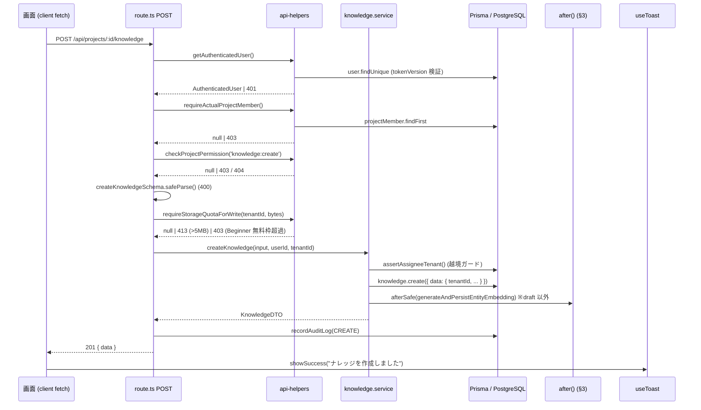
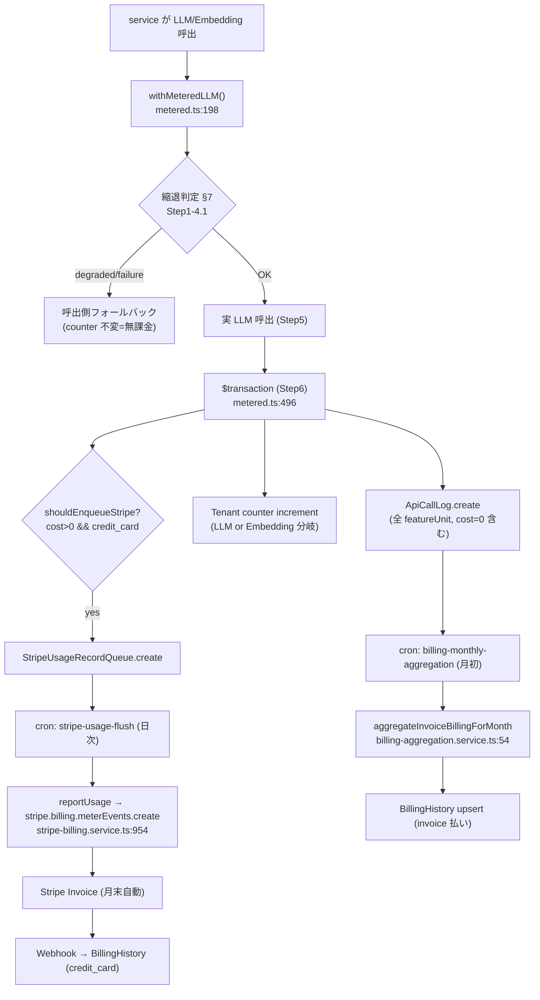
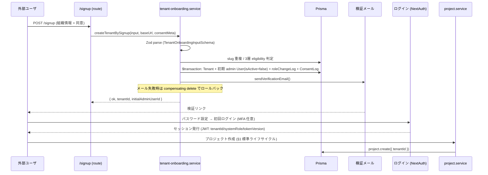
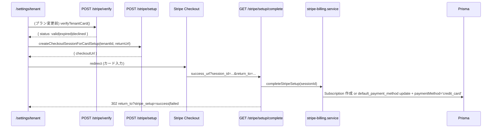
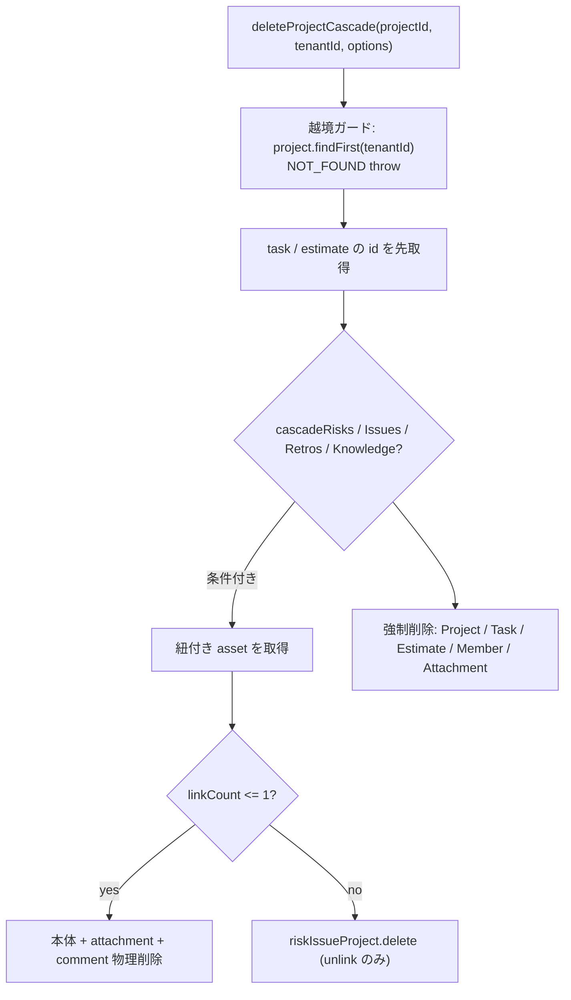
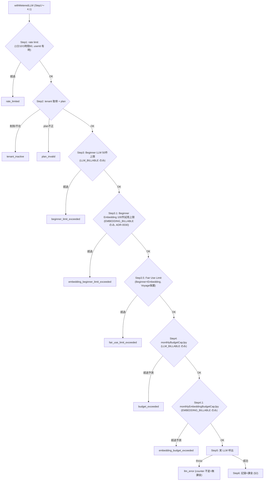
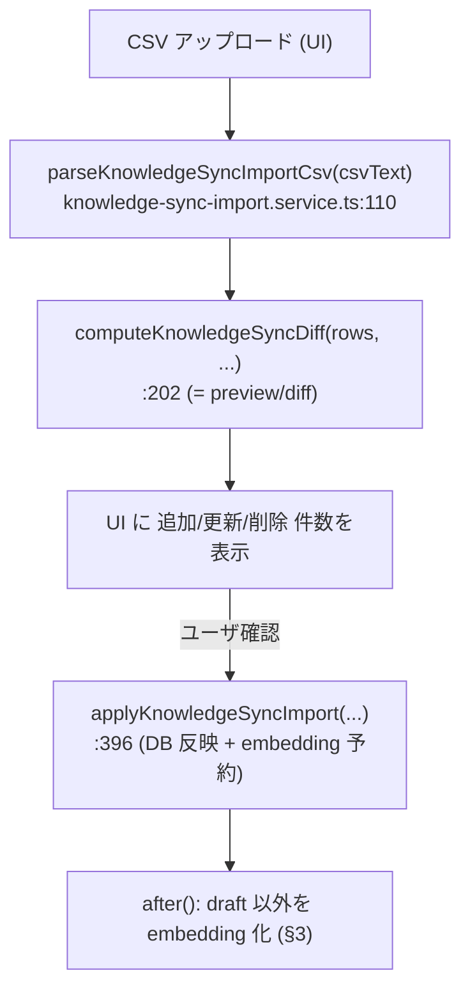
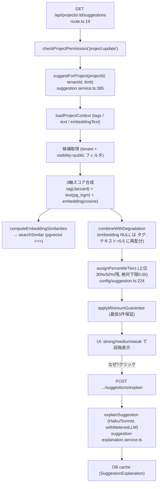

# KEY_FLOWS — 主要フローの連結資料

> **本書の位置づけ (連結資料)**
>
> 本書は「1 つのユーザ操作・業務がソースコードのどこから始まり、どう層を貫通して **DB 保存 / メッセージ表示 / 課金** に至るか」を **連結して** 追える資料です。
> 各レイヤ・コンポーネント単体の詳細仕様 (テーブル定義、API 一覧、サービス責務、セキュリティ設計) は他の design 文書に委ね、ここでは **経路と順序** を最短で掴むことを目的とします。
>
> - すべてのステップに実ファイル `path:line` を併記しています (該当コミット時点で実在確認済)。
> - 行番号は変更されやすいため、リンク切れ時は関数名 (例 `createKnowledge`) で再検索してください。
> - 「要確認」と注記した箇所は本書執筆時点で一次検証しきれなかった点です。

関連文書 (末尾に再掲): [ARCHITECTURE](./ARCHITECTURE.md) / [DATA_MODEL](./DATA_MODEL.md) / [API_DESIGN](./API_DESIGN.md) / [SERVICES](./SERVICES.md) / [SECURITY](./SECURITY.md) / [SUGGESTION_ENGINE](./SUGGESTION_ENGINE.md) / [STRIPE_TECHNICAL_DESIGN](./STRIPE_TECHNICAL_DESIGN.md)

---

## 目次

1. [§1 標準リクエストライフサイクル (最重要)](#1-標準リクエストライフサイクル-最重要)
2. [§2 課金 money-flow (LLM/Embedding → Stripe → 請求書)](#2-課金-money-flow)
3. [§3 非同期 embedding ライフサイクル](#3-非同期-embedding-ライフサイクル)
4. [§4 認証 → テナントオンボーディング → 初回プロジェクト](#4-認証--テナントオンボーディング--初回プロジェクト)
5. [§5 プラン変更 + カード検証 (Stripe setup/verify/complete)](#5-プラン変更--カード検証)
6. [§6 cascade delete (プロジェクト/顧客)](#6-cascade-delete)
7. [§7 縮退モード判定 (withMeteredLLM の reason 分岐)](#7-縮退モード判定)
8. [§8 CSV / sync インポート (parse → diff → apply)](#8-csv--sync-インポート)
9. [§9 提案エンジン (suggestForProject → cosine → tier → explain)](#9-提案エンジン)

---

## §1 標準リクエストライフサイクル (最重要)

たすきば の **全 CRUD** はこの層構造を踏襲します。新規 route を書くときは本節をテンプレートにしてください。

```
画面 (client onSubmit/fetch)
  → route.ts
      getAuthenticatedUser()   … 認証 (401)
      requireXxx()             … 認可 (403 / 404)
      Zod safeParse()          … 検証 (400)
      requireStorageQuotaForWrite() … ペイロード上限 (413, 5MB) + Beginner 無料枠 pre-check (403)
      service 呼出
  → service
      テナント越境ガード (where/data に tenantId 強制)
      prisma.create / update / $transaction
      recordAuditLog()         … 監査ログ
      after() で embedding 等の非同期処理を予約 (§3)
      戻り値 (DTO)
  → route.ts: NextResponse.json({ data }, { status })
  → 画面: useToast().showSuccess / showError
```

### 図: ナレッジ作成 (代表例)



### 代表経路の file:line (create)

| ステップ | ファイル:行 | 関数 |
|---|---|---|
| 認証 | [`src/lib/api-helpers.ts:47`](../../src/lib/api-helpers.ts) | `getAuthenticatedUser` (tokenVersion 失効検証込み, L55) |
| メンバー認可 | [`src/lib/api-helpers.ts:183`](../../src/lib/api-helpers.ts) | `requireActualProjectMember` |
| 権限認可 | [`src/lib/api-helpers.ts:85`](../../src/lib/api-helpers.ts) | `checkProjectPermission` |
| ペイロード上限 + Beginner pre-check | [`src/lib/api-helpers.ts:230`](../../src/lib/api-helpers.ts) | `requireStorageQuotaForWrite` (5MB 超で 413 / Beginner 無料枠超過で 403。累積ハードキャップは ADR-0030 で撤廃) |
| route 入口 | [`src/app/api/projects/[projectId]/knowledge/route.ts:37`](../../src/app/api/projects/[projectId]/knowledge/route.ts) | `POST` |
| Zod 検証 | [`src/app/api/projects/[projectId]/knowledge/route.ts:52`](../../src/app/api/projects/[projectId]/knowledge/route.ts) | `createKnowledgeSchema.safeParse` |
| service 本体 | [`src/services/knowledge.service.ts:377`](../../src/services/knowledge.service.ts) | `createKnowledge` |
| 越境ガード | [`src/services/knowledge.service.ts:384`](../../src/services/knowledge.service.ts) | `assertAssigneeTenant` |
| DB INSERT | [`src/services/knowledge.service.ts:386`](../../src/services/knowledge.service.ts) | `prisma.knowledge.create` (data に `tenantId` 明示, L387) |
| embedding 予約 | [`src/services/knowledge.service.ts:428`](../../src/services/knowledge.service.ts) | `afterSafe(generateAndPersistEntityEmbedding)` |
| 監査ログ | [`src/app/api/projects/[projectId]/knowledge/route.ts:97`](../../src/app/api/projects/[projectId]/knowledge/route.ts) | `recordAuditLog` |
| トースト | [`src/components/toast-provider.tsx:54`](../../src/components/toast-provider.tsx) | `useToast().showSuccess` |

### read / list・update・delete の差分

- **read / list** ([`GET` route.ts:20](../../src/app/api/projects/[projectId]/knowledge/route.ts), service [`listKnowledgeByProject` knowledge.service.ts:306](../../src/services/knowledge.service.ts))
  - 認可は `checkProjectPermission('knowledge:read')` のみ (メンバー作成ガード・容量 pre-check は不要)。
  - service は `where.tenantId = viewerTenantId` を **必須** 付与 + viewer の `visibility` フィルタ (非 admin は public + 自分の draft のみ, L317-320)。
- **update** ([`updateKnowledge` knowledge.service.ts:494](../../src/services/knowledge.service.ts))
  - 既存行を `where: { id, deletedAt: null, tenantId }` で取得 (越境編集ブロック, L506)。
  - 認可: 作成者 OR 担当者のみ (`FORBIDDEN` throw, L525)。text フィールド実変更時のみ embedding 再生成 (L546, L600)。
- **delete** ([`deleteKnowledge` knowledge.service.ts:638](../../src/services/knowledge.service.ts))
  - 論理削除 (`deletedAt` セット) + 紐づく Attachment / Comment も同一 `$transaction` で cascade soft-delete (L667-681)。
  - 認可は経路 (`context: 'project' | 'global'`) で分岐 (L656)。
  - Beginner プランは削除後に容量キャッシュ即時再集計 `maybeRecalcAfterBeginnerDelete` (L685)。
- **一括削除 (WBS タスク)** は上記の per-id `delete` とは別系統。クライアントが選択 ID を **K=100 件ずつチャンク分割 + 最大 3 並列**で [`bulk-delete`](../../src/app/api/projects/[projectId]/tasks/bulk-delete/route.ts) へ送信し (`runChunkedBulk`)、各チャンクは `bulkDeleteTasks` が `$transaction([updateMany×3])` で一括 soft-delete。WP 集計の再計算は全チャンク完了後に `POST /tasks/recalculate` を 1 回だけ実行する。Netlify 10 秒上限と性能の両立設計 (ADR-0035)。

### エラー時の経路

| HTTP | 発生箇所 | 例 |
|---|---|---|
| 401 UNAUTHORIZED / SESSION_INVALIDATED | `getAuthenticatedUser` ([api-helpers.ts:50, :66](../../src/lib/api-helpers.ts)) | 未ログイン / tokenVersion 失効 |
| 403 FORBIDDEN | `requireAdmin` / `checkProjectPermission` / `requireActualProjectMember` | 権限不足 / 非メンバー |
| 413 PAYLOAD_TOO_LARGE | `requireStorageQuotaForWrite` ([api-helpers.ts:235](../../src/lib/api-helpers.ts)) | 1 操作 5MB (`DB_WRITE_PAYLOAD_MAX_BYTES`) 超過 |
| 403 BEGINNER_DB_QUOTA_EXCEEDED | `requireStorageQuotaForWrite` ([api-helpers.ts:249](../../src/lib/api-helpers.ts)) | Beginner 無料枠 (DB 50MB) 超過。**累積 50GB ハードキャップ (`STORAGE_LIMIT_EXCEEDED`) は ADR-0030 で撤廃済** |
| 404 NOT_FOUND | `checkProjectPermission` (非メンバーは越境秘匿で 404), service の `throw new Error('NOT_FOUND')` | 越境 / 不在 |
| 400 VALIDATION_ERROR / ASSIGNEE_TENANT_MISMATCH | Zod safeParse / service の越境担当者検証 ([route.ts:53, :83](../../src/app/api/projects/[projectId]/knowledge/route.ts)) | 入力不正 |
| 409 STATE_CONFLICT | `changeProjectStatus` の `throw 'STATE_CONFLICT:'` ([project.service.ts:739](../../src/services/project.service.ts)) | 不正な状態遷移 |
| 縮退 (200, ただし機能限定) | embedding 失敗は本体 INSERT を巻き戻さず NULL のまま継続 (§3) | Voyage 障害 |

---

## §2 課金 money-flow

**最重要 invariant** ([metered.ts:59-61](../../src/lib/llm/metered.ts)):

```
ApiCallLog SUM(costJpy) = 画面表示 = Stripe Meter 送信 = 請求書 = CSV
```

ApiCallLog が**真値**。Tenant の counter (`currentMonthApi*` / `currentMonthEmbedding*`) はホットパスの上限チェック専用です。



### file:line

| ステップ | ファイル:行 |
|---|---|
| 計測ミドルウェア | [`src/lib/llm/metered.ts:198`](../../src/lib/llm/metered.ts) `withMeteredLLM` |
| ApiCallLog 記録 (全 featureUnit) | [`metered.ts:434`](../../src/lib/llm/metered.ts) `prisma.apiCallLog.create` |
| counter increment (LLM) | [`metered.ts:454`](../../src/lib/llm/metered.ts) `currentMonthApiCallCount` / `currentMonthApiCostJpy` |
| counter increment (Embedding) | [`metered.ts:464`](../../src/lib/llm/metered.ts) `currentMonthEmbeddingCallCount` / `currentMonthEmbeddingCostJpy` |
| Stripe queue 投入条件 | [`metered.ts:425`](../../src/lib/llm/metered.ts) `shouldEnqueueStripe` (cost>0 && credit_card && stripeCustomerId) |
| queue 投入 | [`metered.ts:480`](../../src/lib/llm/metered.ts) `prisma.stripeUsageRecordQueue.create` |
| 単一 transaction | [`metered.ts:496`](../../src/lib/llm/metered.ts) `prisma.$transaction(operations)` |
| 1 業務=1 ApiCallLog | [`embedding.service.ts:601`](../../src/services/embedding.service.ts) `generateBatchEmbeddings` (N 件 text を 1 ラップ) |
| queue → Stripe (日次 cron) | [`stripe-usage-flush.service.ts:76`](../../src/services/stripe-usage-flush.service.ts) `flushStripeUsageRecordQueue` |
| Stripe Meter 送信 | [`stripe-billing.service.ts:954`](../../src/services/stripe-billing.service.ts) `reportUsage` (`meterEvents.create`, idempotency=`usage:{callType}:{apiCallLogId}`) |
| invoice 払い月次集計 (月初 cron) | [`billing-aggregation.service.ts:54`](../../src/services/billing-aggregation.service.ts) `aggregateInvoiceBillingForMonth` |
| 集計の真値 | [`billing-aggregation.service.ts:99`](../../src/services/billing-aggregation.service.ts) `apiCallLog.aggregate({ _sum: costJpy }, featureUnit ∈ BILLABLE_FEATURE_UNITS)` |

### 設計上の要点

- **非同期送信**: `withMeteredLLM` は同期で Stripe を叩かず queue 行を作るのみ。日次 cron が `nextSendAt <= now` の行を最大 500 件 flush ([stripe-usage-flush.service.ts:39, :90](../../src/services/stripe-usage-flush.service.ts))。
- **冪等性**: queue は `sentAt=null` 行のみ拾い、Stripe 側も `identifier` で 24h 重複排除。失敗は exponential backoff (1/5/15/60/240 分) → 6 回で DLQ ([stripe-usage-flush.service.ts:45, :169](../../src/services/stripe-usage-flush.service.ts))。
- **invoice 払い**: Stripe を介さず ApiCallLog を月次集計し `BillingHistory` を upsert (`pending` のみ更新, paid 等は不変) ([billing-aggregation.service.ts:127](../../src/services/billing-aggregation.service.ts))。
- **credit_card 払い**: Stripe が月末に Invoice を自動生成 → Webhook ([`src/app/api/webhooks/stripe/route.ts`](../../src/app/api/webhooks/stripe/route.ts)) で `BillingHistory` 同期 (詳細は [STRIPE_TECHNICAL_DESIGN](./STRIPE_TECHNICAL_DESIGN.md))。

---

## §3 非同期 embedding ライフサイクル

資産 (Knowledge / RiskIssue / Retrospective / Memo / Project) の作成・更新時、embedding 生成はレスポンスを待たせず `after()` で response 後に実行されます (ADR-0026 非同期化)。Attachment は別経路で cron 駆動です。

```mermaid
flowchart TD
    A["createKnowledge / updateKnowledge"] --> B{"visibility != 'draft'?"}
    B -->|draft| Z["生成しない (提案候補外=無課金)"]
    B -->|public| C["afterSafe(generateAndPersistEntityEmbedding)<br/>knowledge.service.ts:428"]
    C --> D["generateEmbedding → withMeteredLLM (§2 課金)<br/>embedding.service.ts:135"]
    D -->|ok| E["persistEmbedding (raw SQL: text→vector cast)<br/>embedding.service.ts:212"]
    D -->|fail| F["recordError(warn) のみ<br/>本体は巻き戻さない (fail-safe)"]
    E -->|persist 失敗| F
    F --> G["月初 backfill cron が NULL を補完"]

    subgraph Attachment 経路 (ADR-0021)
      H["添付アップロード → embeddingStatus='pending'"] --> I["cron: attachment-embedding"]
      I --> J["processAttachmentEmbeddingQueue<br/>attachment-embedding-cron.service.ts:94"]
      J --> K["atomic claim: pending→generating"]
      K --> L["download → extractText → embedAttachment"]
      L -->|success| M["embeddingStatus='completed'"]
      L -->|fail| N["retry (1/5min, 最大3回) → 'failed'"]
    end
```

### file:line

| ステップ | ファイル:行 |
|---|---|
| `after()` 予約 (create) | [`knowledge.service.ts:428`](../../src/services/knowledge.service.ts) `afterSafe(...)` |
| `after()` 予約 (update, 判定マトリクス) | [`knowledge.service.ts:588`](../../src/services/knowledge.service.ts) `shouldGenerateEmbedding` (L597) |
| draft は生成しない | [`knowledge.service.ts:428`](../../src/services/knowledge.service.ts) `if (k.visibility !== 'draft')` |
| 高レベル helper | [`embedding.service.ts:477`](../../src/services/embedding.service.ts) `generateAndPersistEntityEmbedding` |
| 生成 (Voyage + 課金) | [`embedding.service.ts:135`](../../src/services/embedding.service.ts) `generateEmbedding` |
| DB 保存 (pgvector) | [`embedding.service.ts:212`](../../src/services/embedding.service.ts) `persistEmbedding` (text→`::vector` cast, テーブル名は union+exhaustive switch で固定) |
| fail-safe ログ | [`embedding.service.ts:504, :523`](../../src/services/embedding.service.ts) `recordError` |
| Attachment cron 本体 | [`attachment-embedding-cron.service.ts:94`](../../src/services/attachment-embedding-cron.service.ts) `processAttachmentEmbeddingQueue` |
| stale 'generating' 再 pickup (15分) | [`attachment-embedding-cron.service.ts:43`](../../src/services/attachment-embedding-cron.service.ts) `STALE_GENERATING_MS` |
| atomic claim (double-pickup 防止) | [`attachment-embedding-cron.service.ts:145`](../../src/services/attachment-embedding-cron.service.ts) `updateMany` |
| retry backoff (1/5min, 最大3回) | [`attachment-embedding-cron.service.ts:52`](../../src/services/attachment-embedding-cron.service.ts) `RETRY_BACKOFF_MS` |

**embeddingStatus 遷移**: `pending → generating → completed` / `failed` / `unsupported` ([attachment-embedding-cron.service.ts:135-256](../../src/services/attachment-embedding-cron.service.ts))。
資産系は schema 上の embedding 列が `NULL → 値あり`、生成失敗は NULL のまま (提案エンジンは縮退モードで動作, §9)。

---

## §4 認証 → テナントオンボーディング → 初回プロジェクト



### file:line

| ステップ | ファイル:行 |
|---|---|
| signup フォーム (UI) | [`signup/page.tsx`](../../src/app/(auth)/signup/page.tsx) 入力順 = 組織情報 → 初期管理者 → プラン → (Expert/Pro) 請求先 (feat/signup-friction-reduction 2026-06-12)。**組織 ID は入力させず**、サーバが数字連番を自動採番する。採番値は送信後の成功画面と招待メールで本人へ案内 |
| 組織 ID 数字連番採番 (サーバ) | [`tenant-onboarding.service.ts`](../../src/services/tenant-onboarding.service.ts) `pickNextNumericSlug` (既存数字 slug の MAX+1, BASE=100000 = [`lib/slug.ts`](../../src/lib/slug.ts) `nextNumericSlug`)。slug UNIQUE 衝突時は最大 5 回までリトライ採番 (ユーザは組織 ID を編集できないため) |
| signup エントリ | [`tenant-onboarding.service.ts:189`](../../src/services/tenant-onboarding.service.ts) `createTenantBySignup` (autoAssignSlug=true) |
| super_admin 手動払い出し | [`tenant-onboarding.service.ts:169`](../../src/services/tenant-onboarding.service.ts) `createTenantBySuperAdmin` (eligibility skip) |
| 入力検証スキーマ | [`tenant-onboarding.service.ts:57`](../../src/services/tenant-onboarding.service.ts) `TenantOnboardingInputSchema` (規約/プラポリ同意は `z.literal(true)`) |
| slug 重複チェック | [`tenant-onboarding.service.ts:234`](../../src/services/tenant-onboarding.service.ts) |
| 3 層 eligibility 判定 (ADR-0016) | [`tenant-onboarding.service.ts:280`](../../src/services/tenant-onboarding.service.ts) (OWNED_TENANT_EXISTS / BEGINNER_REQUIRES_UPGRADE) |
| Tenant+User+Log transaction | [`tenant-onboarding.service.ts:318`](../../src/services/tenant-onboarding.service.ts) `prisma.$transaction` |
| 初期 admin (非アクティブ) | [`tenant-onboarding.service.ts:350`](../../src/services/tenant-onboarding.service.ts) `isActive: false` |
| 検証メール送信 | [`tenant-onboarding.service.ts:419`](../../src/services/tenant-onboarding.service.ts) `sendVerificationEmail` |
| compensating delete | [`tenant-onboarding.service.ts:425`](../../src/services/tenant-onboarding.service.ts) (メール失敗時) |
| 認証 (JWT 失効検証) | [`api-helpers.ts:47`](../../src/lib/api-helpers.ts) `getAuthenticatedUser` |
| プロジェクト作成 | [`project.service.ts:218`](../../src/services/project.service.ts) `createProject` |

> **要確認**: NextAuth の sign-in route / MFA 検証の具体ファイル行は本書では未確認です。認証フロー詳細は [SECURITY](./SECURITY.md) を参照してください。Beginner プランは初回 90 日無料試用のため signup の `paymentMethod` は `'invoice'` 固定 ([tenant-onboarding.service.ts:99](../../src/services/tenant-onboarding.service.ts))。

---

## §5 プラン変更 + カード検証

Stripe Checkout (setup mode) でカードを登録し、戻りハンドラで Subscription 作成 + `paymentMethod` 切替を完了します。プラン変更前には `verify` で現カードの有効性を $0 SetupIntent で確認します。



### file:line

| ステップ | ファイル:行 |
|---|---|
| カード検証 route | [`src/app/api/tenants/me/billing/stripe/verify/route.ts:29`](../../src/app/api/tenants/me/billing/stripe/verify/route.ts) `POST` → `verifyTenantCard` |
| Checkout 作成 route | [`src/app/api/tenants/me/billing/stripe/setup/route.ts:42`](../../src/app/api/tenants/me/billing/stripe/setup/route.ts) `POST` → `createCheckoutSessionForCardSetup` |
| 戻りハンドラ route | [`src/app/api/tenants/me/billing/stripe/setup/complete/route.ts:36`](../../src/app/api/tenants/me/billing/stripe/setup/complete/route.ts) `GET` → `completeStripeSetup` |
| 既存カード再利用 | [`src/app/api/tenants/me/billing/stripe/setup-with-existing-card/route.ts`](../../src/app/api/tenants/me/billing/stripe/setup-with-existing-card/route.ts) |
| Customer Portal | [`src/app/api/tenants/me/billing/stripe/portal/route.ts`](../../src/app/api/tenants/me/billing/stripe/portal/route.ts) |
| Subscription キャンセル | [`stripe-billing.service.ts:1007`](../../src/services/stripe-billing.service.ts) `cancelTenantStripeSubscription` (解約 / invoice 戻し時) |

- 認可は全 route で `requireAdmin` + `isStripeEnabled()` feature flag ([setup/route.ts:46, :50](../../src/app/api/tenants/me/billing/stripe/setup/route.ts))。
- 失敗時 `tenant.paymentMethod` は `invoice` のまま (設計 §A-1)。session 失効時はログイン画面でなく `return_to?stripe_setup=pending` に redirect ([setup/complete/route.ts:43-55](../../src/app/api/tenants/me/billing/stripe/setup/complete/route.ts))。
- `completeStripeSetup` / `createCheckoutSessionForCardSetup` / `verifyTenantCard` の内部実装詳細は [STRIPE_TECHNICAL_DESIGN](./STRIPE_TECHNICAL_DESIGN.md) を参照。

---

## §6 cascade delete

プロジェクト / 顧客の物理カスケード削除は **段階的な順序付き削除** を行い、N:M 紐付き資産は「最後の紐付けが消える時のみ本体削除、それ以外は unlink」のモデルを取ります (ADR-0015 系)。



### file:line

| ステップ | ファイル:行 |
|---|---|
| プロジェクト論理削除 | [`project.service.ts:751`](../../src/services/project.service.ts) `deleteProject` (`$transaction` で attachment cascade soft-delete) |
| プロジェクト状態遷移 | [`project.service.ts:718`](../../src/services/project.service.ts) `changeProjectStatus` (state-machine `canTransition`, 不正遷移は `STATE_CONFLICT` → 409) |
| プロジェクト cascade 物理削除 | [`project.service.ts:839`](../../src/services/project.service.ts) `deleteProjectCascade` |
| 越境ガード (最優先) | [`project.service.ts:858`](../../src/services/project.service.ts) `project.findFirst({ id, tenantId })` |
| 紐付き>1 は unlink | [`project.service.ts:912`](../../src/services/project.service.ts) `riskIssueProject.delete` |
| 紐付き<=1 は物理削除 | [`project.service.ts:899`](../../src/services/project.service.ts) (attachment+comment+本体) |
| 顧客 cascade 削除 | [`src/services/customer.service.ts`](../../src/services/customer.service.ts) `deleteCustomerCascade` (同型パターン) |

- **冪等性**: 越境ガードで `tenantId` 不一致は `NOT_FOUND` throw ([project.service.ts:862](../../src/services/project.service.ts))。条件付きフラグ (`cascadeRisks` 等) は確認ダイアログから渡され、false なら本体・attachment を残し孤児参照は UI 側でマスク。
- Beginner プランは削除後に容量キャッシュ再集計 ([project.service.ts:813](../../src/services/project.service.ts) `maybeRecalcAfterBeginnerDelete`)。

> **要確認**: `deleteCustomerCascade` の具体行番号は本書では未確認です ([customer.service.ts](../../src/services/customer.service.ts) で関数名検索)。

---

## §7 縮退モード判定

`withMeteredLLM` は実 LLM 呼出の前に多段ガードを順に評価し、引っかかると **LLM を呼ばず即返却** します。呼出側はこの `reason` でフォールバック (タグのみスコアリング / 検索バナー表示等) を選びます。縮退時は **counter を進めない = 無課金** です。



### file:line (すべて [metered.ts](../../src/lib/llm/metered.ts))

| reason | 判定箇所 |
|---|---|
| `rate_limited` | [metered.ts:206](../../src/lib/llm/metered.ts) (Step1) |
| `tenant_inactive` / `plan_invalid` | [metered.ts:219, :230](../../src/lib/llm/metered.ts) (Step2) |
| `beginner_limit_exceeded` | [metered.ts:278](../../src/lib/llm/metered.ts) (Step3, LLM_BILLABLE のみ) |
| `embedding_beginner_limit_exceeded` | [metered.ts:300](../../src/lib/llm/metered.ts) (Step3.1, ADR-0030) |
| `fair_use_limit_exceeded` | [metered.ts:318](../../src/lib/llm/metered.ts) (Step3.5) |
| `budget_exceeded` | [metered.ts:332](../../src/lib/llm/metered.ts) (Step4) |
| `embedding_budget_exceeded` | [metered.ts:359](../../src/lib/llm/metered.ts) (Step4.1, ADR-0030) |
| `llm_error` | [metered.ts:380](../../src/lib/llm/metered.ts) (Step5 catch) |

**4 階層分類** (cost / counter / Stripe queue が分岐) — [`src/config/billing-feature-units.ts`](../../src/config/billing-feature-units.ts):
`LLM_BILLABLE` / `EMBEDDING_BILLABLE` / `EMBEDDING_BACKFILL` (cron 自動リカバリ=明示 free) / その他 (LEARNING_FREE 含む=安全側 cost0)。判定関数は `isLlmBillableFeatureUnit` / `isEmbeddingBillableFeatureUnit` / `isEmbeddingBackfillFeatureUnit` ([metered.ts:257-259](../../src/lib/llm/metered.ts))。

---

## §8 CSV / sync インポート

各資産 (knowledge / task / risk / retrospective / memo) の CSV 同期インポートは **parse → diff(preview) → apply** の 3 段です。プレビューで差分をユーザに見せ、確認後に apply で DB 反映します。



### file:line (knowledge を代表に)

| ステップ | ファイル:行 |
|---|---|
| CSV parse | [`knowledge-sync-import.service.ts:110`](../../src/services/knowledge-sync-import.service.ts) `parseKnowledgeSyncImportCsv` |
| diff / preview | [`knowledge-sync-import.service.ts:202`](../../src/services/knowledge-sync-import.service.ts) `computeKnowledgeSyncDiff` |
| apply (DB 反映) | [`knowledge-sync-import.service.ts:396`](../../src/services/knowledge-sync-import.service.ts) `applyKnowledgeSyncImport` |
| export (対称) | [`knowledge-sync-import.service.ts:586`](../../src/services/knowledge-sync-import.service.ts) `exportKnowledgeSync` |
| 他資産の同型 | [`task-sync-import.service.ts`](../../src/services/task-sync-import.service.ts) / [`risk-sync-import.service.ts`](../../src/services/risk-sync-import.service.ts) / [`retrospective-sync-import.service.ts`](../../src/services/retrospective-sync-import.service.ts) / [`memo-sync-import.service.ts`](../../src/services/memo-sync-import.service.ts) |

### テナント丸ごと ZIP インポート (別系統)

P-C エクスポート ZIP を全件新規作成で取り込む経路です。UUID 再採番 + Beginner 無料枠 post-check ロールバックを行います (累積ハードキャップは ADR-0030 で撤廃済、計測失敗は fail-open)。

| ステップ | ファイル:行 |
|---|---|
| エントリ | [`data-import.service.ts:123`](../../src/services/data-import.service.ts) `importTenantData` |
| 二重インポートロック | [`data-import.service.ts:55`](../../src/services/data-import.service.ts) `IMPORT_LOCK_STALE_MINUTES` (30分) |
| ZIP bomb 二重防御 | [`data-import.service.ts:65`](../../src/services/data-import.service.ts) `MAX_DECOMPRESSED_BYTES` |
| Beginner 無料枠超過ロールバック | [`data-import.service.ts:48`](../../src/services/data-import.service.ts) `assertStorageLimitInTx` (transaction 内 post-check。Beginner 50MB 超過で `BeginnerWriteGuardExceededError` → rollback。累積ハードキャップ撤廃済 ADR-0030、計測失敗時は fail-open で取り込み継続) |
| Beginner 席数チェック | [`data-import.service.ts:71`](../../src/services/data-import.service.ts) `BEGINNER_SEAT_LIMIT` |

> ZIP import 後の embedding 列は NULL で取り込まれ、月初 backfill cron / 後続バッチで補完されます ([data-import.service.ts:32-34](../../src/services/data-import.service.ts))。

---

## §9 提案エンジン

新規プロジェクトの文脈に対し、過去資産 (Knowledge / 過去 Issue / 過去 Risk / Retrospective / Memo / Attachment) を **全網羅** し、タグ + pg_trgm + embedding の 3 軸でスコアリング → percentile tier で段階表示します (高再現率設計)。「なぜ?」ボタンで個別に LLM 説明文を lazy 生成します。



### file:line

| ステップ | ファイル:行 |
|---|---|
| route 入口 | [`src/app/api/projects/[projectId]/suggestions/route.ts:19`](../../src/app/api/projects/[projectId]/suggestions/route.ts) `GET` (認可 `project:update`) |
| エンジン本体 | [`suggestion.service.ts:395`](../../src/services/suggestion.service.ts) `suggestForProject` |
| 緊急停止フラグ | [`suggestion.service.ts:401`](../../src/services/suggestion.service.ts) `isSuggestionEngineDisabled` (env) |
| プロジェクト文脈 | [`suggestion.service.ts:190`](../../src/services/suggestion.service.ts) `loadProjectContext` |
| テナント境界 | [`suggestion.service.ts:412`](../../src/services/suggestion.service.ts) `tenantScopeFilter` (seedData 有時のみ MANAGEMENT 許可) |
| 縮退合成 (5:5 再配分) | [`suggestion.service.ts:342`](../../src/services/suggestion.service.ts) `combineWithDegradation` |
| cosine 検索 | [`embedding.service.ts:296`](../../src/services/embedding.service.ts) `searchSimilar` (`<=>` cosine distance, `1 - dist/2` 正規化) |
| 3 軸重み | [`config/suggestion.ts:34, :37, :43`](../../src/config/suggestion.ts) tag0.3 / text0.2 / embedding0.5 |
| percentile tier | [`config/suggestion.ts:224`](../../src/config/suggestion.ts) `assignPercentileTiers` (strong30%/medium50%/weak, 絶対下限0.05) |
| 絶対閾値 fallback (≤5件) | [`config/suggestion.ts:168`](../../src/config/suggestion.ts) `classifyTier` |
| 最低件数保証 | [`config/suggestion.ts:266`](../../src/config/suggestion.ts) `applyMinimumGuarantee` (5件) |
| 説明文生成 (lazy) | [`suggestion-explanation.service.ts`](../../src/services/suggestion-explanation.service.ts) `explainSuggestion` (DB cache `SuggestionExplanation`, Pro=Sonnet/他=Haiku) |
| explain route | [`src/app/api/projects/[projectId]/suggestions/explain/route.ts`](../../src/app/api/projects/[projectId]/suggestions/explain/route.ts) |

詳細なスコアリング設計は [SUGGESTION_ENGINE](./SUGGESTION_ENGINE.md) を参照。

---

## 関連文書

| 文書 | 内容 |
|---|---|
| [ARCHITECTURE.md](./ARCHITECTURE.md) | 全体アーキテクチャ・レイヤ構成 |
| [DATA_MODEL.md](./DATA_MODEL.md) | テーブル定義・リレーション・テナント境界 |
| [API_DESIGN.md](./API_DESIGN.md) | API 一覧・エラーコード・レスポンス形式 |
| [SERVICES.md](./SERVICES.md) | 各 service の責務・依存 |
| [SECURITY.md](./SECURITY.md) | 認証・認可・JWT 失効・テナント越境防止 |
| [SUGGESTION_ENGINE.md](./SUGGESTION_ENGINE.md) | 提案エンジンのスコアリング詳細 |
| [STRIPE_TECHNICAL_DESIGN.md](./STRIPE_TECHNICAL_DESIGN.md) | Stripe Checkout / Subscription / Webhook 詳細 |

関連 ADR: ADR-0015 (cascade delete) / ADR-0016 (テナント onboarding 3 層判定) / ADR-0019・0022・0029・0030 (課金分類・Embedding 従量課金・予算上限) / ADR-0021 (Attachment embedding) / ADR-0026 (embedding 非同期化)。
