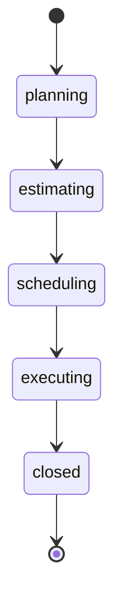
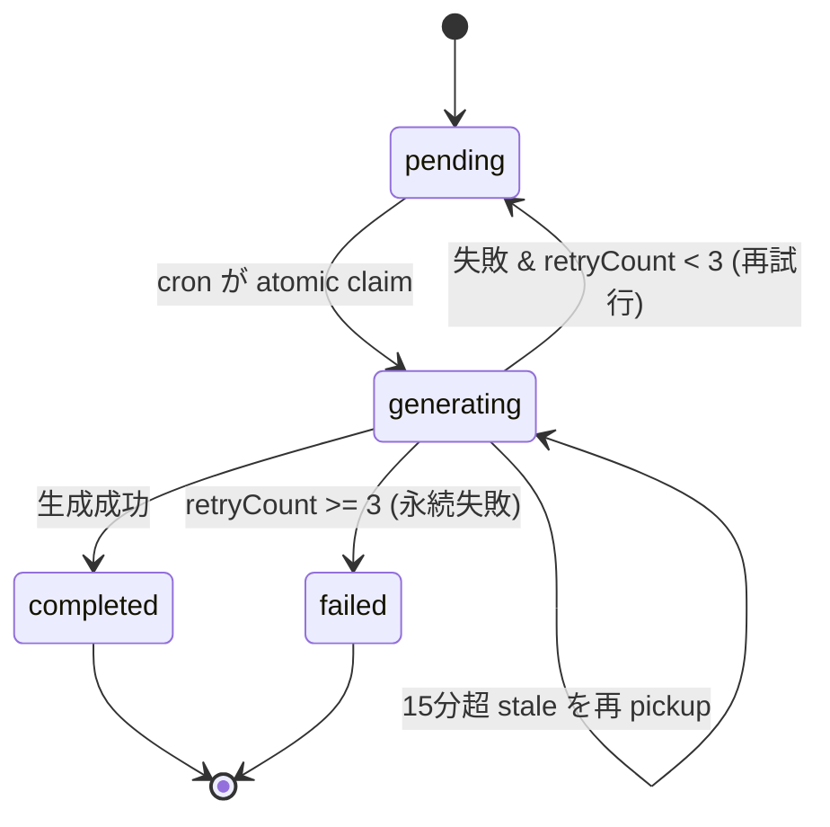
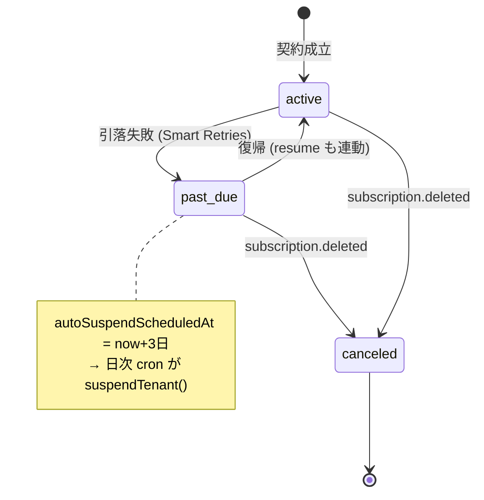
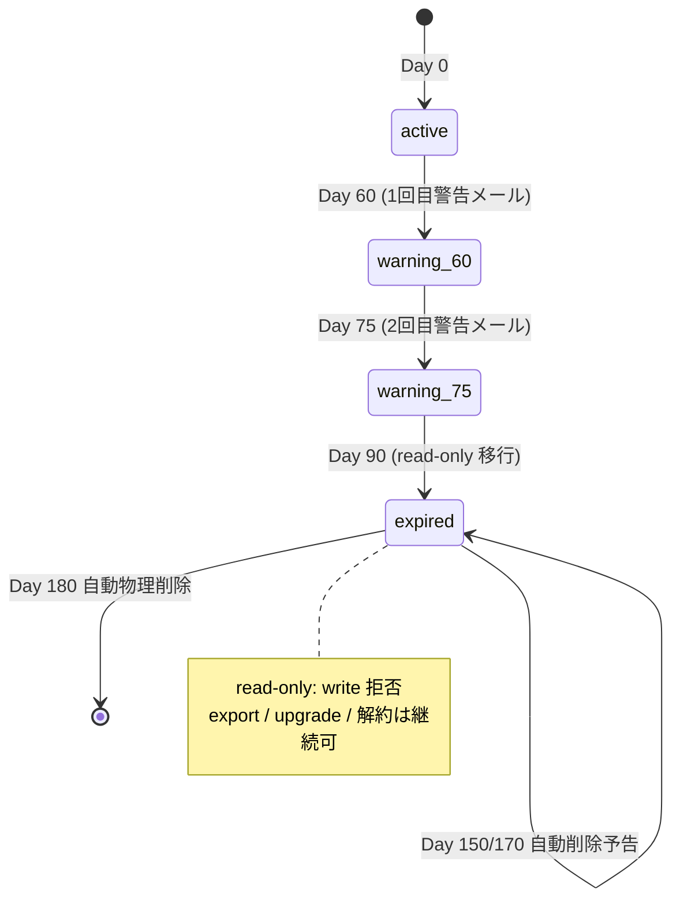

# 状態 / ステータスフィールド リファレンス (State Reference)

> システム内の **全ての状態 / ステータスフィールドと遷移を 1 箇所に集約** したリファレンス。
> 各状態フィールドの「取り得る値・既定値・遷移トリガ・各状態での制約・真値ソース (file:line)」を網羅する。
> 実装変更時はまず本書で影響範囲を確認し、本書も同一 PR で更新すること。

## 共通原則

- **一方向遷移・逆戻り不可**: プロジェクト状態は `planning → … → closed` の一方向のみ。後戻りは設計上禁止 (`state-machine.ts` の `ALLOWED_TRANSITIONS` に逆方向ルールが存在しない)。
- **enum 値は単一の真実から**: 業務概念の列挙値 (ステータス / 優先度 / 公開範囲 等) は `src/config/master-data.ts` を真値とし、UI 表示・Zod 検証・DB 投入の全経路がここを参照する。DB カラムはすべて `String`(VarChar) で、型レベルの enum 制約は持たない (= アプリ層で担保)。
- **既定値は schema の `@default`**: DB レベルの初期値は `prisma/schema.prisma` の `@default(...)` に従う。
- **冪等な遷移**: cron 駆動の状態遷移 (Beginner 警告メール、自動 suspend 等) はすべて重複実行に耐える設計 (専用フラグ / FOR UPDATE / 条件付き更新)。
- **状態と請求の不変条件**: 課金関連の状態 (billing_history.status / subscription_status) は表示・請求書・CSV・Stripe 全経路で `ApiCallLog` SUM を真値とする (詳細は `docs/business/` 課金 ADR 群)。

---

## 状態フィールド一覧 (索引)

| # | フィールド | 対象 | 取り得る値 | 状態機械図 |
|---|---|---|---|---|
| 1 | `projects.status` | Project | planning / estimating / scheduling / executing / closed | あり |
| 2 | `tasks.status` | Task | not_started / in_progress / completed / on_hold | — |
| 3 | `risks.state` | RiskIssue | open / in_progress / monitoring / resolved | — |
| 4 | `*.visibility` (state=draft 系) | Knowledge / Risk / Retrospective | draft / public | — |
| 5 | `attachments.embedding_status` | Attachment | pending / generating / completed / failed | あり |
| 6 | `tenants.stripe_subscription_status` | Tenant | active / past_due / canceled / incomplete / trialing 等 (Stripe 値) | あり |
| 7 | `tenants.card_verification_status` | Tenant | valid / expired / declined / never_verified (+ null) | — |
| 8 | Beginner expiry state (派生) | Tenant (plan+createdAt) | active / warning_60 / warning_75 / expired | あり |
| 9 | `tenants.db_capacity_warning_level` | Tenant | none / l1 / l2 / l3 (監視アラート Level、write 止めない) | — |
| 10 | `tenants.file_storage_warning_level` | Tenant | none / l1 / l2 / l3 (監視アラート Level、write 止めない) | — |
| 11 | ~~storage-guard circuit (派生)~~ **撤廃済 (ADR-0030)** | Tenant (dormant 列) | — (fail-open 化) | — |
| 12 | テナント稼働状態 (派生) | Tenant (suspended_at) | active / suspended | — |
| 13 | `tenants.plan` | Tenant | beginner / expert / pro | — |
| 14 | `billing_history.status` | BillingHistory | pending / paid / failed / refunded / canceled / replaced_by_stripe | — |
| 15 | `cron_execution_logs.status` | CronExecutionLog | running / success / failure | — |
| 16 | MFA / ログインロック (派生) | User (locked_until / mfa_locked_until) | unlocked / locked | — |
| 17 | アカウント状態 (派生) | User (invitation_accepted_at + is_active) | invited(招待中) / active(有効) / inactive(無効) | — |

---

## アカウント状態 (User、2026-06-03)

`deriveAccountStatus({ isActive, invitationAcceptedAt })`（真値: `src/services/user.service.ts`）で導出する派生状態。

| 状態 | 条件 | 意味 |
|---|---|---|
| invited（招待中） | `invitationAcceptedAt == null` | 招待メール送信〜パスワード設定まで |
| active（有効） | 受諾済 かつ `isActive == true` | ログイン可能 |
| inactive（無効） | 受諾済 かつ `isActive == false` | 管理者が席を停止 |

- 有効化トリガ = パスワード設定完了（`setupPassword` / super_admin は `setupInitialMfa`）で `invitationAcceptedAt=now`。
- **ロック（#16）はこの状態とは別軸**。有効なユーザにも一時ロックは掛かる。
- 論理削除（`deletedAt`）は一覧から除外し状態導出の対象外。
- 詳細: [USER_MANAGEMENT.md](./USER_MANAGEMENT.md)。

---

## 1. Project status (プロジェクト状態)

- **対象**: `projects.status` — `prisma/schema.prisma:635`
- **取り得る値** (`PROJECT_STATUSES`, `src/config/master-data.ts:78-84`):
  `planning` 企画中 / `estimating` 見積中 / `scheduling` 計画中 / `executing` 実行中 / `closed` クローズ
  - 2026-06 簡素化: 旧 `completed` 完了 / `retrospected` 振り返り完了 を廃止し、`executing` から直接 `closed` へ遷移する 5 区分に変更。
- **既定値**: `planning` (`schema.prisma` `@default("planning")`)
- **遷移ルール** (`src/services/state-machine.ts`): 隣接する 1 段階のみの一方向遷移。`canTransition(from, to)` が許可リストに無い遷移を拒否し、`getNextStatuses(current)` が次状態を返す。
- **トリガ**: PM/TL 権限ユーザによる手動の状態更新操作。
- **制約**: 逆戻り・スキップ不可。**`closed`（クローズ）は完全に読み取り専用**（`STATE_RESTRICTIONS`：read 系のみ許可）**だが、プロジェクトの削除（`project:delete`）は可能**。詳細なビジネスルールは別書に集約。
- **詳細**: [docs/business/PROJECT_LIFECYCLE.md](../business/PROJECT_LIFECYCLE.md)

---

## 2. Task status (タスク状態)

- **対象**: `tasks.status` — `prisma/schema.prisma:749`
- **取り得る値** (`TASK_STATUSES`, `src/config/master-data.ts:95-100`):
  `not_started` 未着手 / `in_progress` 進行中 / `completed` 完了 / `on_hold` 保留
- **既定値**: `not_started` (`schema.prisma:749` `@default("not_started")`)
- **遷移**: 専用の state machine は無く、ユーザが任意の値に直接更新可能 (一方向制約なし)。
- **制約 / 利用箇所**: 通知 cron が `task_start_due` (ACT の予定開始日当日 AND `status='not_started'`)、`task_end_due` (予定終了日当日 AND `status≠'completed'`) を判定する (`schema.prisma:1388-1389`)。

---

## 3. RiskIssue state (リスク / 課題の状態)

- **対象**: `risks.state` — `prisma/schema.prisma:834`
- **取り得る値** (`RISK_ISSUE_STATES`, `src/config/master-data.ts:145-150`):
  `open` 未対応 / `in_progress` 対応中 / `monitoring` 監視中 / `resolved` 解消
- **既定値**: `open` (`schema.prisma:834` `@default("open")`)
- **遷移**: 専用 state machine 無し、ユーザが直接更新。
- **関連**: `priority` は state とは別概念で、impact × likelihood から service 層で自動算出される (`master-data.ts:111-127`, `risk.service.ts computePriority()`)。

---

## 4. Visibility (公開範囲) — `*.state='draft'` 系

- **対象**: Knowledge / RiskIssue / Retrospective の `visibility`。例: Retrospective 等で `state String @default("draft")` (`prisma/schema.prisma:1054`)
- **取り得る値** (`VISIBILITIES`, `src/config/master-data.ts:161-164`): `draft` 下書き / `public` 公開
- **既定値**: `draft`
- **制約**:
  - `draft` = 作成者 + admin のみ閲覧可 / `public` = 全ログインユーザ閲覧可。
  - `visibility='draft'` のエンティティには **embedding を生成しない** (提案エンジン非対象のため Voyage API 課金を消費しない)。Knowledge / RiskIssue / Retrospective に適用、Project は対象外。

---

## 5. Attachment embedding_status (添付ファイル埋め込み状態)

- **対象**: `attachments.embedding_status` — `prisma/schema.prisma:1297`
- **取り得る値** (実値を service で確認):
  `pending` 生成待ち / `generating` 生成中 (claim 済) / `completed` 完了 / `failed` 永続失敗 (リトライ上限到達)
  - 確認: `src/services/attachment-embedding-cron.service.ts:5,14,78-82,154,195,229` / `src/services/attachment-embedding.service.ts:128,158,169`
- **既定値**: `pending` (`schema.prisma:1297` `@default("pending")`)
- **遷移トリガ**: cron (`/api/cron/attachment-embedding`) が batch で処理。
  - `pending → generating`: atomic claim (FOR UPDATE 相当の条件付き update)。
  - **stale 再 pickup**: `generating` のまま 15 分経過 (Netlify Function crash 等で中断) した行は再 claim 対象 (`embeddingLastRetryAt < now-15min`、cron service:39-41,109,117-118,150-151)。
  - `generating → completed`: embedding 生成成功 (service:128 で `embedding_status='completed'`)。
  - `generating → pending`: 失敗かつ `retryCount < MAX(=3)` → 再試行待ちへ戻す (service:169 / cron service:195,229)。
  - `generating → failed`: `retryCount >= 3` (= `RETRY_BACKOFF_MS.length`) で永続失敗確定 (cron service:50,68,195,229)。
- **制約**: `failed` 確定行は cron の再 pickup 対象外。`visibility='draft'` のエンティティは embedding 生成自体を行わない (§4 参照)。

---

## 6. Stripe subscription_status (サブスクリプション状態)

- **対象**: `tenants.stripe_subscription_status` — `prisma/schema.prisma:315` (nullable, VarChar(30))
- **取り得る値**: Stripe の Subscription status をそのまま同期保存 (`'active'` / `'past_due'` / `'canceled'` / `'incomplete'` / `'trialing'` 等、schema comment:313-314)。アプリ側が明示的に書く値: `'canceled'` (subscription.deleted 受信時、`stripe-webhook-handlers.service.ts:187`)。
- **既定値**: `null` (サブスクリプション未契約)。契約時に作成、解約時 `null`。
- **遷移トリガ**: Stripe Webhook (`customer.subscription.updated` / `.deleted`) で同期 (`stripe-webhook-handlers.service.ts:18-19,140`)。
- **連鎖する状態変化**:
  - `→ past_due`: `tenant.autoSuspendScheduledAt = now + 3日` をセット (Smart Retries 全失敗から +3 日で自動停止、handlers:108,130)。
  - `→ active`: `autoSuspendScheduledAt = null`、`suspendReason='payment_delinquent'` で suspend 中なら自動 resume (handlers:109,132,157-162)。
  - `→ canceled` (subscription.deleted): `autoSuspendScheduledAt` クリア (handlers:172-173,187)。
- **制約**: 1 テナント = 1 Active Subscription (`stripe_subscription_id` に UNIQUE 制約、schema:312)。自動 suspend は日次 cron が `autoSuspendScheduledAt` を拾って `suspendTenant()` を呼出 (handlers:32)。

---

## 7. Card verification_status (カード検証状態)

- **対象**: `tenants.card_verification_status` — `prisma/schema.prisma:343` (nullable, VarChar(20))
- **取り得る値** (`CardVerificationStatus`, `src/services/stripe-billing.service.ts:649`):
  `valid` / `expired` / `declined` / `never_verified` (+ カード解除時は `null`)
- **既定値**: `null` (カード未登録)。
- **遷移トリガ**:
  - `→ valid`: SetupIntent / カード登録・変更成功時 (stripe-billing.service.ts:275,454,475,792)。
  - `→ expired`: 定期検証で期限切れ検出 (service:724)。
  - `→ declined`: 検証 / authorize 失敗 (service:759,776)。
  - `→ null`: カード解除 (service:1120)。
- **制約**: 検証失敗時 (`expired`/`declined`) は `cardLastVerifiedAt` を更新しない (service:668-669)。

---

## 8. Beginner expiry state (Beginner プラン期限状態 — 派生)

- **対象**: DB カラムではなく、`Tenant.plan` + `createdAt` + `beginnerEverUpgraded` (+ `timezone`) から計算する **派生状態** (純関数 `getBeginnerExpiryState`)。
- **取り得る値** (`BeginnerExpiryState`, `src/services/beginner-expiry.service.ts:57`):
  `active` / `warning_60` / `warning_75` / `expired`
- **境界 (テナント TZ カレンダー日数, createdAt 起点)** (`beginner-expiry.service.ts:43-45,84-99`):
  - `active`: Day 0〜59
  - `warning_60`: Day 60〜74 (`BEGINNER_NOTICE_DAY_60 = 60`)
  - `warning_75`: Day 75〜89 (`BEGINNER_NOTICE_DAY_75 = 75`)
  - `expired`: Day 90+ (`BEGINNER_EXPIRY_DAYS = 90`) → **read-only モード**
- **対象外 (常に `active`)**: `plan != 'beginner'` / `beginnerEverUpgraded == true` / 管理テナント (service:88-89)。
- **遷移トリガ**: 時間経過 (純関数のため自動)。日次 cron (`/api/cron/daily-usage-aggregation`) が警告メールを送信 (`sendBeginnerExpiryNotices`, service:157-)。各 type は専用フラグ (`beginnerNoticeDay60SentAt` 等) で冪等。
- **制約**:
  - `expired` = write 系 API 拒否 (read / 既存閲覧 / **export / アップグレード / セルフ解約は継続可**)。判定は middleware の JWT claim 経由 (`isBeginnerExpired`, service:121-126)。
  - 物理削除予告: Day 150 / Day 170 で追加通知、**Day 180 (`BEGINNER_AUTO_DELETE_DAYS`) で自動物理削除** (`super-admin.service.ts purgeExpiredBeginnerTenants`、service:47-51)。
- **無料枠 write guard (ADR-0025)**: Beginner プランは DB 50MB / File Storage 100MB 超過状態で INSERT/UPDATE を拒否 (期限とは別ロジック、§11 参照)。

---

## 9. DB capacity warning level (DB 容量警告レベル)

- **対象**: `tenants.db_capacity_warning_level` — `prisma/schema.prisma:225` (VarChar(8))
- **取り得る値** (`DbCapacityWarningLevel`, `src/config/db-capacity-pricing.ts:186`):
  `none` / `l1` / `l2` / `l3`
- **既定値**: `none` (`schema.prisma:225` `@default("none")`)
- **閾値 (月中 peak bytes, `classifyDbCapacityLevel`, db-capacity-pricing.ts:77-89,188-193)**:
  - `none`: < 1GB
  - `l1`: ≥ 1GB (`DB_CAPACITY_L1_USER_WARNING_BYTES`, ユーザ通知)
  - `l2`: ≥ 10GB (`DB_CAPACITY_L2_ADMIN_ALERT_BYTES`, 管理者アラート)
  - `l3`: ≥ 50GB (`DB_CAPACITY_L3_HARD_CAP_BYTES`, **監視アラート閾値**)
- **遷移トリガ**: write 時の Post-check (`assertStorageLimitInTx`)。`storageBytesPeakThisMonth` の MAX 更新に伴い再分類。
- **制約**: Level は **監視アラート Level であり write を止めない** (2026-05-31 ADR-0030「データはたすきばの命」で累積ハードキャップ撤廃。L3=50GB 到達は super_admin に Supabase Compute 増強検討を促す通知のみ)。Level 昇格時のみ super_admin 通知 (spam 防止、横ばい・降格は通知なし)。月初 cron でリセット。write を止めるのは Beginner 無料枠ガード (§後述 / ADR-0025) のみ。

---

## 10. File storage warning level (ファイルストレージ警告レベル)

- **対象**: `tenants.file_storage_warning_level` — `prisma/schema.prisma:258` (VarChar(8))
- **取り得る値** (`FileStorageWarningLevel`, `src/config/file-storage-pricing.ts` `classifyFileStorageLevel`):
  `none` / `l1` / `l2` / `l3` (DB 容量と同設計)
- **既定値**: `none` (`schema.prisma:258` `@default("none")`)
- **遷移トリガ**: ファイル finalize 時の Post-check (`assertFileStorageLimitInTx`)。`storageFileBytesPeakThisMonth` の MAX 更新に伴い再分類。
- **制約**: DB 容量 (§9) と同じく **監視アラート Level でアップロードは止めない** (ADR-0030、L3=50GB は super_admin 通知のみ)。Level 昇格時のみ super_admin 通知。DB 容量とは独立した SKU。アップロードを止めるのは Beginner 無料枠 (100MB) ガード / 1 ファイル 50MB 上限のみ。

---

## 11. Storage guard circuit breaker — **撤廃済 (ADR-0030 / 2026-05-31)**

> **2026-05-31 (ADR-0030「データはたすきばの命」) でこの状態は撤廃された**。累積 50GB ハードキャップ廃止に伴い、「計測できないから write を拒否する (fail-close)」の根拠が消えたため、storage-guard の計測失敗時の挙動を **fail-open** に変更した。計測が失敗しても write は止めず、`recordError` で記録するのみとし、真値は日次 cron `updateAllStorageBytesUsed` が再計測して補正する (課金は月内 MAX なので取りこぼさない)。

- **状態フィールドとしては存在しない** (closed/open 遷移なし)。`StorageGuardCircuitOpenError` / HTTP 403 `STORAGE_GUARD_CIRCUIT_OPEN` も撤去済。
- **dormant な残置物 (別 PR で撤去予定、import/型影響回避のため残置・未使用)**:
  - schema 列: `tenants.storage_guard_circuit_opened_at` / `storage_guard_circuit_fail_count` (書き込み・参照なし)
  - 定数: `STORAGE_GUARD_CIRCUIT_BREAKER_THRESHOLD = 3` (参照箇所なし)
  - `withStorageGuard` wrapper / storage-guard-reset route (現役のロジックからは circuit を操作しない)
- **計測失敗時の現挙動 (fail-open)**: `assertStorageLimitInTx` / `assertFileStorageLimitInTx` 内で計測クエリが失敗したら `recordError` (severity=warn, `kind: 'storage_guard_measure_failed'`) を残して return。write は止めない。

---

## 12. テナント稼働状態 (active / suspended — 派生)

- **対象**: DB カラムではなく `tenants.suspended_at` から導出 (`schema.prisma:278`)。`suspended_at != null` = suspended。
- **付随フィールド**: `suspendReason` (VarChar(50), 例 `'payment_delinquent'` / `'tos_violation'` / `'other'`、`schema.prisma:281`) / `suspendedBy` (実行 super_admin、schema:283) / `resumedAt` (解除日時)。
- **遷移トリガ**:
  - `active → suspended`: super_admin 手動 suspend、または `past_due` から +3 日経過で日次 cron が自動 suspend (`suspendReason='payment_delinquent'`、§6 参照)。
  - `suspended → active`: 手動 resume (`POST .../resume`、`suspendedAt=null`, `resumedAt=now`)、または `payment_delinquent` suspend 中に subscription が `active` 復帰した際の自動 resume (§6)。
- **制約**: suspended テナントは middleware で拒否 (storage-guard とは別経路、storage-guard.service.ts:41 コメント)。`suspendReason` は v1 では String で柔軟運用 (将来 enum 化検討、schema:279-280)。

---

## 13. Tenant plan (テナントプラン)

- **対象**: `tenants.plan` — `prisma/schema.prisma:69` (VarChar(20))
- **取り得る値** (schema comment:68): `beginner` / `expert` / `pro`
- **既定値**: `beginner` (`schema.prisma:69` `@default("beginner")`)
- **遷移**: アップグレード (`beginner → expert/pro`)。一度上位に上がると `beginnerEverUpgraded=true` となり Beginner 期限制御の対象外になる (ダウングレードは禁止、`beginner-expiry.service.ts:18-21`)。
- **制約**: `beginner` のみ 90 日試用期限 (§8) と無料枠 write guard (DB 50MB / File 100MB, ADR-0025) が適用。Beginner 既定の月次 call 上限 = 50 (`beginnerMonthlyCallLimit`, schema:109)、最大シート数 = 5 (`beginnerMaxSeats`, schema:111)。

---

## 14. BillingHistory status (請求履歴の状態)

- **対象**: `billing_history.status` — `prisma/schema.prisma:1794` (VarChar(20))
- **取り得る値** (schema comment:1787-1793):
  - `pending` 請求書発行待ち / Stripe Invoice 確定待ち
  - `paid` 入金確認済 (invoice は手動消込、credit_card は Webhook 自動)
  - `failed` 引落失敗 (credit_card のみ、Smart Retries 中)
  - `refunded` 返金済
  - `canceled` 請求取消 (顧客合意のもと)
  - `replaced_by_stripe` 月途中で invoice → credit_card 切替時、invoice 側を Stripe 一括に置換
- **既定値**: なし (INSERT 時に明示指定、`@default` なし)。
- **遷移トリガ**:
  - `invoice` / `bank_transfer`: super_admin が手動で `→ paid` (schema:1764)。
  - `credit_card`: Stripe Webhook (`invoice.created` / `invoice.paid` / `invoice.payment_failed`) で自動更新 (schema:1765)。
  - `→ replaced_by_stripe`: 月途中で invoice → credit_card 切替時に既存レコードを更新 (物理削除せず監査用に残す、schema:1766,1826-1827)。
- **制約**: `(tenantId, yearMonth)` は 1 件のみ (UNIQUE, schema:1828)。期日超過検知 cron は `status='pending' AND payment_due_date < now` を判定 (schema:1808,1831)。`retryCount` は credit_card のみ 0〜4 (schema:1801)。

---

## 15. CronExecutionLog status (cron 実行ログの状態)

- **対象**: `cron_execution_logs.status` — `prisma/schema.prisma:1209` (VarChar(20))
- **取り得る値** (schema comment:1209): `running` / `success` / `failure`
- **既定値**: なし (実行開始時に `running` で INSERT)。
- **遷移**: `running` (開始) → `success` / `failure` (完了)。
- **制約**: stale 検知 — `status='running'` AND `startedAt < now()-30s` を「中断された実行」とみなす (schema:1186)。watchdog は failure 検知に加え「期待スケジュールに対し N 時間記録なし」も併用 (cron-job.org 未登録 cron はログ自体が空のため `status=failure` では検知不能)。

---

## 16. User ログイン / MFA ロック (派生)

- **対象**: DB カラムではなく `users.locked_until` / `users.mfa_locked_until` から導出 (`schema.prisma:405,420`)。当該時刻が未来 = locked。
- **付随フィールド**: `failedLoginCount` (Int, default 0, schema:404) / `isActive` (Boolean, default true, schema:403)。
- **状態**: `unlocked` (`*_until == null` または過去) / `locked` (`*_until` が未来)。
- **遷移トリガ**:
  - ログインロック: 連続ログイン失敗で `failedLoginCount` increment、閾値到達で `lockedUntil` に解除時刻をセット。
  - MFA ロック: MFA 検証 3 回連続失敗で 30 分ロック (`mfaLockedUntil` に解除時刻、schema:416)。
- **制約**: `isActive=false` のユーザは非アクティブ (一定期間ログインなしで cron がロックする運用あり、`idx_users_active`, schema:480)。`lockedUntil` 経過後は自動的に unlocked 扱い (時刻比較ベース)。

---

## 補足: 「状態」ではないが混同しやすいもの

これらは状態機械ではなく入力値の列挙 / 算出結果。`src/config/master-data.ts` 参照。

- `priorities` (high/medium/low/minimal) — リスク/課題は impact × likelihood から service 層で **自動算出** (master-data.ts:120-127)。
- `risk_natures` (threat/opportunity)、`risk_issue` の impact/likelihood (high/medium/low)。
- `stakeholder_engagements` (unaware/resistant/neutral/supportive/leading) — current/desired の Gap で抽出 (master-data.ts:249-274)。
- `system_roles` (super_admin/admin/general)、`project_roles` (pm_tl/member/viewer)。
- `dev_methods` / `contract_types` / `task_categories` / `knowledge_types` / `wbs_types` 等のマスタ列挙。

---

## 真値ソース一覧

| 領域 | ファイル |
|---|---|
| enum マスタ全般 | `src/config/master-data.ts` |
| project 遷移ルール | `src/services/state-machine.ts` |
| DB スキーマ (`@default` / VarChar / comment) | `prisma/schema.prisma` |
| Beginner 期限 state | `src/services/beginner-expiry.service.ts` |
| embedding_status | `src/services/attachment-embedding-cron.service.ts` / `attachment-embedding.service.ts` |
| storage guard (Beginner 無料枠 + 監視 Level / circuit は撤廃済 ADR-0030) | `src/services/storage-guard.service.ts` |
| DB 容量 level / 閾値 | `src/config/db-capacity-pricing.ts` |
| File storage level | `src/config/file-storage-pricing.ts` |
| Stripe subscription / card | `src/services/stripe-billing.service.ts` / `stripe-webhook-handlers.service.ts` |
| project ライフサイクル詳細 | `docs/business/PROJECT_LIFECYCLE.md` |
