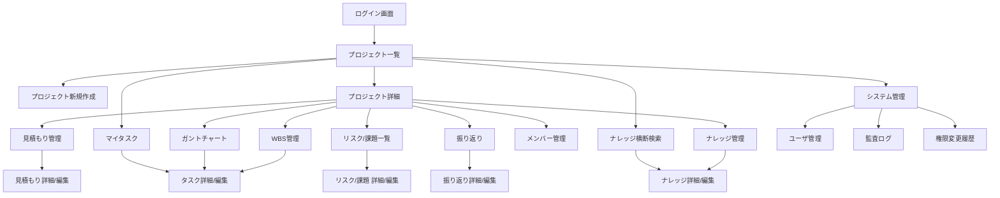

# UI コンポーネントとパターン (Program Design)

本ドキュメントは、UI 共通コンポーネント、ダイアログパターン、テーマ設定、レスポンシブ実装などのフロントエンド設計パターンを集約する。これらは元々 DESIGN.md §11、§21〜§32 と DEVELOPER_GUIDE.md §5 の各サブセクションに分散していた内容を統合。

---

## DESIGN §11. 画面遷移設計

## 11. 画面遷移設計

### 11.1 画面遷移図



### 11.2 プロジェクト詳細のタブ構成

プロジェクト詳細画面はハブ画面として機能し、以下のタブで各機能に遷移する。

| タブ | パス | 表示条件 |
|---|---|---|
| 概要 | /projects/:id | 常時表示 |
| 見積もり | /projects/:id/estimates | admin, pm_tl のみ |
| WBS管理 | /projects/:id/tasks | 常時表示 |
| ガントチャート | /projects/:id/gantt | 常時表示 |
| リスク/課題 | /projects/:id/risks | 常時表示 |
| ナレッジ | /projects/:id/knowledge | 常時表示 |
| 振り返り | /projects/:id/retrospectives | 完了以降表示 |
| メンバー | /projects/:id/members | admin, pm_tl のみ |

---


## DESIGN §21. 設計原則 (PR #63 追加)

## 21. 設計原則 (PR #63 追加)

本プラットフォームの UI / コード全般で遵守すべき横断的な原則を明示する。
新規実装・リファクタ時は本セクションを参照し、違反があれば是正する。
ただし、既存コードの書き換え範囲が大きく影響が読みづらい場合は据え置きも許容する
（「動いているものを壊さない」を優先する判断）。

### 21.1 デザインの 3 原則（そろえる・まとめる・繰り返す）

鷹野雅弘氏らが提唱する画面設計 / タイポグラフィの指針を本プラットフォームでも採用する。
UI 要素の配置・配色・余白・見出し階層などに適用する。

| 原則 | 意味 | 本プロダクトでの適用例 |
|---|---|---|
| **そろえる** | 位置・大きさ・色・書式を揃え、視線の迷いを減らす | ダイアログ共通のフィールド並び (公開範囲を常にフォーム先頭に配置する等)、`nativeSelectClass` / `Button` バリアントを一律に使う |
| **まとめる** | 関連する情報を近接・グルーピングして意味単位で認識させる | `grid grid-cols-2 gap-4` で「公開範囲」「脅威/好機」をセットで提示する等、`Table` ヘッダの whitespace-nowrap で論理単位を崩さない |
| **繰り返す** | 同じ意味のものには同じ見た目を使う | リスク一覧・全リスク一覧・全○○ 一覧で同じ `Badge` バリアントを使う、日時は全画面で `formatDateTime` ユーティリティに揃える |

### 21.2 DRY 原則 (Don't Repeat Yourself)

Andrew Hunt / David Thomas『達人プログラマー』で定式化された原則。
「**同じ知識をシステム内で 2 箇所以上で表現しない**」を方針とする。
単なる文字列の重複ではなく「ドメイン上の同じ知識 / ルール」が複数箇所に散らばることを避ける。

本プロダクトで特に意識する適用点:

- **マスタ定数の単一化**: `src/types/index.ts` の `TASK_STATUSES` / `VISIBILITIES` / `RISK_NATURES` / `PRIORITIES` 等を UI と検証（zod）で共有する
- **フィルタ / ツリー走査ユーティリティの共通化**: WBS・ガント・マイタスクで使う `filterTreeByAssignee` / `filterTreeByStatus` / `collectAllIds` を `src/lib/task-tree-utils.ts` に一元化する
- **UI コンポーネントの共通化**: 複数選択フィルタは `MultiSelectFilter` (WBS・ガント・マイタスクで共通)、編集ダイアログは `RiskEditDialog` / `RetrospectiveEditDialog` / `KnowledgeEditDialog` を「一覧」「全○○」両方で共有する
- **セッション設定の永続化**: `useSessionState` / `useSessionStringSet` (`src/lib/use-session-state.ts`) を使い、各画面でバラバラに sessionStorage アクセスを書かない
- **サーバ側ルールの共通化**: 公開範囲 (visibility) フィルタ `{ OR: [{visibility:'public'}, {visibility:'draft', ...:userId}] }` 等、認可ロジックは service 層に集約する

### 21.3 原則適用の判断基準

1. **最優先**: 同一の「ドメイン知識」が 2 箇所以上に現れたら共通化を検討する
2. **共通化のコストが利得を上回る場合**: 据え置き可 (例: 3 行の類似コードで別々に成長する可能性が高いもの)
3. **リファクタの副作用が大きい場合**: PR を分離し段階的に実施する。動作確認不足な変更は避ける
4. **違反の発見時**: ユーザ要求の本線を阻害しない範囲で本 PR 中に是正、困難なものは TODO コメントと Issue として残す

### 21.4 ゼロハードコーディング原則 (PR #75 で明文化)

#### 21.4.1 原則

> **業務的な意味を持つ値はプログラム内にハードコードせず、専用の定義ファイル / 設定ファイルに外出しする。**
> プログラムは定義を**参照する**のみとし、値そのものを埋め込まない。

「業務的な意味を持つ値」とは、**その値の変更がユーザ体験・データ整合性・運用方針に影響するもの** を指す。
逆に、純粋な実装詳細 (ループカウンタ / 内部フラグ / アルゴリズムの閾値など) は対象外。

#### 21.4.2 背景と狙い

複数画面・複数機能を横断する値 (カラー・ラベル・ステータス名・API パス・閾値など) がコード中に散在すると、以下の問題が累積する。

1. **横展開漏れ** — 1 箇所だけ値が更新され、他画面が旧値のままになり UI/データ不整合を起こす
2. **運用保守工数の増加** — 「値を変えたい」要求が都度プログラマを介した全検索・全置換作業になる
3. **画面/機能間の統一が崩れる** — 同じ概念が画面ごとに微妙に違う表記で実装され、ユーザ学習コストが増える
4. **テスト不能** — 「この値がここに現れる」という暗黙知がテスト不可能な形で分散する

これらは PR #73 (テーマ定義一元化) の原体験でも検証済み。定義ファイル化により:

- 値の**追加漏れ**を型検査で検出可能に (`satisfies Record<..., ...>`)
- 値の**一覧性**が確保され、新メンバーでも選択肢全体を把握できる
- **テスト**で「全ての画面/状態で参照されている」ことを自動検証できる

#### 21.4.3 スコープ: 外出し対象の値

以下のカテゴリは **原則として外出し必須**。

| カテゴリ | 典型例 | 正規の格納先 (PR #75 Phase 1 で `src/config/` に集約) |
|---|---|---|
| マスタデータ列挙 | タスク状態 / 公開範囲 / 優先度 / 脅威/好機 | `src/config/master-data.ts` (`TASK_STATUSES` / `VISIBILITIES` / `PRIORITIES` / `RISK_NATURES` 等) |
| UI テーマカタログ (表示名) | 画面テーマの ID と表示ラベル | `src/config/themes.ts` |
| UI テーマ・配色の CSS 変数値 | 背景色 / テキスト色 / ボーダー色 / アクセント色 | `src/config/theme-definitions.ts` (PR #73) |
| 業務ドメインタグ・工程タグ・技術スタック | 提案型サービスで使う候補語彙 | 専用定義モジュール (将来 `src/config/vocabulary.ts` を想定、要確認) |
| 環境依存値 | DB 接続文字列 / API キー / URL / cron 設定 | `.env` (詳細は [OPERATION.md](../administrator/OPERATION.md) §1) |
| 数値閾値で業務的意味があるもの | ログイン失敗ロック回数 / セッション有効時間 / パスワード最小文字数 | `src/config/security.ts` |
| 認可判定用ルートパス | `/login`, `/api/auth`, MFA pending paths 等 | `src/config/routes.ts` |
| 提案スコアリング重み・閾値 | TAG_WEIGHT / TEXT_WEIGHT / SCORE_THRESHOLD | `src/config/suggestion.ts` |
| 画面ラベル・メッセージ文言 | 共通ボタン文言・エラーメッセージ | 原則 JSX 内は許容 (国際化対応は未着手)、ただし**同じ文言が 3 箇所以上**で使われたら共通化する |
| 日付・数値のフォーマット規則 | YYYY-MM-DD / 小数桁数 / 通貨表記 | `src/lib/format/` 相当のユーティリティ (`formatDateTime` 等) |

#### 21.4.4 スコープ外 (ハードコードで許容)

以下は本原則の**対象外** (過度な抽象化を避けるため)。

- 関数内のローカル変数・実装ロジックの分岐値 (例: 配列インデックス、ループ上限)
- テストコード内の期待値 (テストは「この値のとき」を固定するものが本質)
- 明らかに普遍の定数 (円周率、ミリ秒換算係数の `1000` 等)
- その場限りの一時的な値で、他所から参照される予定がないもの

#### 21.4.5 定義ファイルの設計ガイド

新しく定義ファイルを作る際は、PR #73 のテーマ定義を雛形とする (設計書 §29 参照)。共通して満たすべき要件:

1. **型安全な網羅**: `satisfies Record<Key, Value>` パターンで「全 Key が値を持つ」ことをコンパイル時に保証
2. **単一ファイル原則**: 関連する値は 1 ファイルに集約 (検索容易性 + PR 差分の見通し)
3. **値の意味をコメントで明記**: 「なぜこの値なのか」を各エントリで説明
4. **テストで整合性を検証**: 「定義の全キーが想定通りに処理されるか」を網羅するテストを書く
5. **変更手順をコメントで誘導**: 「値を追加するときはここと、ここと、ここを触る」の指示を冒頭コメントに

#### 21.4.6 現在の遵守状況 (2026-04-21 時点、PR #76 Phase 2 実施後)

| 領域 | 遵守状況 | 備考 |
|---|---|---|
| マスタデータ列挙 | ✅ 準拠 | `src/config/master-data.ts` に集約 (PR #75 Phase 1)。`src/types/index.ts` は後方互換の re-export |
| テーマカタログ / 色定義 (CSS 変数) | ✅ 準拠 | `src/config/themes.ts` + `src/config/theme-definitions.ts` に集約 |
| 認証・ロック・トークン期限 | ✅ 準拠 | `src/config/security.ts` に集約 (PR #75 Phase 1 で 4 ファイル重複解消) |
| 認可判定用ルートパス | ✅ 準拠 | `src/config/routes.ts` に集約 (`PUBLIC_PATHS` / `MFA_PENDING_PATHS` / `LOGIN_PATH` / `MFA_LOGIN_PATH`) |
| 提案スコアリング重み | ✅ 準拠 | `src/config/suggestion.ts` に集約 |
| 環境依存値 | ✅ 準拠 | `.env` / `.env.example` に集約 |
| **Tailwind パレット色** (`bg-gray-50` / `text-gray-500` / `bg-red-50` 等) | ✅ **準拠 (PR #76 Phase 2 で完了)** | 全 ~395 箇所を semantic token (`bg-muted` / `text-muted-foreground` / `bg-destructive/10` 等) に置換。新セマンティックトークン (`info` / `success` / `warning` / `milestoneMarker`) を `theme-definitions.ts` に追加し全テーマで定義 |
| 設定画面のテーマプレビュー色 | ✅ 準拠 | hex リテラル 10 行を `THEME_DEFINITIONS` 参照に置換 (テーマ定義の真実から派生) |
| 業務ドメインタグ・工程タグ (候補語彙) | 🟡 部分的 | 現状は入力側で自由文字列。候補語彙の定義ファイル化は今後検討 (要確認) |
| ページ遷移の Link / href (`/projects` 等) | ✅ 準拠 (PR #81) | `src/config/app-routes.ts` に集約。redirect / Link / router.push の全 URL リテラルを定数 / 関数参照に移行 |
| バリデーション数値 (Zod / JSX maxLength) | ✅ 準拠 (PR #81) | `src/config/validation.ts` に集約。Zod スキーマ (knowledge / memo / risk / project / retrospective / estimate / attachment / auth) を全て定数参照に移行 |
| UI ラベル: 共通アクション動詞 (保存 / 削除 / キャンセル等 9 語) | ✅ 準拠 (PR #77 Phase A) | `src/i18n/messages/ja.json` の `action.*` に集約。`useTranslations('action')` / `getTranslations('action')` で参照。テストでキー集合を検査 |
| UI ラベル: 共通フォームラベル (件名 / 内容 等) | 🟢 Phase B カタログ完備 + 主要 dialog 移行済 (PR #82) | `field.*` 20 キー、user-edit / risk-edit / retrospective-edit dialog で `tField()` 使用例あり。残ファイルは段階実施 |
| UI ラベル: 共通メッセージ (saveSuccess / deleteConfirm 等) | 🟢 Phase C カタログ拡張 (PR #82) | `message.*` 13 キー (createFailed / updateFailed / passwordChanged 追加)。JSX 移行は段階実施 |
| CI ワークフロー有効化 | ✅ 準拠 (PR #82) | `.github/workflows/ci.yml` (lint/test/build) + `security.yml` (gitleaks/audit/CodeQL) を有効化 |
| CONTRIBUTING.md | ✅ 準拠 (PR #82) | コミット前チェックリスト / PR 規約 / コードレビューチェックリスト / 禁止事項を集約 |
| 視覚回帰検証 | 🟡 ユーザ実施待ち | `docs/VISUAL_REGRESSION_CHECKLIST.md` (PR #82) を整備、10 テーマ × 主要画面の目視確認手順を文書化 |
| UI ラベル: 画面固有本文 | 🟡 部分的 | 真の多言語化が必要になった段階で Phase D として一括抽出。当面は JSX リテラル許容 |
| コンポーネント固有のレイアウト定数 (Gantt の DAY_WIDTH 等) | 🟢 自己完結で許容 | 単一コンポーネント内のみで使用される数値 (§21.4.4 スコープ外) |
| Tailwind utility class (`flex` / `gap-4` / `p-3` 等) | 🟢 対象外 | レイアウト・配置・サイズの class は外出し対象外 (Tailwind 設計方針に基づく) |
| **サービス層 / API ルートのトップレベル docblock** (PR #79 Phase 1) | ✅ 準拠 | 全 18 サービス + 全 56 API ルートに役割・認可要件・監査記録・関連設計書セクションを記述。AI なしの将来運用引き継ぎを支える人間可読性確保 |

#### 21.4.7 違反発見時の対応フロー

1. 違反を見つけたら、まず**横展開スキャン** (`grep` 等) で全箇所を列挙する
2. 件数・影響範囲を評価し、以下のどれかを選ぶ:
   - **本 PR 内で是正** (数箇所・影響範囲が狭い場合)
   - **別 PR で段階是正** (横断的・数十箇所以上の場合)
   - **既知違反として本節 §21.4.6 に追記** (即時是正が現実的でない場合)
3. 「既知違反」として残す場合は、**テスト・ドキュメントで現状を明示**し、将来の担当者が実態を誤認しないようにする

---


## DESIGN §22. 添付リンク設計 (PR #64)

## 22. 添付リンク設計 (PR #64)

### 22.1 方針

実ファイルを DB / Supabase Storage に**保持しない**設計とし、外部ストレージ (SharePoint / Google Drive / OneDrive / GitHub 等) の **URL 参照のみ** を格納する。
Supabase Free (DB 500MB / Storage 1GB) の無料枠で長期運用することを最優先した判断。
base64 化で DB に格納する案は「容量が +33% に膨張し、500MB 上限を数十ファイルで使い切る」「一覧 API が重くなる」ため採用しない。

### 22.2 データモデル

単一のポリモーフィック関連テーブル `attachments` に 6 エンティティ (project / task / estimate / risk / retrospective / knowledge) を集約する (DRY 原則 §21.2)。

| カラム | 型 | 役割 |
|---|---|---|
| `id` | UUID | PK |
| `entity_type` | VARCHAR(30) | 親エンティティ種別 |
| `entity_id` | UUID | 親エンティティ ID |
| `slot` | VARCHAR(30) | 'general' (複数) / 'primary' / 'source' (単数) |
| `display_name` | VARCHAR(200) | 表示名 |
| `url` | VARCHAR(2000) | 外部ストレージ URL (http/https のみ) |
| `mime_hint` | VARCHAR(50)? | アイコン表示用のヒント (任意) |
| `added_by` | UUID | 追加ユーザ (FK: users.id) |
| `created_at / updated_at / deleted_at` | TIMESTAMPTZ | 論理削除対応 |

インデックス: `(entity_type, entity_id)` と `(entity_type, entity_id, slot)`。
FK は `added_by` のみ (エンティティ側は種別が可変のため FK を張らず `resolveProjectIds` で逆引き)。

### 22.3 スロット運用

| スロット | 用途 | 件数制約 | 適用エンティティ |
|---|---|---|---|
| `general` | 一般的な関連 URL | 複数 | 全エンティティ |
| `primary` | 中心となる資料 1 本 | 単数 (UI 強制) | project |
| `source` | 一次情報源 URL | 単数 (UI 強制) | knowledge |

単数スロットへの POST 時、サービス層は**既存行を論理削除してから新規作成**する (置換)。履歴は `deleted_at` に残るため監査に追跡可能。

### 22.4 セキュリティ

- URL スキームは `http://` / `https://` のみ validator で許容
- `javascript:` / `data:` / `file:` は validator + UI pattern 両方で拒否 (XSS / 情報漏洩対策)
- 表示は `<a href={url} target="_blank" rel="noopener noreferrer">` を徹底 (tabnabbing 対策)

### 22.5 認可

- admin: 全エンティティで全操作許可
- メンバー: 親エンティティ → Project ID を `resolveProjectIds` で導出し、`checkMembership` で判定
- 複数プロジェクト紐付けのナレッジ: いずれか 1 つでもメンバーなら許可
- 孤児ナレッジ (`knowledge_projects` 0 件): admin のみ操作可能

### 22.6 UI コンポーネント

| コンポーネント | 用途 |
|---|---|
| `AttachmentList` (`src/components/attachments/attachment-list.tsx`) | 複数 URL 用。リスト表示 + 追加フォーム |
| `SingleUrlField` (`src/components/attachments/single-url-field.tsx`) | 単数 URL 用。未設定時は追加ボタン、設定済みなら編集/削除 |

### 22.7 フェーズ分けと組込み状況

| フェーズ | 内容 | 状態 |
|---|---|---|
| Phase 1 | スキーマ / validator / service / API / 共通 UI | PR #64 で実装 |
| Phase 2 | リスク/課題・振り返り・ナレッジ・タスク・プロジェクト概要タブへの組込み | PR #64 で実装 |
| Phase 3 | Estimate (編集ダイアログ基盤が未整備のため延期) / リンク切れチェック / Slack 通知 | 未着手 |

---


## DESIGN §24. PR #67: 作成ダイアログの添付入力 + 一覧添付列 + MFA ログイン強化

## 24. PR #67: 作成ダイアログの添付入力 + 一覧添付列 + MFA ログイン強化

### 24.1 作成ダイアログの添付 URL 入力 (Task 1)

既存の AttachmentList / SingleUrlField は **編集**ダイアログ専用 (entityId 必須)。
**作成**ダイアログでは entityId が存在しないため、専用の `StagedAttachmentsInput`
を導入し、React 内でステージした後に作成成功後のエンティティ ID で一括 POST する。

| 箇所 | entityType | 採用 slot |
|---|---|---|
| `ProjectsClient` 新規作成 | project | general |
| `TasksClient` 作成 (WP/ACT) | task | general |
| `RisksClient` 起票 | risk | general |
| `RetrospectivesClient` 作成 | retrospective | general |
| `ProjectKnowledgeClient` 作成 | knowledge | general |

実装: `src/components/attachments/staged-attachments-input.tsx` の
`persistStagedAttachments({ entityType, entityId, items })` を作成 API 呼び出し成功直後に実行。
部分失敗時は親エンティティを残し、呼び出し側で `{ succeeded, failed }` を受け取れる設計。

### 24.2 一覧画面への添付列 (Task 2)

各一覧行に紐づく添付を **chip 形式**の 1 つのセルに並べて表示 (技術的に
「リンクの数だけ動的に追加」される)。N+1 を避けるためバッチ取得 API を新設:

- `POST /api/attachments/batch` — `{ entityType, entityIds[], slot? }` で一括取得、`{ [entityId]: AttachmentDTO[] }` 返却 (O(1) lookup)
- `useBatchAttachments(entityType, ids, slot?)` フックで UI 側からキャッシュアクセス
- `<AttachmentsCell items={...} />` で chip 描画、`target="_blank" rel="noopener noreferrer"` 徹底

導入箇所:
- `/risks` / `/issues` (AllRisksTable)
- `/retrospectives` (AllRetrospectivesTable)
- `/knowledge` (KnowledgeClient)
- `/projects/[id]/risks` / `/issues` (RisksClient 内テーブル)

### 24.3 MFA ログインフロー強化 (Task 3)

**問題**: MFA 有効化後もログイン時に TOTP 検証されず、パスワードのみで通過できる状態だった。

**修正**:
- `authorize` で `mfaEnabled` を返却
- `jwt` callback が新規ログイン時 (user !== undefined) に **常に `mfaVerified=false` にリセット**。以前のセッションで検証済でも新規ログインでは再検証必須
- `authorized` callback (middleware) が `mfaEnabled && !mfaVerified` の未検証ユーザを `/login/mfa` に redirect
- `/login/mfa` で TOTP 検証 → `useSession().update({ mfaVerified: true })` で JWT を trigger='update' 経由で再署名
- 再署名後、`callbackUrl` へ遷移

セキュリティ補強:
- `/api/auth/mfa/verify` の `userId` をセッションユーザと厳格比較 (他人の TOTP 検証を防止)
- `mfaPendingPaths` (/login/mfa, /api/auth/mfa/verify, signout) のみ検証前アクセスを許容し他は全て遮断

---


## DESIGN §25. PR #68: 一覧列幅のドラッグリサイズ

## 25. PR #68: 一覧列幅のドラッグリサイズ

### 25.1 背景

ガント画面や一覧画面で「タスク名」「件名」「顧客名」などの長文列が切り詰められ、
ユーザが中身を確認できない状況が発生していた (既存の whitespace-nowrap + overflow-hidden)。
ユーザ自身が UI 上で列幅を調整できるようにして画面構成を最適化できるようにする。

### 25.2 共通機構

`src/components/ui/resizable-columns.tsx` に集約 (DRY 原則 §21.2):

| エクスポート | 役割 |
|---|---|
| `<ResizableColumnsProvider tableKey="...">` | 列幅状態を sessionStorage と同期 (`resizable-cols:<tableKey>` キー) |
| `<ResizableHead columnKey="..." defaultWidth={...}>` | `<th>` + 右端ドラッグハンドル、セッション優先で幅決定 |
| `<ResetColumnsButton />` | プロバイダ配下の幅をすべて消去 (デフォルトに戻る) |

- 最小 40px / 最大 800px でクランプ
- `sessionStorage` を使用 (タブ/ブラウザを閉じると破棄、既存の `useSessionState` パターンと統一)

### 25.3 導入範囲

| 画面 | tableKey | 備考 |
|---|---|---|
| `/projects` | `projects` | |
| `/risks` / `/issues` | `all-risks` | typeFilter 別でも同一キー (同一テーブル構造) |
| `/retrospectives` | `all-retrospectives` | |
| `/knowledge` | `all-knowledge` | |
| `/projects/[id]/risks` / `/issues` | `project-risks-<risk|issue|all>` | typeFilter で分岐 |
| `/my-tasks` | `my-tasks` | 複数プロジェクトセクションが同一 Provider で幅を共有 |
| `/projects/[id]/tasks` (WBS) | `project-tasks` | |
| `/projects/[id]/gantt` | (専用実装) | タスク名列のみ対応、日付列は `DAY_WIDTH` 固定 |

### 25.4 ガントチャート専用実装

ガントは絶対位置レイアウトで `NAME_COL_WIDTH` を複数箇所から参照していたため、
ResizableHead 共通機構ではなく**ガント固有の state + ドラッグ**を実装:

- `useSessionState('gantt:<projectId>:name-col-width', 280)` で永続化
- タスク名ヘッダ右端に絶対配置のドラッグハンドル
- 「タスク名列の幅をリセット」ボタンを画面右上に配置
- 日付列は固定 (ユーザ要求: 「日付列は固定で問題ない」)

### 25.5 データフロー

```
ユーザがハンドルをドラッグ
  → onMouseDown で startX/startWidth を capture
  → document の mousemove で delta 計算 → setState
  → useSessionState が sessionStorage を同期更新
  → 次レンダーで th/div に style width 反映
```

### 25.6 Reset UX

各一覧画面の右上に「列幅をリセット」ボタンを配置し、1 クリックで sessionStorage から
当該 `tableKey` のエントリを削除 (`{}` で上書き) → 各 `<ResizableHead>` が defaultWidth に戻る。

---


## DESIGN §26. PR #70: 個人メモ機能

## 26. PR #70: 個人メモ機能

### 26.1 位置付け

既存の Knowledge はプロジェクト紐付け必須 (KnowledgeProject 経由) で共有前提のため、
個人の一時的な作業メモ・調査ログの置き場として**重すぎた**。独立エンティティとして
`Memo` を新設し「プロジェクトに紐付かない個人の知見置き場」を実現する。

### 26.2 スキーマ

```prisma
model Memo {
  id         String    @id @default(dbgenerated("gen_random_uuid()")) @db.Uuid
  userId     String    @map("user_id") @db.Uuid
  title      String    @db.VarChar(150)
  content    String    @db.Text
  visibility String    @default("private") @db.VarChar(20)  // 'private' | 'public'
  createdAt  DateTime  @default(now()) @map("created_at") @db.Timestamptz
  updatedAt  DateTime  @updatedAt @map("updated_at") @db.Timestamptz
  deletedAt  DateTime? @map("deleted_at") @db.Timestamptz

  author User @relation("MemoAuthor", fields: [userId], references: [id])

  @@index([userId, createdAt(sort: Desc)], map: "idx_memos_user_recent")
  @@index([visibility, createdAt(sort: Desc)], map: "idx_memos_visibility_recent")
  @@map("memos")
}
```

タグを持たせない設計判断: 業務知見判断は人間ベース、軽量 UX を優先 (PR #70 要件)。

### 26.3 認可モデル

**他エンティティとの根本的な違い**: memo は project スコープ**外**、admin 特権**なし**。

| 操作 | 許可条件 |
|---|---|
| 閲覧 (list/get) | 作成者 OR `visibility='public'` |
| 作成 | 認証済ユーザなら誰でも (自分の memo として) |
| 編集・削除 | 作成者のみ (admin も不可) |

`getMemoForViewer`: 他人の private memo は `null` を返し、呼び出し側で 404 に変換 (403 ではなく 404 で「存在自体を隠す」情報漏洩防止)。

### 26.4 Attachment 統合

PR #64 の polymorphic attachments 機構を `entityType='memo'` で拡張。

- `resolveProjectIds('memo', ...)`: memo が存在すれば `[]` (project ID なし)、存在しなければ `null`
- `authorizeMemoAttachment(memoId, userId, mode)`: memo 固有の認可を別関数に切り出し
- attachments `route.ts` / `[id]/route.ts` の `authorize` は最初に entityType === 'memo' で分岐、project 経路をスキップ
- batch API は memo の場合 entityIds を `userId+visibility` でフィルタしてから attachments を取得 (URL 漏洩防止)

### 26.5 UI

- ナビ: ユーザ名プルダウンに「**全メモ**」追加 (マイタスクの下、設定の上)
- 画面 `/memos`: 一覧 + 右上「メモ作成」ボタン + 列幅リサイズ (PR #68) + 添付列 (PR #67)
- 自分のメモは行クリックで編集ダイアログ、他人のメモは参照のみ (クリック不活性)
- 作成ダイアログ: `StagedAttachmentsInput` で URL 添付を同時登録 (PR #67)

### 26.6 フェーズ分け (将来拡張)

| フェーズ | 内容 | 状態 |
|---|---|---|
| Phase 1 | Memo 基本 CRUD + visibility + URL 添付 | PR #70 で実装 |
| Phase 1.5 | UI を「メモ (個人管理)」と「全メモ (横断 read-only)」に分離 | PR #71 で実装 |
| Phase 1.5b | 全日付項目に「今日」「削除」ボタンを併設 (DateFieldWithActions) | PR #71 で追加実装 |
| Phase 2 | 「この Memo を Knowledge に昇格」ボタン (個人知見を社内資産に展開) | 未着手 (別 PR) |
| Phase 3 | Memo をソースとした提案サジェスト (匿名化して PR #65 に組込) | 未着手 |

### 26.7 PR #71: UI 分離の詳細

旧 `/memos` (PR #70) は「自分のメモ + 他人の public メモ」を同一画面に混在表示していた。
PR #71 で責務を明確化するため、以下の 2 画面に分離した。

| 画面 | URL | 役割 | 導線 | 操作 |
|---|---|---|---|---|
| メモ | `/memos` | 個人管理 (自分のメモ CRUD) | ユーザ名プルダウン | 作成・編集・削除 |
| 全メモ | `/all-memos` | 公開メモの横断閲覧 | 上部ナビ (全リスク/全課題 等と同列) | 参照のみ (read-only) |

**サービス層** (`memo.service.ts`) の変更:

```ts
// PR #70 の listMemosForViewer を 2 つに分割 (PR #71)
listMyMemos(viewerUserId)       // /memos 用: 自分のメモ (private + public)
listPublicMemos(viewerUserId)   // /all-memos 用: 全 public メモ
```

**API 層** の変更:

- `GET /api/memos?scope=mine|public` の 2 モードに対応
- scope 未指定 → 既定 `mine` (後方互換)

**UI 層** の変更:

- `memos-client.tsx`: タイトルを「メモ」に変更、(自分) バッジ削除 (全件自分のため)
- `all-memos-client.tsx`: 新設。`fieldset disabled` で全入力を read-only 化、添付も `canEdit={false}`
- `dashboard-header.tsx`: ドロップダウンは「メモ」、ナビに「全メモ」を追加

**認可は PR #70 から変更なし**:
- 他人の private メモは `/all-memos` でも表示されない (listPublicMemos で visibility='public' のみ返す)
- 全メモ画面からの編集試行は UI にボタンがないため発生しないが、もし直接 API を叩いても `/api/memos/:id` PATCH は作成者チェックで 404 を返す (二重防御)

---


## DESIGN §27. PR #71: 日付項目の入力効率化 (DateFieldWithActions)

## 27. PR #71: 日付項目の入力効率化 (DateFieldWithActions)

### 27.1 背景

ブラウザ標準の `<input type="date">` は「今日」「削除」相当の操作がカレンダーポップオーバー内部にしかない。
ユーザはカレンダーを開いてから探す必要があり、2 ステップのオペレーションが発生して負担が大きかった。

### 27.2 実装

`src/components/ui/date-field-with-actions.tsx` に共通部品 `<DateFieldWithActions>` を作成。

```tsx
<DateFieldWithActions
  value={form.plannedStartDate}
  onChange={(v) => setForm({ ...form, plannedStartDate: v })}
  required
  hideClear  // 必須項目では削除ボタンを非表示
/>
```

- 入力の**右**に「今日」ボタン (常時表示) と「削除」ボタン (未記入時 disabled)
- **1 クリック**で今日日付セット / 空文字クリア
- `required` / `disabled` / `hideClear` を prop で制御
- onChange は生文字列を受け取るため既存 state setter と直接接続可能

### 27.3 導入箇所 (全 11 箇所に展開)

| ファイル | 項目 |
|---|---|
| `projects-client.tsx` | プロジェクト新規: 開始予定日 / 終了予定日 |
| `project-detail-client.tsx` | プロジェクト編集: 開始予定日 / 終了予定日 |
| `tasks-client.tsx` (新規 ACT) | 開始予定日 / 終了予定日 |
| `tasks-client.tsx` (bulk edit) | 予定開始日 / 予定終了日 |
| `tasks-client.tsx` (bulk actual) | 実績開始日 / 実績終了日 |
| `tasks-client.tsx` (個別編集) | 予定開始日 / 予定終了日 / 実績開始日 / 実績終了日 |
| `retrospectives-client.tsx` | 実施日 |
| `retrospective-edit-dialog.tsx` | 実施日 |
| `risk-edit-dialog.tsx` | 期限 |

### 27.4 `hideClear` の使い分け

- 必須項目 (required): 削除ボタンを隠す (`hideClear`) → 空にできないのにボタンがあると誤解を招くため
- 任意項目: 削除ボタン表示 (空時は disabled)

---


## DESIGN §28. PR #72: 自作カレンダーとテーマ設定

## 28. PR #72: 自作カレンダーとテーマ設定

### 28.1 カレンダー自作への置き換え (Task 1)

ブラウザ標準 `<input type="date">` は、カレンダーポップオーバー内に「今日」「クリア」相当の
ベンダー提供ボタンを持ち、CSS / JS からは非表示化できない。PR #71 で右側に外出しした
「今日」「削除」ボタンと重複するため、ユーザ体験として冗長だった (要望: カレンダー内から
それらを消してほしい)。

対応として `DateFieldWithActions` を以下に刷新した:

- `<input type="date">` を廃止し、自作の Popover + 日付グリッドに置換
- カレンダー内は「月ナビ (‹ / ›) + 日付グリッド」のみ。今日 / クリアは**常時外側**のボタンで操作
- API サーフェス (`value` / `onChange` / `disabled` / `required` / `hideClear` / `todayLabel` / `clearLabel`) は
  PR #71 と完全互換 — 呼び出し側 11 箇所は変更なし
- 純粋関数 (`parseYMD` / `formatYMD` / `buildMonthGrid` / `todayString`) を
  `date-field-helpers.ts` に分離し、vitest でユニットテスト (9 ケース)

### 28.2 テーマ設定 (Task 3)

#### 28.2.1 テーマカタログ

`src/types/index.ts` の `THEMES` を唯一の真実とし、以下 10 種を提供:

| ID | 表示名 | 分類 |
|---|---|---|
| `light` | ライトテーマ（デフォルト） | 基調 |
| `dark` | ダークテーマ | 基調 |
| `pastel-blue` | パステル（青） | パステル (低彩度) |
| `pastel-green` | パステル（緑） | パステル |
| `pastel-yellow` | パステル（黄） | パステル |
| `pastel-red` | パステル（赤） | パステル |
| `pop-blue` | ポップ（青） | ポップ (高彩度) |
| `pop-green` | ポップ（緑） | ポップ |
| `pop-yellow` | ポップ（黄） | ポップ |
| `pop-red` | ポップ（赤） | ポップ |

`toSafeThemeId(unknown)` で DB / セッションから来た不正値を `light` に安全に丸めて返す
(攻撃面を閉じる)。

#### 28.2.2 永続化方式

要件「セッションにかかわらず永続的に適用」に対して、sessionStorage は不適切 (タブ/ブラウザ
閉じで失われる)。よって `users.theme_preference VARCHAR(30) NOT NULL DEFAULT 'light'` を追加
(`prisma/migrations/20260420_user_theme_preference/migration.sql`)。

- 書き込み経路: `PATCH /api/settings/theme` → Zod で `THEMES` のキー enum 検証 → `prisma.user.update` → 200
- 読み出し経路: NextAuth の `authorize` → `jwt` token → `session.user.themePreference`
- 反映経路: Root layout (`src/app/layout.tsx`) を `async` 化し、`<html data-theme={theme}>` を
  サーバ側で出力 → フラッシュなし

#### 28.2.3 CSS 変数切り替え

`src/app/globals.css` に `[data-theme="..."]` セレクタで 9 テーマ分の CSS 変数を上書き定義。
既存の shadcn トークン (`--background` / `--primary` / `--accent` ...) を使うコンポーネントには
追加改修は不要で、html の `data-theme` 値の変更だけで全画面に反映される。

色相 (oklch の hue 値) は blue=240 / green=150 / yellow=90 / red=20 の 4 軸で統一し、
パステルは低彩度 (`chroma` 0.02〜0.04)、ポップは高彩度 (0.06〜0.2) を採用。

#### 28.2.4 クライアントからのテーマ変更フロー

設定画面 (`settings-client.tsx`) のラジオボタン型 UI で:

1. `PATCH /api/settings/theme` → DB 更新
2. `useSession().update({ themePreference })` → JWT の `token.themePreference` を更新 (再ログイン不要)
3. `router.refresh()` → Root layout が新しい `data-theme` で再レンダリングされ全画面に反映

React の immutability 方針に従い、`document.documentElement.dataset.theme` を直接
書き換える処理は行わない (ESLint `react-hooks/immutability` に抵触するため)。

---


## DESIGN §29. PR #73: テーマ定義ファイルの一元化 + 生成パターン

## 29. PR #73: テーマ定義ファイルの一元化 + 生成パターン

### 29.1 背景

PR #72 では全テーマの CSS 変数を `globals.css` に直接定義していた。しかし:

- 新規テーマ追加時に CSS 変数を漏らしても、実行時エラーにならず「色が一部だけ違う」
  見た目バグとなって検出が遅れる
- トークン追加 (例: `--warning`) 時に全テーマ × 全トークンを CSS 側で手動更新する必要があり、
  保守コストと追加漏れリスクが累積する
- CSS ファイルと TS の `THEMES` カタログが独立して管理されており、同期が取れているかは
  目視頼みだった

### 29.2 対応方針

テーマのカラー定義を TypeScript 側 (`src/lib/themes/definitions.ts`) に集約し、
HTML 組立時に CSS を生成して head に inline 注入する「定義 → 生成」パターンに切り替える。

### 29.3 アーキテクチャ

```
src/lib/themes/
  definitions.ts     # ThemeTokens 型 + THEME_DEFINITIONS (10 テーマ × 31 トークン)
  generate-css.ts    # definitions → CSS 文字列の純粋関数
  index.ts           # 公開 API (generateThemeCss / THEME_DEFINITIONS / ThemeTokens)
  definitions.test.ts
  generate-css.test.ts
```

**型安全性による網羅保証**:
```ts
export const THEME_DEFINITIONS = {
  light: LIGHT,
  dark: extend({ ... }),
  // ...
} as const satisfies Record<ThemeId, ThemeTokens>;
```

- `ThemeId` に新テーマを追加 → `Record<ThemeId, ThemeTokens>` 制約で定義漏れがビルドエラー
- `ThemeTokens` にトークンを追加 → 全テーマで値未設定がビルドエラー
- `satisfies` により厳密な型 (`light`, `dark`, ...) を保ったまま制約チェック

**差分上書きパターン (`extend`)**:
LIGHT をベースに、各テーマで「変更したいトークンだけ」を差分指定する。
31 トークン × 10 テーマ = 310 行の総当たりを避け、テーマごとのデザイン意図が読みやすい。

### 29.4 CSS 注入

`src/app/layout.tsx` の先頭で `generateThemeCss()` を一度呼び出して文字列をキャッシュし、
`<head><style id="tasukiba-themes">{THEME_CSS}</style></head>` で描画する。

- **SSR に内包**: 初回 HTML に含まれるため FOUC なし
- **安全性**: CSS 値 (`oklch(...)`) は静的な色トークンのみでユーザ入力を含まないが、念のため
  React の `<style>` 子要素として文字列を渡すパターンを採用 (`<style>{string}</style>`)。
  HTML 危険文字 (`<`, `>`, `&`) が混入していないことは `generate-css.test.ts` で検査
- **パフォーマンス**: 文字列はモジュールロード時に 1 回生成してキャッシュ。
  リクエストごとの再生成は発生しない

### 29.5 保守の流れ

**新しいテーマを追加する場合**:
1. `src/types/index.ts` の `THEMES` に ID と表示名を追加
2. `src/lib/themes/definitions.ts` の `THEME_DEFINITIONS` にも同じ ID を追加
   → `satisfies` で型検査が通るまで必要トークンを埋める
3. テスト (`definitions.test.ts`) が自動で検証
   - THEMES と THEME_DEFINITIONS の ID 一致
   - 全トークンが非空で存在
   - 余計なキーが混入していない

**新しいトークンを追加する場合**:
1. `ThemeTokens` 型に key を追加 → 全 10 テーマで値を要求される (型エラー)
2. shadcn utility として使いたい場合は `globals.css` の `@theme inline` に
   `--color-X: var(--X);` を追記
3. テスト (`generate-css.test.ts`) の `REQUIRED_TOKENS` 配列にキーを追加

**色を変更する場合**:
`globals.css` ではなく `src/lib/themes/definitions.ts` を編集する
(コメントで誘導済み)。

### 29.6 移行によって削除されたもの

- `globals.css` の `:root` 内の色変数群 (約 25 行)
- `globals.css` の `.dark` / `[data-theme="..."]` 9 ブロック (約 140 行)
- 合計 165 行の CSS を約 150 行の型安全な TS に置換 (+自動網羅テスト 11 ケース)

---


## DESIGN §30. PR #77: i18n 基盤導入 (next-intl) と UI ラベル外出し Phase A

## 30. PR #77: i18n 基盤導入 (next-intl) と UI ラベル外出し Phase A

### 30.1 背景

ゼロハードコーディング原則 (§21.4) の最後に残った大きな塊が **JSX 内の日本語 UI ラベル** だった。
特に「同じ機能のボタンが画面ごとに違うラベル名で書かれる」表記ゆれ問題が、横展開漏れの最大の温床だった (例: 「保存」「保存する」「登録」が画面ごとに混在する潜在リスク)。

PR #75 で確立した「定義ファイル → 参照」パターンを UI ラベルにも適用し、加えて将来の多言語化に備えるため、**業界標準の i18n ライブラリ (`next-intl`) を導入** する。

### 30.2 採用ライブラリ: next-intl

| 比較軸 | 採否 / 理由 |
|---|---|
| Next.js App Router 公式推奨 | ✅ Vercel チームが next-intl を案内 |
| TypeScript 型統合 | ✅ メッセージ JSON から型を生成し、未定義キー使用をビルドエラー化可能 |
| Server / Client 両対応 | ✅ `getTranslations()` (RSC) / `useTranslations()` (Client) |
| バンドルサイズ | ⚪ 中程度。単一ロケール運用なら影響軽微 |
| react-i18next との比較 | ⚪ 機能はほぼ同等だが、Next.js App Router 統合は next-intl が手厚い |

### 30.3 ディレクトリ構成

```
src/i18n/
  request.ts            # next-intl のサーバ設定 (locale + messages 解決)
  messages/
    ja.json             # 全 UI ラベルのキー → 日本語文言 (現状唯一のロケール)
  messages.test.ts      # キー集合の整合性テスト
```

`messages/ja.json` の構造 (3 階層: 概念別グルーピング):

```json
{
  "action": { "save": "保存", "cancel": "キャンセル", "delete": "削除", ... },
  "field":   { "title": "件名", "content": "内容", ... },          // Phase B 以降
  "message": { "saveSuccess": "保存しました", ... }                 // Phase C 以降
}
```

### 30.4 利用パターン

**サーバコンポーネント** (RSC):
```tsx
import { getTranslations } from 'next-intl/server';
const t = await getTranslations('action');
return <h1>{t('save')}</h1>;
```

**クライアントコンポーネント**:
```tsx
'use client';
import { useTranslations } from 'next-intl';
const t = useTranslations('action');
return <Button>{t('save')}</Button>;
```

### 30.5 同機能 = 同ラベルの保証メカニズム

ご懸念事項「画面ごとに同じ機能のボタンが違う表記になる」を以下の 3 重で防止:

1. **キー一意性**: `t('action.save')` を呼ぶ全画面が `messages/ja.json` の同じ値を参照 → 文言を変えるなら 1 行修正のみで全画面同時更新
2. **テスト網羅**: `messages.test.ts` の `REQUIRED_ACTION_KEYS` でキー追加漏れ・余計なキー混入を検出
3. **検索性**: 「保存ボタンの全使用箇所をリストアップしたい」が `grep "action.save"` 一発

### 30.6 段階移行プラン

| Phase | 範囲 | 進捗 |
|---|---|---|
| **A** | 基盤導入 + アクション動詞 9 語 (save / cancel / delete / edit / create / back / close / today / clear) を 10 ファイルで使用箇所置換 | ✅ PR #77 で完了 |
| B | 共通フォームラベル (件名 / 内容 / 担当者 等) を `field.*` で抽出 | 未着手 |
| C | 共通エラー / 成功メッセージを `message.*` で抽出 | 未着手 |
| D | 残り (画面固有文言) を改修機会のたびに段階移行 | 未着手 |

Phase B〜D は将来の修正機会で増やしていけば良く、必須ではない。

### 30.7 §21.4 原則との整合

`§21.4.4 スコープ外` で「画面ラベル・メッセージ文言は JSX 内リテラルを許容」としていたが、PR #77 で**この方針を更新**:

- **共通アクション動詞 (Phase A)** は外出し必須 (横展開漏れ防止のため)
- **共通フォームラベル (Phase B)** は外出し推奨 (使用機会あれば抽出)
- **画面固有の本文・見出し (Phase D)** は当面 JSX リテラル許容 (i18n 真の必要時に一括抽出)

§21.4.6 の遵守状況表も「共通アクション動詞」を ✅ 準拠として記録する。

---


## DESIGN §31. PR #78: ネイティブ <select> のドロップダウンコントラスト修正

## 31. PR #78: ネイティブ `<select>` のドロップダウンコントラスト修正

### 31.1 問題

ダークテーマでネイティブ `<select>` を開いた際、ドロップダウンパネル内の `<option>` 一覧が **黒系背景に黒系文字** で表示され、選択肢が読みづらかった。

原因:
- ブラウザネイティブのフォームコントロール (`<select>` の OS 描画ドロップダウン等) は CSS の `color-scheme` プロパティを参照して描画モードを決める
- 本プロダクトはこれを宣言していなかったため、Chrome / Edge は常に "light モード既定" でドロップダウンを描画していた
- そこに theme-aware な `bg-card` 等で着色されたコンテナが重なり、コントラスト不一致が発生

### 31.2 解決方針

PR #75 / #76 で確立した「テーマ定義の唯一の真実 = `theme-definitions.ts`」パターンを、`color-scheme` プロパティにも拡張する。

**追加した定義**:

```ts
// src/config/theme-definitions.ts
export const THEME_COLOR_SCHEMES = {
  light:           'light',
  dark:            'dark',
  'pastel-blue':   'light',
  'pastel-green':  'light',
  'pastel-yellow': 'light',
  'pastel-red':    'light',
  'pop-blue':      'light',
  'pop-green':     'light',
  'pop-yellow':    'light',
  'pop-red':       'light',
} as const satisfies Record<ThemeId, 'light' | 'dark'>;
```

`generate-css.ts` を拡張し、各テーマブロックに `color-scheme: <value>;` を追記:

```css
[data-theme="dark"] {
  color-scheme: dark;
  --background: oklch(0.145 0 0);
  ...
}
```

### 31.3 二重防御: `<option>` 直接スタイル

`color-scheme` の挙動はブラウザ間で差がある (Firefox / Safari は限定対応)。保険として `nativeSelectClass` にも明示スタイルを追加:

```ts
'... [&>option]:bg-popover [&>option]:text-popover-foreground'
```

これにより `<option>` の背景は `var(--popover)`、文字色は `var(--popover-foreground)` になる。各テーマの popover トークン値に追従するため、light / dark / pastel / pop いずれでもコントラストが確保される。

### 31.4 横展開保証

新しいテーマを追加するときの必須作業 (3 箇所):

1. `src/config/themes.ts` の `THEMES` に ID と表示名
2. `src/config/theme-definitions.ts` の `THEME_DEFINITIONS` に色トークン値
3. `src/config/theme-definitions.ts` の **`THEME_COLOR_SCHEMES`** に `'light'` か `'dark'` (本 PR で追加)

それぞれ `satisfies Record<ThemeId, ...>` 制約により**追加漏れがビルドエラー**になる。
さらに `theme-definitions.test.ts` の 3 つのテストケースが「全 ID に値があるか」「light / dark のいずれかか」「dark 以外は全て light か」を実行時にも検証する。

---


## DESIGN §32. PR #79: 人間可読性改善 — サービス層 + API ルート docblock 整備 (Phase 1)

## 32. PR #79: 人間可読性改善 — サービス層 + API ルート docblock 整備 (Phase 1)

### 32.1 背景

将来 AI を使わない開発者が引き継いだ場合に「コードを読んでも何が何だか分からない」状態を
避けるため、ゼロハードコーディング原則 (§21.4) に加えて **コード可読性の最低基準** を定める。

直近 (PR #70 以降) の実装は丁寧な docblock を持つが、初期実装 (PR #25 以前) のサービス
ファイルや API ルートは「import → 関数本体」のみで、認可要件・監査記録・関連設計書
セクションの記述が無かった。

### 32.2 Phase 1 で実施した整備

#### 32.2.1 サービス層 (8 ファイル + 既存 10 = 18 全ファイル準拠)

各サービスのトップに以下を必ず含む docblock を追加:

- **役割**: そのサービスが業務上担う責任 (1 段落)
- **設計判断**: 論理削除 vs 物理削除、トランザクション境界、状態整合等の意思決定理由
- **認可**: 呼び出し元 API ルートで実施済みの前提の認可チェック
- **関連ドキュメント**: DESIGN.md / SPECIFICATION.md の該当セクション

対象: `estimate / knowledge / member / project / retrospective / risk / task / user`
(既に docblock があった `attachment / audit / auth-event / email-verification / memo /
mfa / password / password-reset / state-machine / suggestion` は既存内容を維持)

#### 32.2.2 API ルート (30 ファイル + 既存 26 = 56 全ファイル準拠)

各エンドポイントのトップに以下を含む docblock を追加:

- **HTTP メソッド + パス + 役割**
- **認可**: `requireAdmin` / `checkProjectPermission('action:resource')` / 未認証可 等
- **監査**: audit_logs / auth_event_logs / role_change_logs への記録有無
- **関連**: DESIGN.md セクション / 関連 PR

### 32.3 効果

- **将来の人間引き継ぎ**: 初見の開発者がファイルを開いた時点で「何のために存在するか」「どんな
  権限が必要か」「ログに何が残るか」が即座に分かる。git blame で意図を遡る必要が減る
- **設計書との対応付け**: 各ファイルに DESIGN.md の参照先が明記され、コード ↔ 設計書の往復が容易
- **横展開漏れ検出**: 新規 API ルート追加時に既存ルートと同じ docblock パターンが残っているかを
  レビューで確認できる

### 32.4 機能影響

ゼロ。コメント追加のみ、ロジック・テスト挙動・bundle に変化なし。
全 386 テスト pass / lint clean / build 成功で確認済。

### 32.5 残タスク (将来 PR)

- **Phase 2**: サービス層の大規模関数 (特に `task.service.ts` 1274 行) への inline コメント追加
- **Phase 3**: クライアントページ (`src/app/(dashboard)/**/*-client.tsx`) の docblock + 複雑な
  useState/useEffect への補足コメント

これらは「修正機会のあるたびに段階移行」とし、本 PR では着手しない (大量 diff のリスク回避)。

### 32.6 PR #80: Phase 2 + Phase 3 実施 (2026-04-21 追加)

#### Phase 2 実施内容

`task.service.ts` (1274 行、最複雑) の主要関数 5 つに JSDoc 形式の関数ヘッダ + inline コメントを追加:

- **`buildTree`**: WBS 階層ツリー構築の純粋関数 (Map ベース 2 パス)
- **`createTask`**: WP/ACT 区別と親 WP 集計再計算の副作用を明記
- **`updateTask`**: PR #69 の双方向整合ルール (進捗 100% ⇔ ステータス完了) の優先順位を明記
- **`deleteTask`**: 論理削除の理由 + 子ノードの孤児扱いを明記
- **`updateTaskProgress`**: 進捗ログ + タスク本体最新値の同時更新と整合性ルール

`project.service.ts`:
- **`changeProjectStatus`**: state-machine.ts への委譲設計、エラーコード仕様を明記

WP 集約関数 (`aggregateWpFromChildren` / `recalculateAncestors`) は既存コメントが十分詳細だったため変更なし。

#### Phase 3 実施内容

`src/app/(dashboard)/**/*-client.tsx` および `*-table.tsx` 計 15 ファイルにトップレベル docblock を追加:

- **役割**: その画面が業務上担う責任 (1 段落)
- **重要設計**: lazy fetch / メモ化 / 整合性ルール 等の設計判断
- **公開範囲制御 / 認可**: 表示対象データの絞り込みと操作権限
- **API**: 呼び出すエンドポイント
- **関連**: SPECIFICATION.md / DESIGN.md セクション

主な対象:
`tasks-client` (本プロダクト最複雑) / `project-detail-client` / `gantt-client` /
`risks-client` / `retrospectives-client` / `estimates-client` / `members-client` /
`project-knowledge-client` / `settings-client` / `users-client` / `knowledge-client` /
`my-tasks-client` / `projects-client` / `all-risks-table` / `all-retrospectives-table`

#### 効果

- **将来の人間引き継ぎ**: 各クライアントページが「何の画面か」「どんな設計判断があるか」を
  ファイル先頭で読める。git blame で意図を遡る必要が減る
- **task.service.ts**: 1274 行の中で「複雑な業務ロジック (WP 集計 / 状態整合性 / 親子伝播)」を
  持つ関数が一目で識別可能に

#### 機能影響

ゼロ。コメント追加のみで全 386 テスト pass / lint clean / build 成功。


## DESIGN §33. WBS 上書きインポート設計 (feat/wbs-overwrite-import)

## 33. WBS 上書きインポート設計 (feat/wbs-overwrite-import)

### 33.1 目的

旧テンプレートインポート (§API §11 `/tasks/import`) は **「別プロジェクトへの WBS
雛形流用」** 用途で、常に新規 ID で全件 INSERT する。同一プロジェクト内の WBS を
「export → Excel 編集 → re-import」の往復編集サイクルで管理するニーズには対応
できなかった (再インポートすると既存タスクが残ったまま重複作成される)。

本設計は **Sync by ID 方式 + dry-run プレビュー** によりこの欠落を埋める。
旧フローとは別エンドポイントで並走させ、互換性を壊さない。

### 33.2 採用方針 (確定)

| 項目 | 採用 |
|---|---|
| モード | **B. Sync by ID** (画面に ID 表示、CSV に ID 列、ID 一致=UPDATE / 空=新規作成) |
| 進捗・実績の保全 | **(a) 保全** (CSV にあっても進捗系列は更新しない、ヘッダで read-only と明示) |
| 突合キー | ID 完全一致のみ。**ID 不一致だが名称一致は中断+エラー** (誤コピー検知) |
| CSV から消えたタスク | **dry-run プレビューでユーザがモード選択** (保持 / 警告 / 削除) |
| dry-run 必須 | プレビュー → ユーザ確認 → 確定実行の 2 ステップ |
| 階層変更 | UPDATE で対応。WP↔ACT 切替は **dry-run でエラー扱い** (手動の削除→新規作成を促す) |
| トランザクション | **全 or 無**。失敗時は事前スナップショットから完全ロールバック |
| 認可 | PM/TL + admin のみ (member 以下は不可) |

### 33.3 CSV フォーマット (T-19 で 7 列に確定)

T-19 (2026-04-28) で 17 列 → 7 列に削減。CSV 編集の用途を「計画調整」(開始日/終了日/工数の Excel 一括編集) に絞り、それ以外の項目は UI 個別編集に集約する運用に変更。

| # | 列名 | 必須 | 区分 | import 動作 |
|---|---|:---:|---|---|
| 1 | ID | △ | 突合 | 値あり=UPDATE、空欄=新規作成 |
| 2 | 種別 | ○ | 階層 | WP / ACT。切替不可 (dry-run でエラー) |
| 3 | 名称 | ○ | 計画 | UPDATE 反映 |
| 4 | レベル | ○ | 階層 | 親子関係再構築 (1〜N、行順 + level スタックで親解決) |
| 5 | 予定開始日 | △ | 計画 | UPDATE 反映 (ACT のみ、WP は子から自動算出) |
| 6 | 予定終了日 | △ | 計画 | 同上 |
| 7 | 予定工数 | △ | 計画 | 同上 |

BOM 付き UTF-8 (Excel 対応)。

**CSV 非対応項目** (UI 個別編集に集約):
担当者 / 優先度 / マイルストーン / 備考 / WBS 番号 / ステータス / 進捗率 / 実績工数 / 実績開始日 / 実績終了日

UPDATE 時、これらの項目は **DB 既存値を保持** する (CSV 由来の上書きは発生しない)。CREATE 時は UI のデフォルト値で初期化される。

### 33.4 API 仕様

#### 33.4.1 エクスポート

`POST /api/projects/[id]/tasks/export`

```typescript
// Body
{
  taskIds?: string[];  // 選択タスクのみ。未指定なら全件
}
```

T-19 で `mode` パラメータを廃止し sync 7 列出力に一本化。認可は `task:update` 権限を要求 (上書き編集の準備として update 権限相当)。

#### 33.4.2 dry-run プレビュー

`POST /api/projects/[id]/tasks/sync-import?dryRun=1`

- 認可: `task:update` + `task:delete` (= PM/TL + admin)
- Body: multipart/form-data の `file` フィールドで CSV ファイル
- 副作用: なし (DB は変更しない)

レスポンス:

```typescript
{
  data: {
    summary: {
      added: number;          // 新規作成行数
      updated: number;        // UPDATE 行数
      removed: number;        // 削除候補行数
      blockedErrors: number;  // ブロッカーエラー件数
      warnings: number;       // 警告件数
    };
    rows: Array<{
      csvRow: number | null;          // CSV 行番号 (削除候補は null)
      id: string | null;              // DB の ID (新規は null)
      action: 'CREATE' | 'UPDATE' | 'REMOVE_CANDIDATE' | 'NO_CHANGE';
      name: string;
      fieldChanges?: Array<{ field: string; before: unknown; after: unknown }>;
      warnings?: string[];
      errors?: string[];
      hasProgress?: boolean;          // REMOVE_CANDIDATE で進捗持ちのとき true
      warningLevel?: 'INFO' | 'WARN' | 'ERROR';
    }>;
    canExecute: boolean;              // ブロッカーエラー 0 件なら true
  }
}
```

#### 33.4.3 本実行

`POST /api/projects/[id]/tasks/sync-import`

- 認可: 同上
- Body: multipart/form-data
  - `file`: CSV ファイル (dry-run と同じ内容を再送信、サーバ側で再 validate)
  - `removeMode`: `'keep' | 'warn' | 'delete'` (削除候補の扱い)
- 成功時: `{ data: { added, updated, removed, auditLogId } }`
- ブロッカー残存時: 400 IMPORT_VALIDATION_ERROR (再 validate で検知)

### 33.5 エラー分類

| 重大度 | 条件 | 動作 |
|---|---|---|
| **ブロッカー** | (1) ヘッダー不正 / (2) 必須列空 / (3) レベル不正 / (4) 種別不正 / (5) 親不在 / (6) WP↔ACT 切替 / (7) ID が DB に存在しない / (8) ID 不一致だが名称一致 / (9) 担当者氏名がメンバー外 or 複数該当 / (10) CSV 内 ID 重複 / (11) CSV 内同階層名称重複 / (12) 循環参照 / (13) 進捗あり削除候補 (削除モード時のみ) | 実行不可、エラー一覧を表示 |
| **警告** | (1) 進捗系列の値が DB と異なる / (2) 削除候補が存在する (warn モード) / (3) read-only 列を編集している | 実行可、ユーザ確認後 OK |
| **情報** | 追加 / 更新 / 名称変更 / 親変更 | 表示のみ |

### 33.6 トランザクション + ロールバック

PgBouncer 制約により `prisma.$transaction` は使えない (旧 import 同様)。
代替として **事前スナップショット方式** を採用:

```text
[ 開始 ]
  ↓
[ 1. 対象プロジェクトの全タスク (deletedAt=null) をスナップショット保存 ]
   ↓ (audit_log.beforeValue に JSON で 1 件保存、entityType='wbs_sync_import_snapshot')
[ 2. CSV を順に処理 (CREATE / UPDATE / DELETE) ]
   ↓ 失敗
[ 3. ロールバック処理 ]
   ↓ a. 本処理で作成済の Task を物理削除
   ↓ b. UPDATE 済の Task を beforeValue から完全列復元
   ↓ c. DELETE 済の Task (deletedAt セット済) を deletedAt=null に戻す
   ↓
[ 4. WP 集計再計算 (recalculateAncestors) ]
   ↓
[ 5. audit_log を本処理用に 1 件追加 (action='SYNC_IMPORT', afterValue=summary) ]
```

ロールバック時は手順 3 のみ実施し、手順 4・5 は走らない (= 完全に元の状態に戻る)。

### 33.7 セキュリティ・権限

- 認可: `task:update` + `task:delete` 両方を保有 = **PM/TL + admin のみ**
- member 以下は API でも UI でもアクセス不可 (画面のボタン非表示 + API 403)
- closed プロジェクトでは更新操作が禁止される (既存の STATE_RESTRICTIONS が引き続き効く)

### 33.8 画面改修

- タスク一覧画面に「IDを表示」トグルボタンを追加 (既定 OFF)
  - ON で先頭に ID 列を表示 (UUID 全体、`<code>` 風 + クリックで全選択)
- 「WBSをエクスポート」「WBSを上書きインポート」ボタンを別途追加 (PM/TL + admin のみ表示)
- 上書きインポートは dry-run プレビューダイアログを必ず経由する 2 ステップ UX
  - サマリ + 行ごと差分テーブル + 削除候補セクション (赤強調)
  - 「削除モード」ラジオボタン (保持 / 警告のみ / 削除実行)
  - 「確定実行」ボタンで本 API 呼び出し

### 33.9 上限・性能

- 1 インポートあたり 500 件まで (旧テンプレートと同等)
- dry-run はメモリ上の差分計算のみで完結 (副作用なし)
- 本実行も逐次処理で N+1 を避ける (担当者 lookup は事前に ProjectMember 全件取得)

### 33.10 スコープ外 (将来 PR 候補)

- 列名のヘッダーゆらぎ吸収 (例: 「ID」と「id」の同一視)
- Undo (実行後の取り消し: audit_log の beforeValue から復元する管理機能)
- 進捗系列も書き戻し可能にする上級モード
- 複数プロジェクト跨ぎの一括 sync

---

